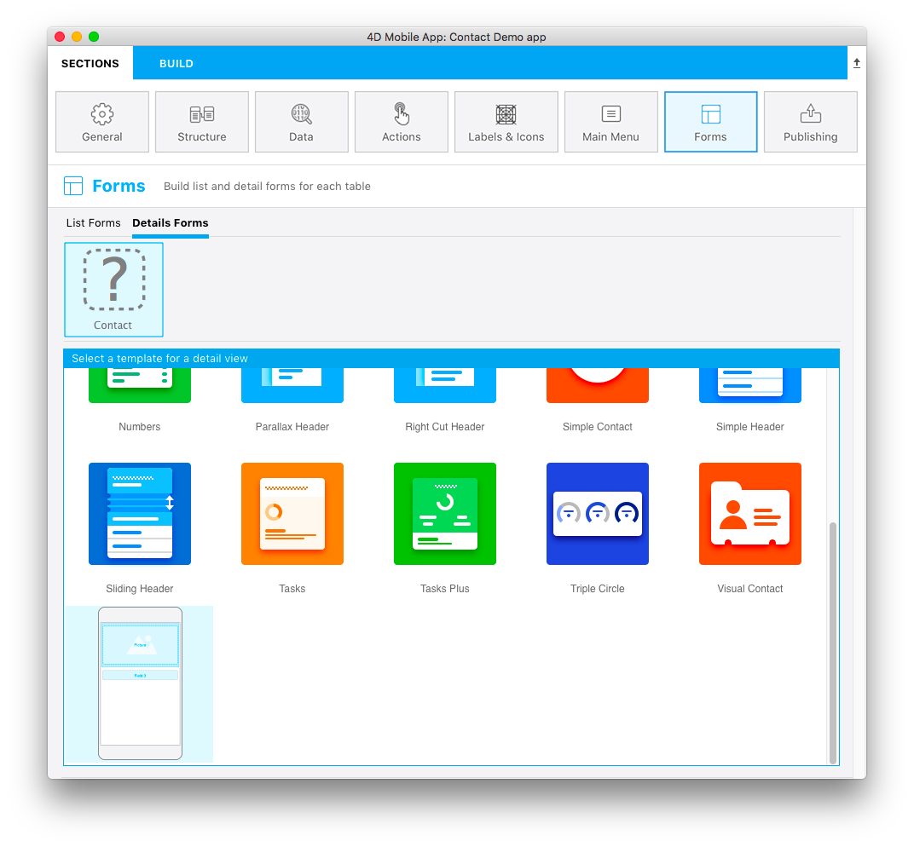

Puede crear su propio icono para su plantilla.

Debe ser de 160x160px y debe llamarse **layoutIconx2.png**

El icono se utilizará:

* sobre el nombre de la tabla cuando la plantilla haya sido seleccionada, y
* en la ventana de selección de plantillas en la **sección Formularios**

Si no está este icono en la carpeta de plantillas de formulario detallado, el archivo **template.svg** se mostrará en la ventana del selector de plantillas y aparecerá un icono de signo de interrogación sobre cada tabla a la que le falte un icono.

Puede utilizar cualquier software de imagen para crear el icono de la plantilla del formulario detallado.

