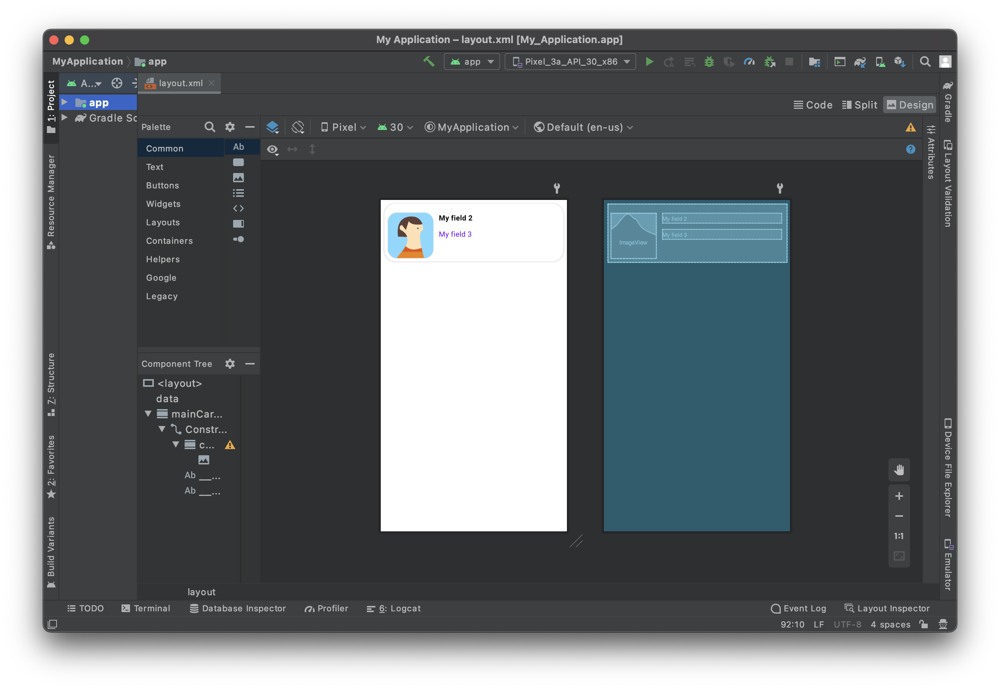

En esta sección verá cómo crear su interfaz de formulario lista Android con Android Studio.

Este es el resultado que queremos lograr:



Para cada celda, vamos a añadir:

* Una foto de perfil
* Título
* Subtitulo

## Abrir el archivo de diseño con Android Studio

La mejor manera de editar o crear una plantilla es:

* Abrir Android Studio y crear un nuevo proyecto móvil vacío presionando en Archivo > Nuevo > Nuevo Proyecto...

* Seleccionar la plantilla Actividad vacía


* Configure su proyecto y haga clic en **Terminar**


* Copiar el archivo layout.xml en app > res > layout soltándolo directamente en la carpeta diseño del proyecto


* Debería tener eso en ese momento:


* Haga clic en la opción superior derecha **Dividir** para visualizar la vista previa de la plantilla así como el código xml.

Está vacío, así que vamos a agregar algo de contenido.


## Añadir un contenedor CardView

Para tener una mejor representación de sus celdas vamos a añadir un [CardView](https://developer.android.com/guide/topics/ui/layout/cardview).

Añadir un contenedor CardView le permitirá mostrar sus celdas de formulario lista como agradables tarjetas y le da la posibilidad de añadir sombra, elevación, radio de esquina, color de fondo...

Así que vamos a añadirlo a su archivo de diseño. No olvide cerrar el contenedor añadiendo `</androidx.cardview.widget.CardView>` justo antes de `</layout>`.

```xml
   <androidx.cardview.widget.CardView
        android:id="@+id/mainCardview" 
        android:layout_width="match_parent" 
        android:layout_height="wrap_content"
        android:layout_marginStart="8dp"
        android:layout_marginTop="8dp"
        android:layout_marginEnd="8dp"
        android:layout_marginBottom="8dp"
        app:cardBackgroundColor="#FFFFFF"
        app:cardCornerRadius="25dp"
        app:layout_constraintBottom_toBottomOf="parent"
        app:layout_constraintEnd_toEndOf="parent"
        app:layout_constraintStart_toStartOf="parent"
        app:layout_constraintTop_toTopOf="parent">

        ...

        </androidx.cardview.widget.CardView>

```

Es fundamental **dar ids a sus elementos de diseño** para referirse a ellos posteriormente y posicionarlos entre sí.

Defina el **ancho** y **alto** de su contenedor, los **márgenes** y como queremos que el contenido ocupe todo el espacio padre (menos los márgenes) sólo tenemos que **añadir restricciones**.


Aquí está el código de diseño completo en esta etapa:

```xml
<?xml version="1.0" encoding="utf-8"?>

<layout xmlns:android="http://schemas.android.com/apk/res/android"
    xmlns:app="http://schemas.android.com/apk/res-auto"
    xmlns:tools="http://schemas.android.com/tools"
    tools:ignore="HardcodedText">

    <data>
        <!--ENTITY_VARIABLE-->
    </data>

    <androidx.cardview.widget.CardView
        android:id="@+id/mainCardview"
        android:layout_width="match_parent"
        android:layout_height="wrap_content"
        android:layout_marginStart="8dp"
        android:layout_marginTop="8dp"
        android:layout_marginEnd="8dp"
        android:layout_marginBottom="8dp"
        app:cardBackgroundColor="#FFFFFF"
        app:cardCornerRadius="25dp"
        app:layout_constraintBottom_toBottomOf="parent"
        app:layout_constraintEnd_toEndOf="parent"
        app:layout_constraintStart_toStartOf="parent"
        app:layout_constraintTop_toTopOf="parent">

        <androidx.constraintlayout.widget.ConstraintLayout
        android:layout_width="match_parent"
            android:layout_height="wrap_content">

        </androidx.constraintlayout.widget.ConstraintLayout>

    </androidx.cardview.widget.CardView>


</layout>

```

Y aquí está el resultado de la vista previa que se espera obtener:


## Añadir una "ImageView"

Para tener una agradable vista de imagen vamos a utilizar de nuevo un contenedor CardView ya que queremos añadir un radio de esquina a la ImageView para tener un mejor diseño.

```xml
            <androidx.cardview.widget.CardView
                android:id="@+id/cardView"
                android:layout_width="wrap_content"
                android:layout_height="wrap_content"
                android:layout_marginStart="8dp"
                app:cardCornerRadius="20dp"
                app:layout_constraintStart_toStartOf="parent"

            <ImageView
                android:id="@+id/__SPECIFIC_ID_1__"
                android:layout_width="100dp"
                android:layout_height="100dp"
                android:contentDescription="Image"
                app:imageUrl="__IMAGE_1__"
                tools:background="@tools:sample/avatars" /> 

            </androidx.cardview.widget.CardView>
```

Como puede ver, el ImageView está insertado en el CardView. Eso permite añadirle radios de esquina.

La línea `app:imageUrl="__IMAGE_1__"` permitirá enlazar el valor de la imagen que se encuentra en la posición 1 del archivo svg que se ha definido previamente.


La línea `tools:background="@tools:sample/avatars"` simplemente está ahí para mostrar un marcador de posición ImageView.


## Añadir un título

Aquí queremos añadir un título a la derecha de la CardView que contiene una ImageView.

Para ello vamos a añadir un TextView:

```xml
 <TextView
                android:id="@+id/__SPECIFIC_ID_2__"
                android:layout_width="0dp"
                android:layout_height="wrap_content"
                android:layout_marginStart="12dp"
                android:layout_marginTop="20dp"
                android:layout_marginEnd="12dp"
                android:layout_marginBottom="6dp"
                android:scrollbars="none"
                android:text="__TEXT_2__"
                android:textAppearance="@style/TextAppearance.MaterialComponents.Body1"
                android:textColor="@color/black"
                android:textStyle="bold"
                app:layout_constraintEnd_toEndOf="parent"
                app:layout_constraintStart_toEndOf="@+id/cardView"
                app:layout_constraintTop_toTopOf="parent"
                tools:text="My field 2" />

```

La línea `app: text="__TEXT_2__"` permitirá enlazar el valor del texto que se encuentra en la posición 2 del archivo svg que se ha definido previamente.

Queremos que el ImageView y el TextView estén alineados arriba. Para ello, vamos a utilizar el id TextView. Sólo tiene que añadir esta línea a la CardView que incluye la foto de perfil:

```xml
app:layout_constraintTop_toTopOf="@id/__SPECIFIC_ID_2__"
```


## Añadir un subtítulo


Queremos añadir un subtítulo a esta celda. Para ello, basta con añadir el mismo bloque que el del título:


```xml

<TextView
                android:id="@+id/__SPECIFIC_ID_3__"
                android:layout_width="0dp"
                android:layout_height="wrap_content"
                android:layout_marginStart="12dp"
                android:layout_marginTop="8dp"
                android:layout_marginEnd="12dp"
                android:layout_marginBottom="50dp"
                android:scrollbars="none"
                android:text="__TEXT_3__"
                android:textAppearance="@style/TextAppearance.MaterialComponents.Body1"
                   android:textColor="?colorPrimary"
                app:layout_constraintBottom_toBottomOf="parent"
                app:layout_constraintEnd_toEndOf="parent"
                app:layout_constraintStart_toEndOf="@+id/cardView"
                app:layout_constraintTop_toBottomOf="@+id/__SPECIFIC_ID_2__"
                tools:text="My field 3" />
```


La línea `app: text="__TEXT_3__"` permitirá enlazar el valor del texto que se encuentra en la posición 2 del archivo svg que se ha definido previamente.

Queremos que el subtítulo esté al final del título. Para ello, vamos a utilizar el id del título TextView. Sólo tiene que añadir esta línea al título TextView:

```xml
app:layout_constraintBottom_toTopOf="@+id/__SPECIFIC_ID_3__"
```


Su primera plantilla de formulario lista:


Aquí está el código de diseño completo en esta etapa:

```xml
<?xml version="1.0" encoding="utf-8"?>

<layout xmlns:android="http://schemas.android.com/apk/res/android"
    xmlns:app="http://schemas.android.com/apk/res-auto"
    xmlns:tools="http://schemas.android.com/tools"
    tools:ignore="HardcodedText">

    <data>

        <!--ENTITY_VARIABLE-->
    </data>

    <androidx.cardview.widget.CardView
        android:id="@+id/mainCardview"
        android:layout_width="match_parent"
        android:layout_height="wrap_content"
        android:layout_marginStart="8dp"
        android:layout_marginTop="8dp"
        android:layout_marginEnd="8dp"
        android:layout_marginBottom="8dp"
        app:cardBackgroundColor="#FFFFFF"
        app:cardCornerRadius="25dp"
        app:layout_constraintBottom_toBottomOf="parent"
        app:layout_constraintEnd_toEndOf="parent"
        app:layout_constraintStart_toStartOf="parent"
        app:layout_constraintTop_toTopOf="parent">

    <androidx.constraintlayout.widget.ConstraintLayout
        android:layout_width="match_parent"
        android:layout_height="wrap_content">

        <androidx.cardview.widget.CardView
            android:id="@+id/cardView"
            android:layout_width="wrap_content"
            android:layout_height="wrap_content"
            android:layout_marginLeft="8dp"
            app:cardCornerRadius="20dp"
            app:layout_constraintStart_toStartOf="parent"
            app:layout_constraintTop_toTopOf="@id/__SPECIFIC_ID_2__">

        <ImageView
                android:id="@+id/__SPECIFIC_ID_1__"
                android:layout_width="100dp"
                android:layout_height="100dp"
                android:contentDescription="Image"
                app:imageUrl="__IMAGE_1__"
                tools:background="@tools:sample/avatars" />

        </androidx.cardview.widget.CardView>

        <TextView
            android:id="@+id/__SPECIFIC_ID_2__"
            android:layout_width="0dp"
            android:layout_height="wrap_content"
            android:layout_marginStart="12dp"
            android:layout_marginTop="20dp"
            android:layout_marginEnd="12dp"
            android:layout_marginBottom="6dp"
            android:scrollbars="none"
            android:text="__TEXT_2__"
            android:textAppearance="@style/TextAppearance.MaterialComponents.Body1"
            android:textColor="@color/black"
            android:textStyle="bold"
            app:layout_constraintEnd_toEndOf="parent"
            app:layout_constraintStart_toEndOf="@+id/cardView"
            app:layout_constraintTop_toTopOf="parent"
            app:layout_constraintBottom_toTopOf="@+id/__SPECIFIC_ID_3__"
            tools:text="My field 2" />

        <TextView
            android:id="@+id/__SPECIFIC_ID_3__"
            android:layout_width="0dp"
            android:layout_height="wrap_content"
            android:layout_marginStart="12dp"
            android:layout_marginTop="8dp"
            android:layout_marginEnd="12dp"
            android:layout_marginBottom="50dp"
            android:scrollbars="none"
            android:text="__TEXT_3__"
            android:textAppearance="@style/TextAppearance.MaterialComponents.Body1"
            android:textColor="?colorPrimary"
            app:layout_constraintBottom_toBottomOf="parent"
            app:layout_constraintEnd_toEndOf="parent"
            app:layout_constraintStart_toEndOf="@+id/cardView"
            app:layout_constraintTop_toBottomOf="@+id/__SPECIFIC_ID_2__"
            tools:text="My field 3" />

    </androidx.constraintlayout.widget.ConstraintLayout>

    </androidx.cardview.widget.CardView>

</layout>

```

## Personalizar la etiqueta

Desde aquí puede personalizar la etiqueta de:

* color => android:textColor

* weight => android:textStyle con posibles valores **normal**, **negrita** o **itálica**

* apariencia de su fuente => android:textAppearance

Intente mantener la coherencia en los tamaños de texto de su diseño con la apariencia. La mejor manera de conseguirlo es seguir el [tipo de diseño de materiales](https://material.io/design/typography/the-type-system.html#type-scale).


Por ejemplo, un TextView básico debe estar en escala `@Body1@`.

```xml
android:textAppearance="@style/TextAppearance.MaterialComponents.Body1"
```

## Cómo obtener datos en sus celdas

### Image View

En nuestra plantilla de formulario lista hemos utilizado `app:imageUrl="__IMAGE_1__"`

Aquí suponemos que la ImageView es la primera vista del svg, y su ID de vista es `__SPECIFIC_ID_1__`. Si fuera la tercera vista, sería `__IMAGE_3__` y su ID de vista sería `__SPECIFIC_ID_3__`.

### Etiquetas

En nuestra plantilla de formulario de lista hemos utilizado `android:text="__TEXT_2__"` para el título.

Aquí suponemos que el título es la segunda vista en el svg, y su ID de vista es `__SPECIFIC_ID_2__`.


## ¿Qué hacer ahora?

En este tutorial, hemos cubierto los conceptos básicos para crear plantillas de formularios listados Android. Ahora puede crear plantillas simples por su cuenta utilizando los recursos del Proyecto Starter. Espere, ¡Hay más! En el siguiente tutorial, aprenderá cómo crear plantillas de formulario detalladas Android.

Descargue la carpeta lista de la plantilla terminada:

<div className="center-button">
<a className="button button--primary"
href="https://github.com/4d-go-mobile/tutorial-CustomListForm/releases/latest/download/tutorial-CustomListForm.zip">Descargar</a>
</div>


