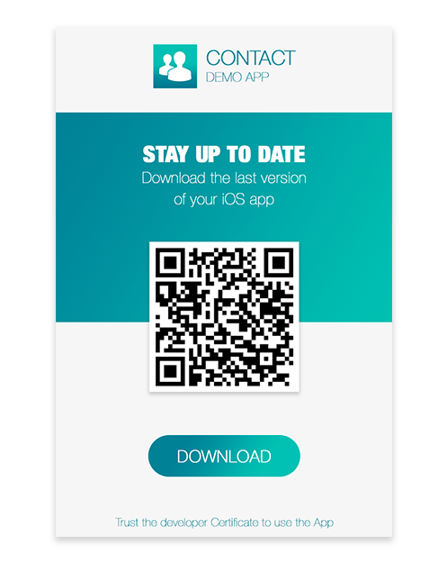

> **OBJECTIFS**
> 
> Upload your app to a secured server.


## ÉTAPE 1. Téléchargez votre application

Téléchargez votre application sur un serveur sécurisé :

* Ressources (image d'affichage et image en taille réelle)
* `manifest.plist` file
* `.ipa` file

Vous pouvez utiliser n’importe quel service de stockage en nuage pour distribuer votre application à partir du moment où il est sécurisé (Dropbox, Google Drive, etc.).

:::note

Your asset and ipa URLs must match the URLs defined in your `manifest.plist` file.

:::

## ÉTAPE 2. Créez le lien d’installation

Create an **ITMS Serices link** (iTUnes Music Store) with the full web address of your manifest file as a parameter:

```html
itms-services://?action=download-manifest&url=https://mywebserver.com/manifest.plist

```

This link can be used when sending emails, embedded in an html page, or even within a QR code.

Here is a simple example:



*The QR Code used for this documentation is not active.*

## ÉTAPE 3. Installez votre application sur iOS

* Installez l’application en cliquant sur le lien ou en scannant un Code QR.


* Lorsque vous ouvrez une application installée manuellement, une notification s’affichera, indiquant que le développeur de l’application n’est pas fiable sur votre appareil.

* Ignorez ce message et cliquez sur **Annuler**.

* Dans Réglages > Général > Gestion de l'appareil, dans la rubrique « Application d'Entreprise », le profil du développeur est répertorié.


* Saisissez le nom du profil développeur pour que ce dernier soit reconnu comme fiable.


* Vous pouvez ensuite accéder à votre application et l'ouvrir.

Congratulations... you can now distribute your app in-house.
