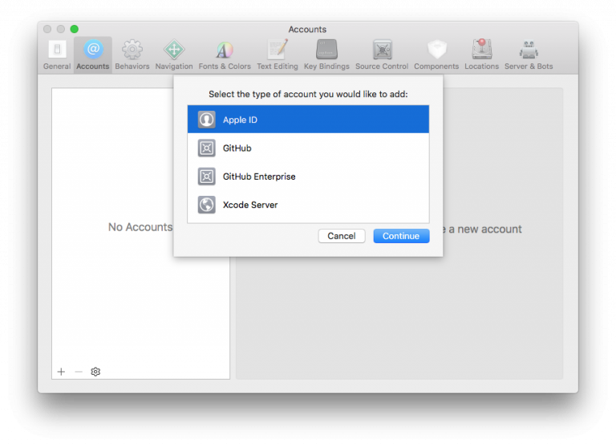
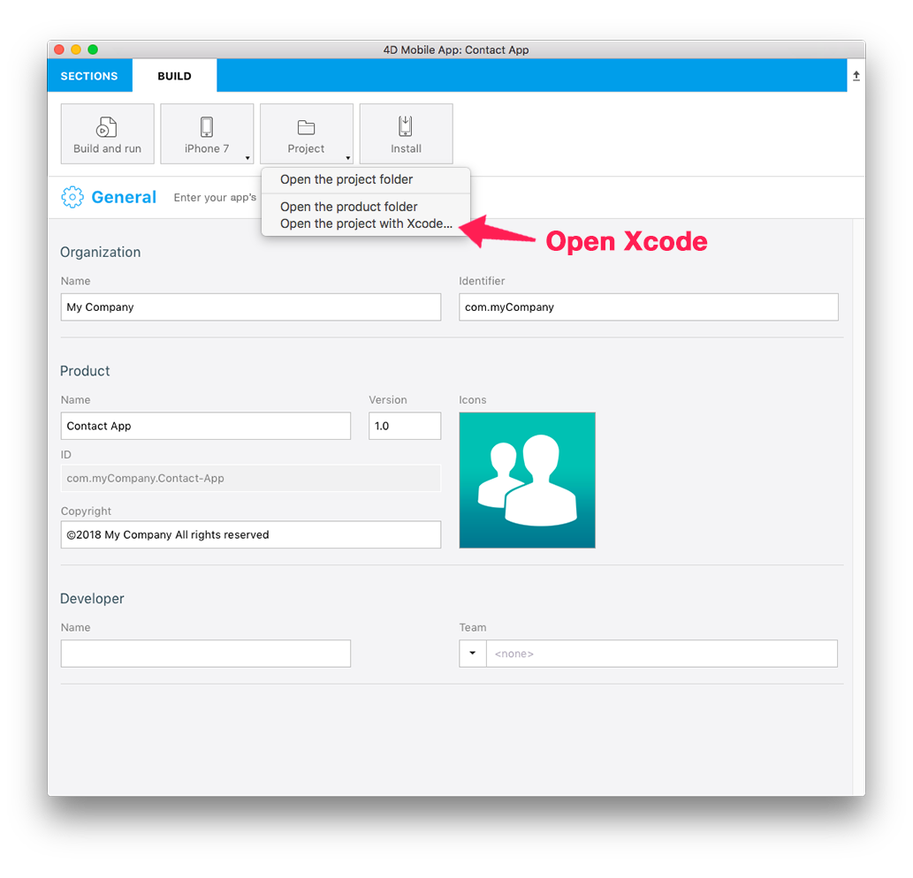
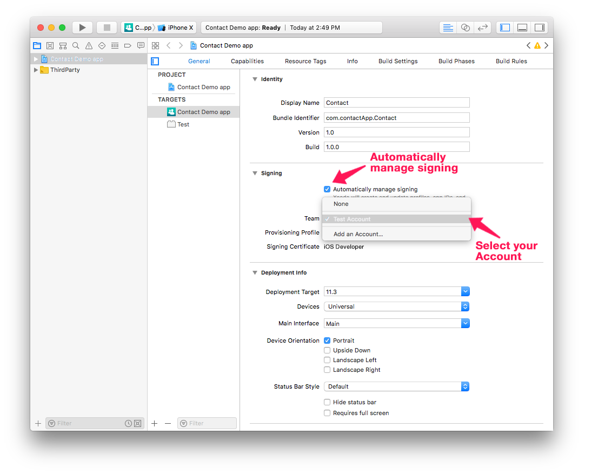
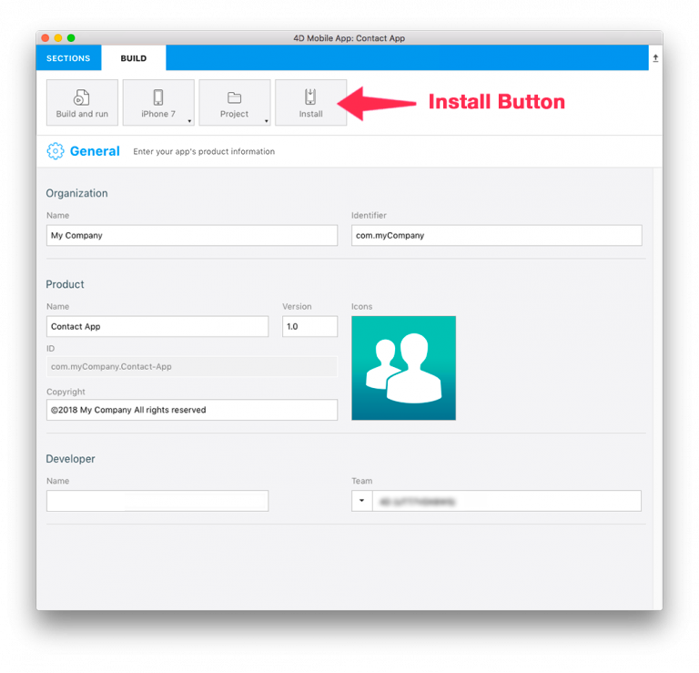
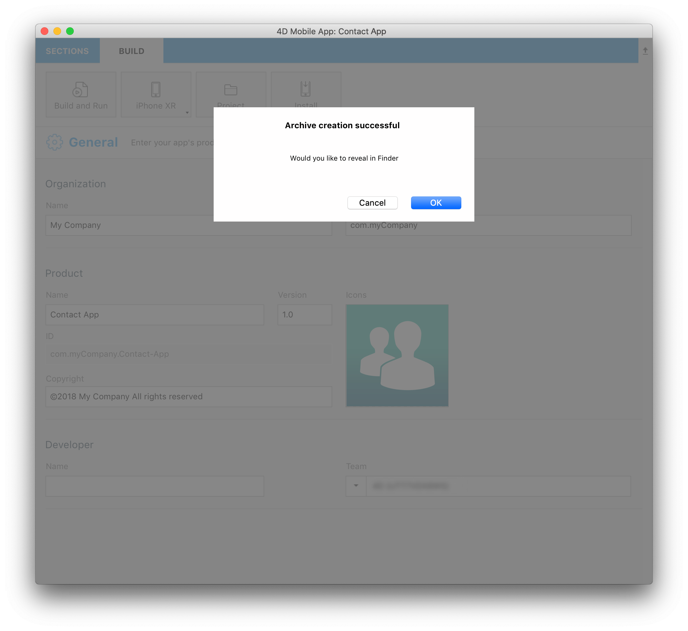

You can install and test your mobile application on a connected device.

## Pré-requis

You need to subscribe to an Apple Developer Program. Depending on your objectives and preferences, you can choose to enroll in one of the following:

* [Free Apple Developer Program]`(free-developer-account.html)-- to add`: For testing only
* [Apple Developer Program for organization](../tutorials/developer-program/register-apple-developer-program-organization) or [individual](../tutorials/developer-program/register-apple-developer-program-individual): For an App Store Deployment
* [Apple Enterprise Developer Program](../tutorials/developer-program/register-apple-developer-enterprise-program): To deploy your app in-house

:::note

You need [Apple configurator 2](https://itunes.apple.com/us/app/apple-configurator-2/id1037126344) installed on your Mac to automate app installation (optional).

:::

## ÉTAPE 1. Account creation

* **Identifiant Apple** : Créez votre identifiant Apple. If you don’t already have one, click [here](https://appleid.apple.com/account#!&page=create).

* **Developer Account** : Choisissez un Apple Developer Program (pour les entreprises ou les particuliers) si vous souhaitez déployer votre application sur l'App Store ou bien depuis l'Apple Developer Enterprise Program (pour un déploiement interne).

## ÉTAPE 2. Configurer Xcode

* **Developer Account** : Dans Xcode > Preferences > Accounts, ajoutez votre Apple ID. 

## ÉTAPE 3. Obtenez votre Team ID

* If your are using a [Free Apple Developer Program]`(free-developer-account.html--to addd)` go to [step 4](#step-4-team-id-for-free-account).
* If your are using an [Apple Developer Program for organization](../tutorials/developer-program/register-apple-developer-program-organization), [individual](../tutorials/developer-program/register-apple-developer-program-individual) or an [Apple Enterprise Developer Program](../tutorials/developer-program/register-apple-developer-enterprise-program) go to [step 5](#step-5-team-id-for-paid-subscription-account).

## ÉTAPE 4. Team ID for Free account

### Profil et certificat fournis par Xcode

* Open your current project from the BUILD tab.

* Verify that the **Automatically manage signing** option is checked and select the account you added [here]`(free-developer-account.html)` from the Team dropdown list.

* Connectez votre appareil à votre ordinateur et sélectionnez-le dans le menu supérieur de Xcode.

* Xcode génère automatiquement les profils et les certificats de provisioning nécessaires à la création de votre application.

### Création du projet avec Xcode

* Cliquez sur le bouton Build and Run dans Xcode !

## STEP 5. Team ID for paid subscription account

* **Team ID** : Cliquez sur Developer Account > Membership et obtenez votre Team ID. 

* **4D for iOS** : Lancez 4D for iOS depuis Sections > Général et entrez votre Team ID. 

* Passez à l’étape 6 pour exécuter votre projet sur votre appareil.

## ÉTAPE 6. Installation

### Installation automatique avec Apple Configurator 2

* Lorsque votre application est prête, cliquez sur l’onglet GÉNÉRATION.
* Connectez votre appareil à votre ordinateur avec un câble USB.
* Dans l’onglet GÉNÉRATION, cliquez sur **Installer**.

* L’application est installée sur votre appareil !

### Installation manuelle avec Xcode

* Lorsque votre application est prête, cliquez sur l’onglet GÉNÉRATION.
* Connectez votre appareil à votre ordinateur avec un câble USB.
* Dans l’onglet GÉNÉRATION, cliquez sur **Installer**.

* Une archive de votre projet est créée.

* Indiquez l'archive générée dans Finder.

* Ouvez Xcode et accédez à Menu > Window > Devices and Simulator et glissez-déposez le fichier ipa généré dans la section Installed Apps.

* The app is now being installed on your device.

