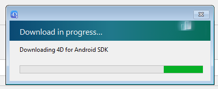

4D for iOS et 4D for Android nécessitent une configuration minimale spécifique.

## Configuration système

Les prérequis système sont identiques aux [prérequis système basiques de 4D](https://us.4d.com/product-download/Feature-Release).

8 Go de RAM sont recommandés.

## Configuration logicielle

### 4D

- **Développement**: 4D avec une licence 4D Developer Pro

- **Déploiement **: 4D Server
    - 4D Web Server doit être lancé.
    - Les ports HTTP et HTTPS doivent être activés et configurés correctement. HTTPS est nécessaire pour le déploiement 4D for iOS et 4D for Android.

### iOS

[Apple configurator 2](https://itunes.apple.com/us/app/apple-configurator-2/id1037126344) installé sur votre Mac (facultatif).

Tableau de versions :

| Xcode | Swift | iOS  | 4D          | macOS   |
| ----- | ----- | ---- | ----------- | ------- |
| 12.5  | 5.4   | 14.6 | 19          | 11.0.1  |
| 12.4  | 5.3.2 | 14.4 | 18R6        | 10.15.4 |
| 12.2  | 5.3   | 14.2 | 18R5 & 18.3 | 10.15.4 |

Historique

| Xcode  | Swift | iOS  | 4D   | macOS   |
| ------ | ----- | ---- | ---- | ------- |
| 12.0   | 5.3   | 14.0 | 18R4 | 10.15.4 |
| 11.5   | 5.2.4 | 13.5 | 18R3 | 10.15.2 |
| 11.4   | 5.2   | 13.4 | 18.2 | 10.15.2 |
| 11.3.1 | 5.1.3 | 13.3 | 18.1 | 10.14.4 |
| 11.3.1 | 5.1.3 | 13.3 | 18R2 | 10.14.4 |
| 11.2   | 5.1   | 13.2 | 18   | 10.14.4 |
| 10.2.1 | 5.0   | 12.2 | 17R6 | 10.14.4 |
| 10.2   | 4.2.1 | 12.2 | 17R5 | 10.14.3 |
| 10.1   | 4.2.1 | 12   | 17R4 | 10.13.6 |
| 10.0   | 4.2   | 12   | 17R3 | 10.13.6 |
| 9.4    | 4.1.2 | 11.4 | 17R2 | 10.13.2 |
| 9.3.1  | 4.1   | 11.3 | 17R2 | 10.13.2 |

### Android

Tableau de versions :

| Android                                               | 4D | Windows                 |
| ----------------------------------------------------- | -- | ----------------------- |
| [4.1.2](https://developer.android.com/studio/archive) | 19 | Windows 10 64-bit xxxxx |

4D for Android nécessite le SDK Android, y compris Android Studio. S'il n'est pas installé, il sera automatiquement téléchargé au lancement de l'éditeur mobile 4D sur Windows :

