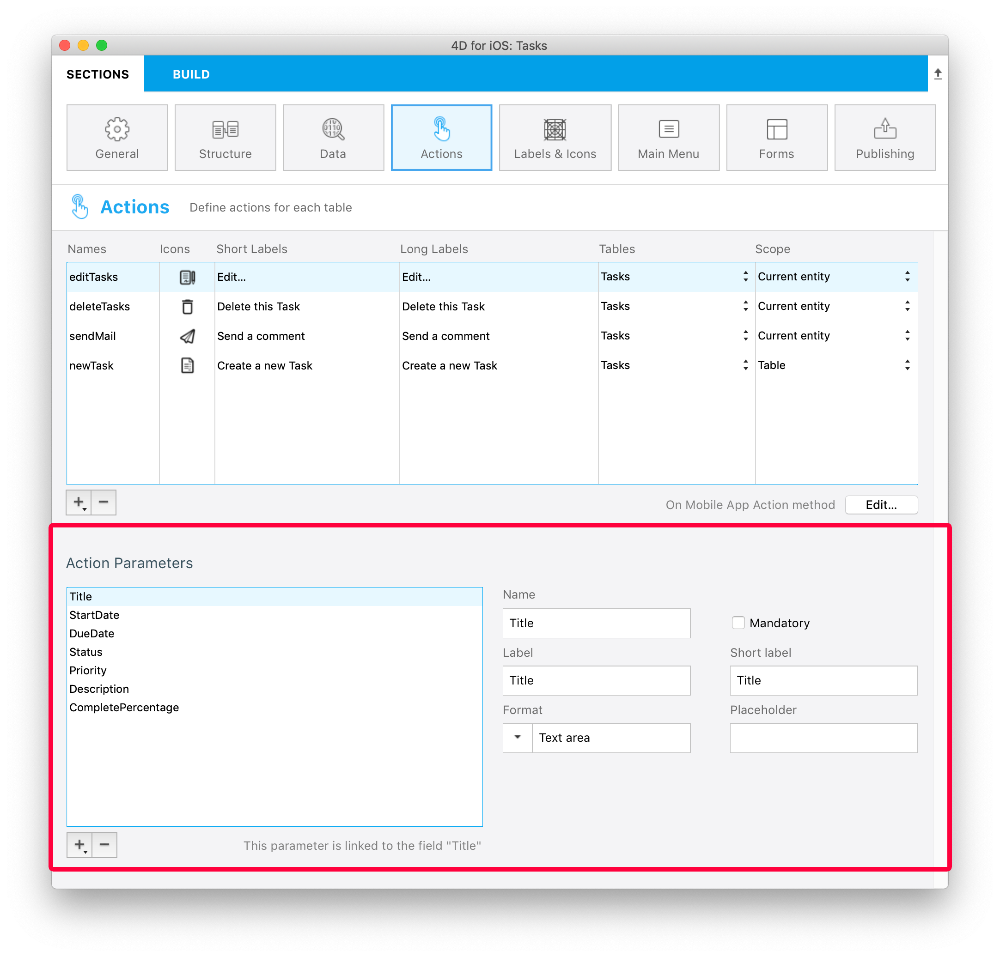

Cette section vous permet :

* de créer des actions permettant d'exécuter du code 4D à partir de votre application iOS.
* de définir et d'ajouter des paramètres à vos actions.

## Éditeur de projet

### Créez votre application

Vous pouvez créer de nouvelles actions en cliquant sur le bouton +, situé en-dessous du tableau d'Actions. Une nouvelle ligne apparaîtra alors dans le tableau.

Vous définirez ensuite les éléments suivants :

* **Noms :** Définissez le nom de l'action à utiliser dans la méthode base [Sur une action app mobile](https://developer.4d.com/4d-for-ios/docs/en/actions.html#on-mobile-app-action) pour lancer votre code 4D.
* **Icônes :** Sélectionnez une icône pour votre action à partir de la librairie d'icônes. Vous pouvez également ajouter votre propre icône à l'aide de ce [tutorial]`(using-icons.html)`.
* **Libellés long et court :** Définissez les libellés correspondant aux actions que vous souhaitez afficher dans votre application.
* **Table :** Sélectionnez la table à laquelle vous souhaitez appliquer une action.
* **Portée :** Choisissez d'appliquer l'action à une **entité** ou à une **table**.


### Ajoutez des paramètres à votre action

Vous pouvez ajouter des **paramètres d'action** et **éditer** des données directement depuis votre application.

Pour chaque paramètre, vous pouvez éditer les propriétés suivantes :

* Le nom
* Le libellé long
* Le libellé court
* Format
* Les contraintes (définir des valeurs minimales ou maximales)
* Le placeholder
* La définition d'un champ obligatoire
* La valeur par défaut



Vous êtes libres de choisir l'ordre des paramètres à l'aide du glisser-déposer.

Voici les différents **formats** que vous pouvez sélectionner en tant que paramètre :

<table>

<tr>
<th colspan="2"  style={{textAlign: 'center'}}>TEXTE</th>
</tr><tr style={{textAlign: 'center'}}>
<th>Format</th><th>Description</th>
</tr><tr>
<td>Texte</td><td>Première lettre de la chaîne en majuscule</td>
</tr><tr>
<td>Adresse mail</td><td>Clavier iOS optimisé pour la saisie de l'e-mail</td>
</tr><tr>
<td>Numéro de téléphone</td><td>Clavier iOS pour la saisie des numéros de téléphone.</td>
</tr><tr>
<td>Compte</td><td>Clavier iOS optimisé pour la saisie du nom d'utilisateur</td>
</tr><tr>
<td>Mot de passe</td><td>Clavier optimisé pour la gestion des mots de passe</td>
</tr><tr>
<td>URL</td><td>Clavier iOS optimisé pour la saisie de l'URL</td>
</tr><tr>
<td>Code postal</td><td>Clavier iOS optimisé pour la saisie du code postal</td>
</tr><tr>
<td>Zone de texte</td><td>Inclut plusieurs lignes de texte dans un même champ</td>
</tr><tr>
<td>Code barres</td><td>Extract barcode associated value. Supported formats : EAN8, EAN13, Code 39, Code 93, Code 128, QR Code, UPC, PDF417</td>
</tr>
<tr>
<td colspan="2"></td>
</tr>

<tr>
<th colspan="2" style={{textAlign: 'center'}}>NUMBER</th>
</tr><tr style={{textAlign: 'center'}}>
<th>Format</th><th>Description</th>
</tr><tr>
<td>Number</td><td>Numbers with decimals</td>
</tr><tr>
<td>Integer</td><td>Numbers without decimals</td>
</tr><tr>
<td>Scientific</td><td>Scientific Notation</td>
</tr><tr>
<td>Percentage</td><td>Percent Notation</td>
</tr><tr>
<td>Spell Out</td><td>Convert numbers into strings</td>
</tr>
<tr>
<td colspan="2"></td>
</tr>

<tr>
<th colspan="2" style={{textAlign: 'center'}}>DATE</th>
</tr><tr style={{textAlign: 'center'}}>
<th>Format</th><th>Description</th>
</tr><tr>
<td>Date</td><td>Nov 23, 1937</td>
</tr><tr>
<td>Short Date</td><td> 11/23/37</td>
</tr><tr>
<td>Long Date</td><td>November 23, 1937</td>
</tr><tr>
<td>Full Date</td><td>Tuesday, November 23, 1937</td>
</tr><tr>
<td colspan="2"></td>
</tr>

<tr>
<th colspan="2" style={{textAlign: 'center'}}>TIME</th>
</tr><tr style={{textAlign: 'center'}}>
<th>Format</th><th>Description</th>
</tr><tr>
<td>Time</td><td>3:30 PM</td>
</tr><tr>
<td>Duration</td><td>2 hours 30 minutes</td>
</tr>
<tr>
<td colspan="2"></td>
</tr>

<tr>
<th colspan="2" style={{textAlign: 'center'}}>BOOLEAN</th>
</tr><tr style={{textAlign: 'center'}}>
<th>Format</th><th>Description</th>
</tr><tr>
<td>Boolean</td><td></td>
</tr><tr>
<td>Check mark</td><td></td>
</tr>

<tr>
<td colspan="2"></td>
</tr>
<tr>
<th colspan="2" style={{textAlign: 'center'}}>IMAGES</th>
</tr>
<tr>
<td>Signature</td><td>Allow to sign with the finger</td>
</tr>

</table>

## Preset actions

4D mobile projects include the following (predefined) preset actions to manage your app content:

* Action d'édition
* Action d'ajout
* Action de suppression
* Share
* Sort

### Add action

4D mobile projects makes the **Add actions** creation process very simple.

Vous n'avez qu'à sélectionner l'option **Action d'ajout pour**, accessible à partir du **bouton +**, situé en-dessous de la table Actions.


Then just **select the table** you want to link to this add action.

Cela **créera automatiquement** tous les paramètres dans l'éditeur de projets et vous permettra de modifier chaque valeur d'un champ.

Pour ce genre d'actions, vous constaterez que toutes les **propriétés** sont déjà saisies à des fins pratiques, à droite de la liste de paramètres.


### Edit action

La création des **actions d'édition** suit le même principe que les actions d'ajout, à l'exception du fait que vous ne serez pas en mesure de définir des valeurs par défaut à partir de la section Actions.


### Delete action

**Delete action** creation follows the same process as the Edit action. La seule différence est que cette action vous permet de supprimer une entité.

To create a Delete action, select the **Delete action for** option accessible from the **+ button** at the bottom of the Actions table.

Ce type d'actions doit être utilisé avec précaution.


### Share action

Selecting the **Share action** will allow your mobile users to share content with other users. You just need to select the scope:

- **entity**: to share content from a detail form
- **table**: to share a list form

See the [Deep Linking](../special-features/deep-linking.md) page for more details.

### Sort action

**Sort actions** are useful to:

- define a default sort order for the table list forms
- allow your mobile users to choose a list sort order

When you create a sort action for a table, you need to select the first field on which the sort will be done:


The field is added to the Sort Criteria list. An ascending sort order is set by default, but you can change it using the **Sort order** menu.

You can sort entities in more than one field. Each field you sort is referred to as a sort level. For example, the results of a two-level ascending sort of the `lastName` and `firstName` fields would produce a list such as this:

```4d
Aardvark, Anthony
Aardvark, Artemis
Aardvark, Arthur
...
Zygote, Elena
Zymosian, Elmer
```

To add one or more sort level(s) in the Sort Criteria list, select the **+** button under the list and configure each level:


#### Sort order menu on the mobile app

When you define more than one sort action for a table, mobile users automatically benefit from a **sort** menu. It contains all the predefined sort actions:


> When only one sort action is defined for a table, the **sort** menu is not displayed on the mobile app side.

### On Mobile App Action

The [On Mobile App Action]`(https://livedoc.4d.com/4D-Language-Reference-17-R5/Database-Methods/On-Mobile-App-Action-database-method.301-4286697.en.html)` database method is available to call all of your 4D methods.

After creating all of your actions, just click on the Create button from the Actions table to automatically generate a *Case of* code block that includes all your action names in the *On Mobile App Action* method.

:::note notes

- You can refresh the selection after executing an action using `$out.dataSynchro:=True`.
- You can notify the app user when action has been executed using `$out.statusText:="Message you want to display"`.
- You can also decide to force close the Edition form using `$out.close:=True`.

:::

## Offline mode actions

The user of an app can draft, store and queue action requests, even if he’s working offline (adding a customer's phone number, uploading a picture, printing an invoice or a quote, deleting an address, etc.).  All these tasks are placed in the Pending actions list until the network is accessible. Once the user is online, all pending actions are consistently synchronized, executed and then visible in the Completed actions list.

Pending tasks can be visualized and opened from:

•   *The Settings screen*

It displays a summary and a history of all pending and completed tasks.


•   *The List & Detail forms*

They display all the tasks related to the table or to the entity that you are currently viewing.


:::note notes

- The "Share" predefined action is only executable online
- Actions are editable while pending, but they can no longer be modified once they switch to the "Completed" mode.

:::

### Update pending tasks that failed

Due to your server business logic, some tasks could be rejected. For mobile users, it is then possible to edit and to retry sending the relevant pending tasks. To do so, you can display a status text describing, in the "Complete" actions history, the reason of the failure. For example, you can reject an action sent by a mobile user to the server and inform him that the operation has failed. In that case, you can set the `success` value to `False` and provide a message in `statusText`, as follows:

 ```4d
 $response:=New object("success"; False; "statusText"; "Operation failed"))
 ```
 You can even add some errors by action parameters for the `alphaField` parameter, for example:

  ```4d
$response.errors:=New collection(New object("parameter"; "alphaField"; "message"; "Alpha field must contains a valide value")
  ```


## iOS app Side

In your iOS app, actions are available in different ways in your List and Detail forms, depending on the templates you select in the Forms section.

### Table List forms

* **Entity action:** Swipe left on a cell to display the available actions in a List form. A "More" button is displayed if you've defined more than three actions per entity.


* **Table actions:** A generic actions button is available in the navigation bar to display a list of available table actions.


:::tip

Actions will be displayed in the same order as defined in the Action section.

:::

### Collection List forms

* **Entity action:** Depending on the template, actions are displayed by clicking on a generic button or by maintaing the pressure on a cell.


* **Table actions:** Like the Table List forms, a generic Actions button is available in the navigation bar to display a list of availble table actions.


### Detail forms

As with Table actions in List forms, a generic Actions button is available in the navigation bar to display all your entity actions in a list.


### Edition forms

If you have created an Edit or an Add action, as soon as you select it from the action list, an **Edition form** will appear.


From here, you can:

* edit all of your fields by selecting them, and
* validate or cancel your modifications using the **Done** or **Cancel** buttons (available in the navigation bar).

For your convenience, the Edition form includes a few **special features**:

* The keyboard type depends on the selected parameter type in the Action section.
* You can go to the next or previous field using the arrow on top of the keyboard.
* The iOS keyboard can be closed by touching anywhere outside of a field.
* Indication is given to the user when a value is not valid.
* The view focuses on empty mandatory fields when the user clicks the Done button.

## Where to go from here?

* A [tutorial]`(actions-getting-started.html)` is available to guide you through the **action definition process**.

* Another [tutorial]`(action-custom-template.html)` will guide you through the **action TAG integration** for custom templates.

* A final [tutorial]`(action-parameters.html)` will guide you through the **action parameters definition**.
