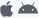

This page allows you to define display properties for your tables, fields and relations in the mobile app.


Default properties are set. To modify a property, select an element and enter the new value in the appropriate column.

You can define the same properties for tables, fields and relations. Additionally, formats can be defined for fields/relations.

These elements will be displayed in detail and list forms, depending on the template in the generated app.


## Icons

Icon to associate to the table or field/element in the mobile app each time a template requires an icon.

:::info

For relation fields, icons will be displayed at the left of the **Relation** button that allows to open a related table.

:::

The 4D mobile editor provides a large library of icons to meet your needs. These include icons for business, finance, education, government, health, industry, real estate, services, etc. To select an icon, click on the **icon** button and choose an icon from the list:


:::info

To keep everything consistent, **default icons** are generated for blank fields if at least one icon has been defined for a field.

:::

You can also leave the icon area empty if you don’t want to display icons in your application.


### Adding custom icons

You can add your own icons to the library, so that you can select them in your project. You can use any icon format (SVG or PNG is recommended to preserve transparency) and size. It's highly recommended having colored versions of your custom icons to better visualize them in the project editor.

For example, here are a set of custom icons that you can use:

<div className="center-button">
<a
  className="button button--primary"
  href="https://github.com/4d-go-mobile/tutorial-CustomIcons/releases/latest/download/tutorial-CustomIcons.zip">
  Download custom icons
</a>
</div>

To include custom icons in your project:

1. Create an `icons` folder at the following location:

```
<my4DProjetFolder>/Resources/Mobile/medias
```

:::note

You may have to create the `medias` folder.

:::

2. Drag and drop your customized icons in the `icons` folder.


Your icons can now be selected for your project, they are listed after the standard icons.


## Short and long labels

You can define custom labels for published tables, fields, and relations. These labels will be automatically used according to the available space in the template to optimize space and avoid overcrowding the tab bar.

:::info

For relation fields, labels will be displayed in the **Relation** button that allows to open a related table.

:::

- Short labels should have 10 characters or less
- Long labels can have up to 25 characters
- You can use characters that are not allowed in structure names, such as "/","@", the space character, etc.

By default, the mobile editor uses the table and field names as defined in the structure as labels in the app, and the same string is used for short and long labels.


## Formats

This property allows you to format the data to display in the app. When you click on a field row, a format menu is displayed.


Available built-in formats depend on the field type:

| Field type         | Formats                                                                                                                |
| ------------------ | ---------------------------------------------------------------------------------------------------------------------- |
| **Texte**          | Texte                                                                                                                  |
| **Date**           | Date, Short date, Long date, Full date                                                                                 |
| **Heure**          | Time, Short time, Duration, Integer number                                                                             |
| **Image**          | Image                                                                                                                  |
| **Booléen**        | "No" or "Yes", "False" or "True"                                                                                       |
| **Integer number** | Integer number, Decimal number, Real number, Percentage, Ordinal number, Currency $, Currency €, Currency ¥, Spell Out |


## Data formatters

The mobile editor allows you to add customized formats called "formatters" in your projects. A formatter enables to display your data through a specific menu, to map your data For example, you can define custom formats for emails, invoice numbers, etc.

To add custom formatters to your mobile project, you can either:

- Download and install customized formatters from the [**go-mobile formatters github repository**](https://4d-go-mobile.github.io/gallery//#/type/formatter).

To install a custom formatter, you just need to drop the formatter folder into the `/Resources/Mobile/formatters` of the 4D project folder. Once installed, a custom format can be selected from the Formats menu, just like a built-in formats.

- Create your own formatters.

Note that there are 2 types of formatters:

- **Static data formatters** without code.
- **Dynamic data formatters** with code (identified with the  in the above-mentioned formatters Github repository).

Your formatter must always be associated with a **manifest.json** file containing the following elements:

- **name**: a string containing the name of the formatter. Ex: phone, objectFormatter, etc.
- **type**: the 4D format type you want to use. Ex: Text, Integer, etc.
- **binding**:
  - For static formatters:`localizedText` for strings or `imageNamed` for images.
  - For dynamic formatters: a string that links the code to your app
- **choiceList**: mapped values depending on the selected type (for static formatters only).
- **assets**: additional formating data for static formatters only, such as dark mode support, tintable, Integer to Image and Text to Image.
- **target**: the OS on which your app will be used.

Ex:

```json
{
   "name": "integerToImage",

   "type": ["integer"],

   "binding": "imageNamed",

   "choiceList": {"0":"todo.png","1":"inprogress.png","2":"pending.png","3":"done.png"},

   "target": ["ios", "android"]

}
```

:::note for Android

You can add a specific permission to your app, using a `capabilities` block as follows:

 ```4d
 "capabilities" : {
        "android" : [ "android.permission.WRITE_EXTERNAL_STORAGE" ]
```

:::

:::tip tutorial

Visit:
- [**this tutorial**](../tutorials/data-formatter/create-data-formatter) to know how to define a custom format.
- [**this tutorial**](../tutorials/data-formatter/create-swift-formatter) to define a Swift formatter.
- [**this tutorial**](../tutorials/data-formatter/create-kotlin-formatter) to define a Kotlin formatter. >>>>>>> Stashed changes

:::


## Title

This property is only available for Relation fields. The defined title will be displayed on top of the destination view when using a relation.

Use a pair of `%` characters to include the value of the related field in the title. For example, if you want that the title of the `Employee.employer` related field displays the name of the related `employee` field, you can write:

```
%Name%'s employer
```

:::tip tutorial

A [**tutorial**](../tutorials/relations/one-to-many-title-definition) is available to guide you through the Title definition process.

:::
