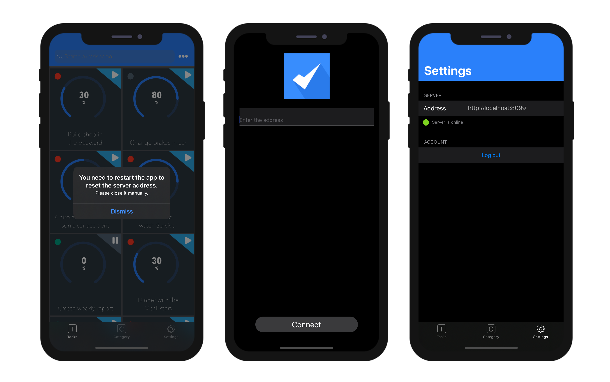

Cette page vous donne accès aux paramètres de publication de votre application et aux fonctionnalités mobiles spéciales :


## URL de production

URL du serveur Web sur lequel les applications mobiles se connecteront pour lire et écrire des données, dans un contexte de production. Vous pouvez saisir n'importe quelle adresse valide, par exemple :

```
https://my.wesbsite.com
http://my.website.com:9200
www.website.com/mobile
```

Pendant la phase de développement, vous pouvez laisser cette zone vide et définir la [Source de données](data.md) comme **Fichier de données courant**.

:::tip

L'utilisateur pourra [modifier l'url du serveur ](#modify-remote-url) à partir de l'appareil mobile.

:::


## Paramètres du serveur Web

Le bouton **Éditer...** ouvre la page **Web** de la boîte de dialogue des paramètres 4D. Utilisez cette page pour définir les paramètres suivants à intégrer dans l'application mobile :

- L'option **Activer HTTP** et **port HTTP**.
- **Enable HTTPS** option and **HTTPS port**.

:::note

Si HTTP et HTTPS sont tous les deux activés, HTTP est utilisé.

:::

L'activation du port HTTPS nécessite que vous ayez installé un [certificat TLS](https://developer.4d.com/docs/Admin/tls.html) valide. Vous pouvez créer des certificats d'essai avec 4D.

Ces paramètres ne sont pris en compte que si l'[URL de production](#production-url) est définie. Sinon, l'adresse IP locale est utilisée.

:::note

Le simulateur fonctionne toujours localement (127.0.0.1 ou localhost).

:::

## Aperçu sur l'appareil

### Écran de paramètres

Un écran de paramètres est disponible dans la barre d’onglets. Vous pouvez également le trouver sous l’onglet "More" si nécessaire (*à savoir*, votre application contient plus de quatre tables).

L'écran Paramètres vous permet de :

* Consultez votre URL distante ainsi que son état actuel
* De vous déconnecter (si vous étiez connecté en tant qu'utilisateur autorisé)


### Modifier l'url distant

Vous pouvez facilement mettre à jour votre URL distante à partir des Paramètres de l'iPhone :

* Accédez aux paramètres de votre iPhone
* Sélectionnez l'application pour laquelle vous souhaitez que l'URL distante soit mise à jour
* Activez l'option "Réinitialiser l'adresse du serveur"


* Puis redémarrez votre application pour réinitialiser l'adresse du serveur
* Enfin, définissez la nouvelle URL distante




## Authentication

A mobile application can require that the user be authenticated or not.

- When authentication is not enabled, mobile users navigate in the application in Guest mode.
- Once authentication is enabled, mobile users are asked to **login** before connecting to the application.

:::info

In any cases, when a mobile user connects to the server, a [user session](session-management) is created.

:::

### Authentication option

To enable authentication, check the **Authentication** option:


When this option is selected, a Login form will be displayed to the user at startup. A Default login form is automatically selected in the Login Form menu (see below).


### Authentication method


The **Create...**/**Edit...** button opens the [`On Mobile App Authentication`](../4d/on-mobile-app-authentication.md) database method in the 4D method editor. A default template code is provided, allowing all users to log as guests:

```4d
#DECLARE($request : Object)->$response : Object

/*
        $request = Informations provided by mobile application
        $response = Informations returned to mobile application
*/

$response:=New object

// Check user email
If ($request.email=Null)
    // No email means Guest mode - Allow connection
    $response.success:=True
Else 
    // Authenticated mode - Allow or not the connection according to email or other device property
    $response.success:=True
End if 

// Optional message to display on mobile App.
If ($response.success)
    $response.statusText:="You are successfully authenticated"
Else 
    $response.statusText:="Sorry, you are not authorized to use this application."
End if 

```

This method handles all incoming requests from the mobile apps and accepts or denies the connection. See the [On Mobile App Authentication](../4d/on-mobile-app-authentication) database method page for a full description of the method.

The most common and comfortable way to authenticate mobile users is to rely on email authentication. For a detailed example of email-based double authentication, please refer to [this tutorial](../tutorials/login-forms/email.md).

### Login Form

The Login Form menu proposes all login forms available in the project, so that you can select the form to use.  **Default** is a basic login form provided by the mobile editor. Its uses the user email as identifier.

You can also create or download [custom login forms](../tutorials/login-forms/custom-login-form). Once installed, custom login forms are listed in the Login Form pop up. You can either create or download custom login forms. Custom login forms can be downloaded from the [**Login form Github gallery**](https://4d-go-mobile.github.io/gallery//#/type/form-login).

A custom login form is associated to a `manifest.json` file and (optionally) Swift or Kotlin source code. The custom login form files must be stored into a subfolder at the following location:

```
myProject/Resources/Mobile/Form/Login/
```

The `manifest.json` file contains the following attributes:

| Property                    | Type               | Description                                      |
| --------------------------- | ------------------ | ------------------------------------------------ |
| "**name**"                  | text               | login form name                                  |
| "**type**"                  | text               | set to "login"                                   |
| Optional "**capabilities**" | object             | to add information or options according to needs |
| "**target**"                | text or collection | platform(s) supported by your login form         |


## Push notifications

This feature is documented in the [Push notifications](../special-features/push-notification.md) section.


## Deep Linking

This feature is documented in the [Deep linking](../special-features/deep-linking) section. 


