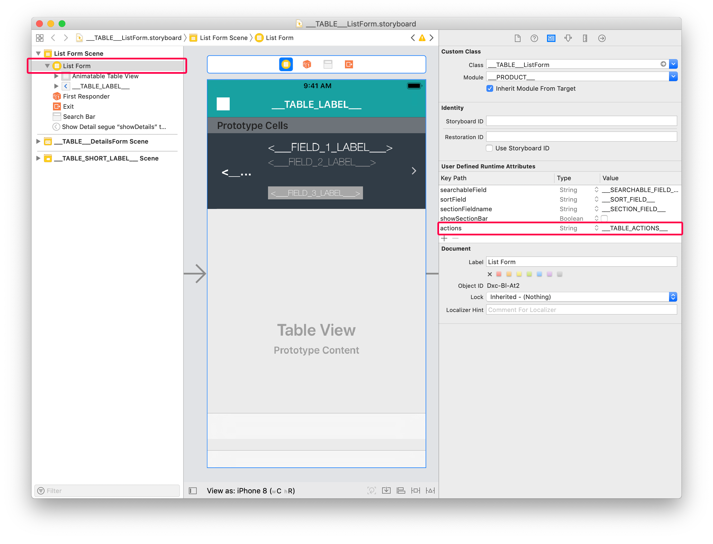

> **OBJECTIFS**
> 
> Ajouter des actions aux modèles de formulaires Liste et formulaires détaillés personnalisés.

> **CONDITIONS PRÉALABLES**
> 
> Cliquez `[here](prerequisites.html)` pour commencer !

Dans ce tutoriel, nous verrons qu'il est très simple d'**ajouter des actions aux modèles personnalisés**.

## ÉTAPE 1. Téléchargez le projet Starter

Pour commencer, téléchargez le **Projet Starter**, qui comprend :

* 2 modèles de formulaires Liste personnalisés (TasksList et TasksCollection)
* 1 modèle de formulaire détaillé personnalisé (TasksDetail)
* un fichier Tasks.4dbase

<a class="button button--primary"
href="https://github.com/4d-go-mobile/tutorial-AddingActionToTemplates/archive/1dc5aecfbea62a9999d571cb1a956f1ef6983111.zip">Download</a>

## ÉTAPE 2. Ajouter des formats personnalisés au projet 4D for iOS

Tout d'abord, déposez :

* les dossiers des modèles **TasksList** et **TasksCollection** dans le dossier *Tasks.4dbase/Resources/Mobile/form/list*

* les dossiers du modèle **TasksDetail** dans *Tasks.4dbase/Resources/Mobile/form/detail folder*

## ÉTAPE 3. Ajouter des actions dans les formulaires Liste

Deux types d'actions sont possibles :
* actions de table
* actions d'entité

D'abord, ouvrons le fichier `list/TasksList/Sources/Forms/Tables/___TABLE___/___TABLE___ListForm.Storyboard`.

### Ajouter des actions au modèle personnalisé TasksList

#### A. Ajouter un Tag d'action de table

Sélectionnez le **List form Controller** et ajoutez cette ligne dans le **User Defined Runtime Attributes** (Identity inspector) :

* Key Path: `actions`
* Type: `String`
* Value: `___TABLE_ACTIONS___`

#### B. Ajouter un Tag d'action d'entité

Sélectionnez la vue Animatable Table et ajoutez cette ligne dans le **User Defined Runtime Attributes** (Identity inspector) :

* Key Path: `actions`
* Type: `String`
* Value: `___ENTITY_ACTIONS___`

Votre modèle personnalisé est prêt à afficher les actions !

Vous pouvez sélectionner le modèle personnalisé TasksList depuis la **section Formulaires** et ajouter les champs suivants :

Ajoutons maintenant les tags d'actions au modèle personnalisé TasksCollection

### Ajouter des actions au modèle personnalisé TasksCollection

Pour ce faire, ouvrez le fichier `list/TasksCollection/Sources/Forms/Tables/___TABLE___/___TABLE___ListForm.Storyboard`.

#### A. Ajouter un Tag d'action de table

Le processus est quasiment identique à celui du modèle personnalisé TasksList.

Sélectionnez le **List form Controller** et ajoutez cette ligne dans le **User Defined Runtime Attributes** (Identity inspector) :

* Key Path: `actions`
* Type: `String`
* Value: `___TABLE_ACTIONS___`

#### B. Ajouter un Tag d'action d'entité

Pour les entités, la façon d'afficher les actions est assez différent de TableView : le glissement des actions n'est pas réellement adapté à CollectionViews.

Ainsi, avec les vues de collection, la meilleure façon d'afficher les actions est d'**appuyer longtemps** sur les cellules que avec lesquelles vous souhaitez intéragir.

Pour ce faire, sélectionnez la cellule collectionView et ajoutez cette ligne dans le **User Defined Runtime Attributes** (Identity inspector) :

* Key Path: `actions`
* Type: `String`
* Value: `___ENTITY_ACTIONS___`

Pour optimiser l'interaction, vous pouvez ajouter un effet scalaire avec un retour haptique qui ajoutera la ligne suivante dans le **User Defined Runtime Attributes** (Identity inspector) :

* Key Path: `touch.zoomScale`
* Type: `Number`
* Value: `0,96` (adapt the scale ratio depending on the result you want to get)

Vous pouvez sélectionner le modèle personnalisé TasksCollection depuis la **section Formulaires** et ajouter les champs suivants :

## ÉTAPE 4. Ajouter des actions dans les formulaires détaillés

Dans les formulaires détaillés, vous pouvez utiliser le **bouton générique** dans la barre de navigation ou **créer simplement votre bouton d'action personnalisé**. Dans les deux cas, vous devez ajouter des tags.

Pour le bouton générique intégré à la barre de navigation, sélectionnez le Controller et ajoutez cette ligne dans le **User Defined Runtime Attributes** (Identity inspector) :

* Key Path: `actions`
* Type: `String`
* Value: `___ENTITY_ACTIONS___`

In our tutorial, we want to build our own generic button. Pour ce faire, ouvrez le fichier Storyboard `detail/TasksDetail/Sources/Forms/Tables/___TABLE___/___TABLE___DetailsForm.storyboard`.

Ouvrez-le, sélectionnez le bouton situé en bas à droite et ajoutez cette ligne dans le **User Defined Runtime Attributes** (Identity inspector) :

* Key Path: `actions`
* Type: `String`
* Value: `___ENTITY_ACTIONS___`

Comme vous pouvez le constater, certains boutons visuels sont manquants dans le fichier Storyboard. Vous pouvez les retrouver dans le modèle du **dossier Resources**. Ils seront inclus au projet durant la phase de génération.

Par exemple, pour le **moreButton.imageset** :

Vous pouvez sélectionner le modèle personnalisé TasksDetail depuis la **section Formulaires** et ajouter les champs suivants :

Félicitations, votre application iOS Tasks est maintenant terminée et inclut des actions dans les formulaires Liste et les formulaires détaillés !

Téléchargez le projet final :

<a className="button button--primary"
href="https://github.com/4d-go-mobile/tutorial-AddingActionToTemplates/releases/latest/download/tutorial-AddingActionToTemplates.zip">Téléchargement</a>

