Now, let's do some storyboard modification ... from simple to complex.

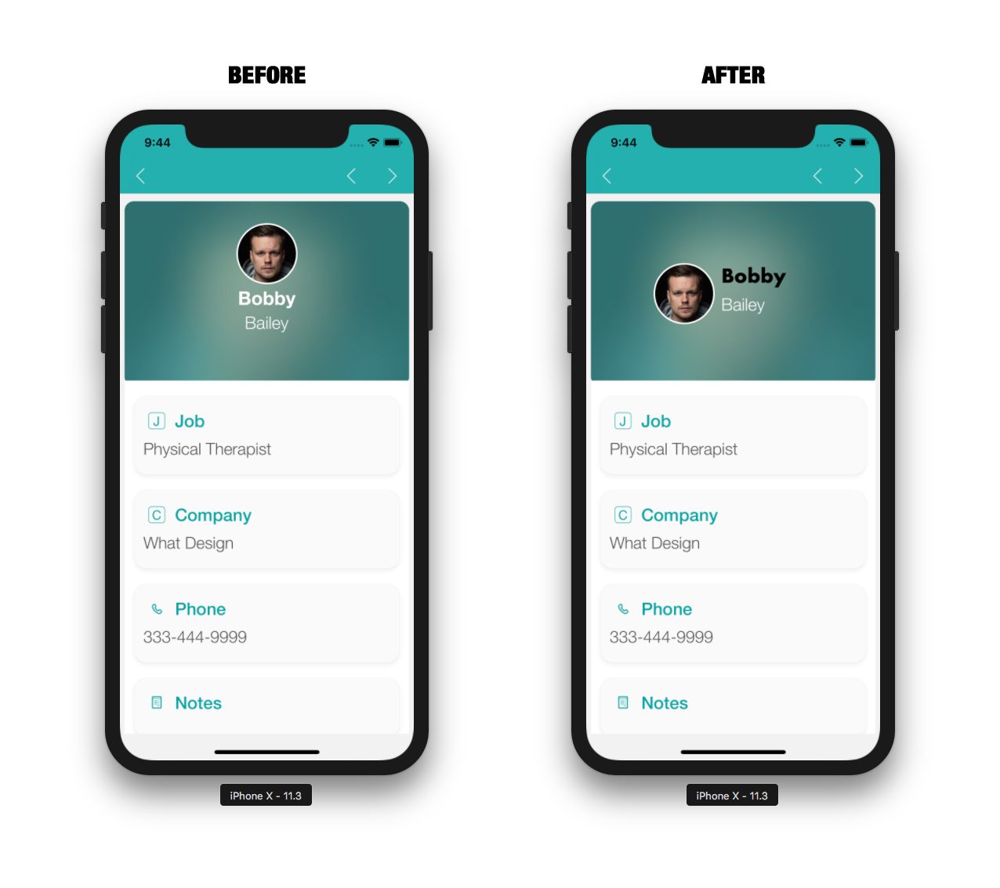

## ÉTAPE 1. Modification simple du libellé

Nous allons commencer par modifier la police et la couleur du libellé :

* Ouvrez le fichier *ContactDetailsForm.storyboard* à partir de l’onglet Navigation.
* Cliquez sur le libellé First Name (vous pouvez également le sélectionner depuis l'Interface Builder ou le volet de gauche).
* Sélectionnez le volet Attributes inspector (Inspecteur d'attributs) dans Utility area (la zone de fonctionnalités).

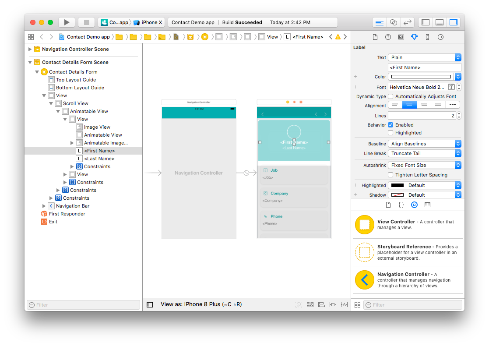

* Remplacez la police Helvetica Neue Bold par Futura Bold.

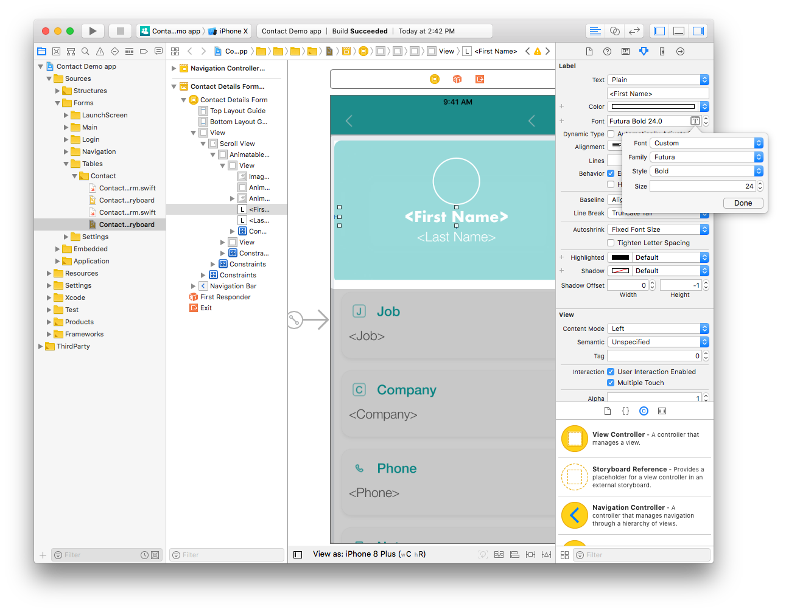

* Vous pouvez également modifier la couleur de la police dans le même volet.

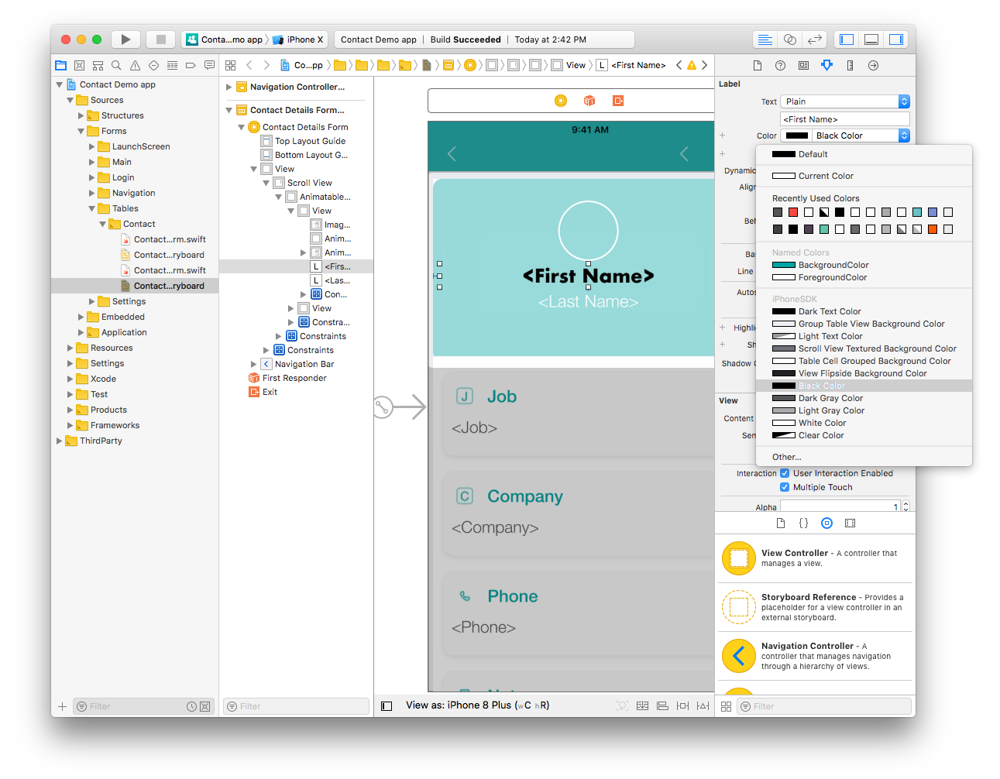

## ÉTAPE 2. Modification de la position de la photo de profil

Tous les modèles de 4D for iOS appliquent des contraintes aux éléments de l'application afin qu'ils s'affichent correctement sur tous les appareils.

Dans le fichier *ContactDetailsForm.storyboard*, les libellés Photo, First Name et Last Name sont actuellement centrés.

Nous allons apporter quelques modifications de façon à les afficher comme suit :

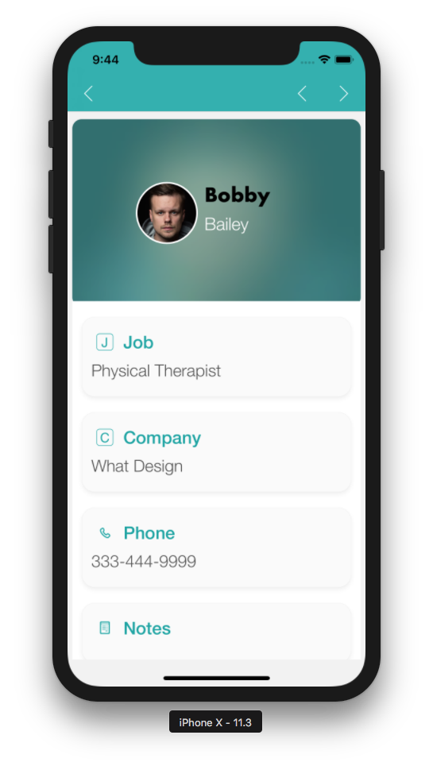

Tout d’abord, alignez l’image verticalement et faites glisser les libellés First Name et Last Name à droite de l’image.

Sélectionnez ensuite l’image et accédez au volet Size attributes (attributs des dimensions) depuis la Utility zone (la zone de fonctionnalités). Remplacez la valeur 161.67 de X par la valeur 40,67 et la valeur 28 de Y par la valeur 79.

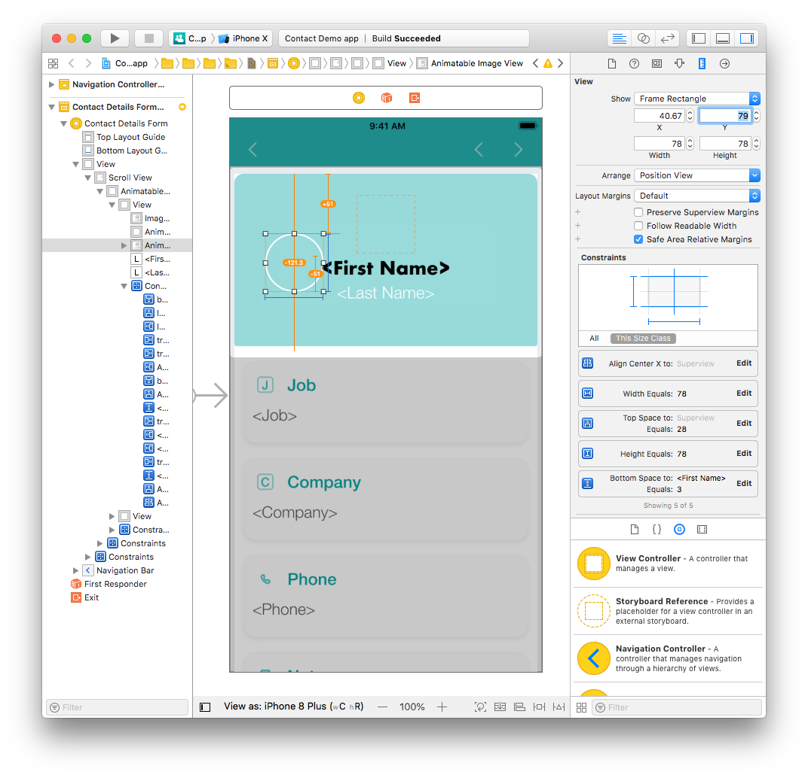

Comme vous pouvez le voir, la position a changé mais Xcode affiche des lignes jaunes. Pourquoi ? Ces lignes jaunes représentent des contraintes qui ne sont plus valables.

## ÉTAPE 3. Mise à jour des contraintes de la photo de profil

Pour aligner verticalement l’image au centre, dans le Superview (l’affichage qui contient l'image), nous devons supprimer les contraintes (Constraints) existantes et en ajouter de nouvelles.

L’image présente actuellement les contraintes suivantes :

* Width Equals : une largeur de 78 pixels.
* Height Equals : une hauteur de 78 pixels.
* Align Center X: Centers the image on a previously defined horizontal axis.
* Top Space : un espace allant de la partie supérieure de l'image à la partie supérieure de la vue.
* Bottom space to `<First Name>`: The previously defined space between the First Name label and the image.

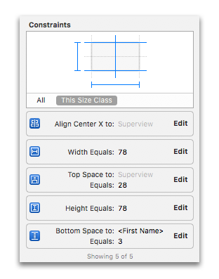

Supprimez toutes les contraintes à l'exception de Width et Height (vous devrez les modifier plus tard à partir du Size inspector (l'inspecteur de dimensions) dans la section "Constraints" consacrée aux contraintes). Le contour de l’image devrait maintenant être en rouge car les contraintes ne sont pas renseignées.

Cliquez sur le bouton Align (dans la partie inférieure de la fenêtre Interface Builder) et cochez la case **Vertically in Container**.

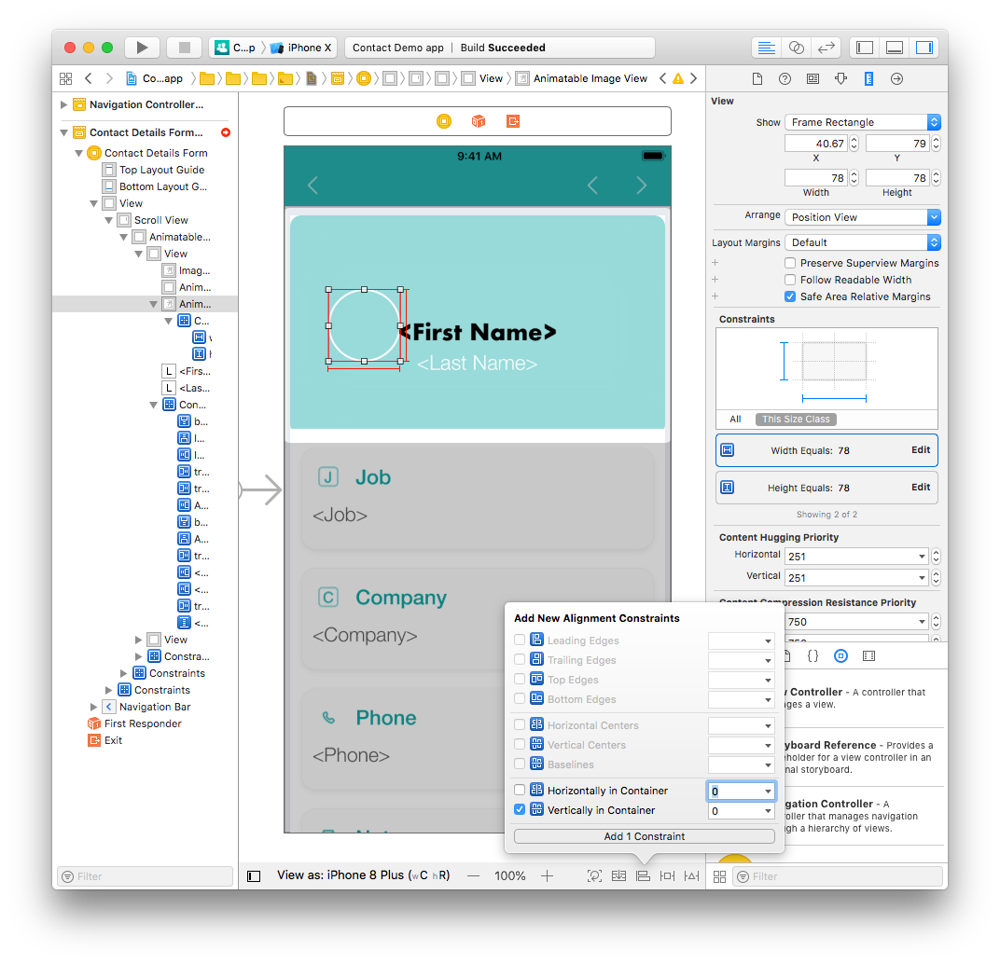

Cliquez ensuite sur le bouton **Add New Constraints** et ajoutez une contrainte de leading space (la contrainte de gauche).

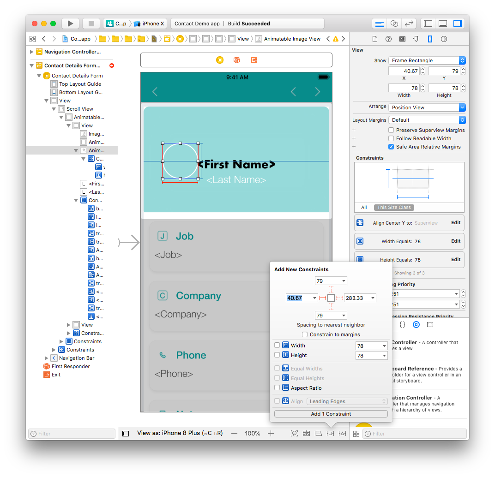

À ce stade, toutes les contraintes de photo de profil doivent être en bleu.

Félicitations ! Votre photo de profil est maintenant bien placée et respecte les contraintes définies.

> **ASTUCES**
> 
> * To create a constraint between two views, press Ctrl and drag one of the views to the other. Lorsque vous relâchez le bouton de la souris, l’Interface Builder affiche un menu avec une liste de contraintes éventuelles.
> 
> * You can delete constraints by either selecting them from the Size inspector or from the Interface Builder.

## ÉTAPE 4. Mise à jour de l'emplacement et des contraintes des libellés

#### Nous allons nous pencher sur le libellé First Name.

Nous allons commencer par modifier la position et la largeur :

* Sélectionnez le premier libellé First Name à partir de l'Interface Builder.
* Remplacez ensuite la valeur 386 pixels de la largeur par 267 pixels.
* Remplacez la valeur 8 pixels de X par 40,67 pixels et la valeur 28 pixels de Y par 79 pixels.

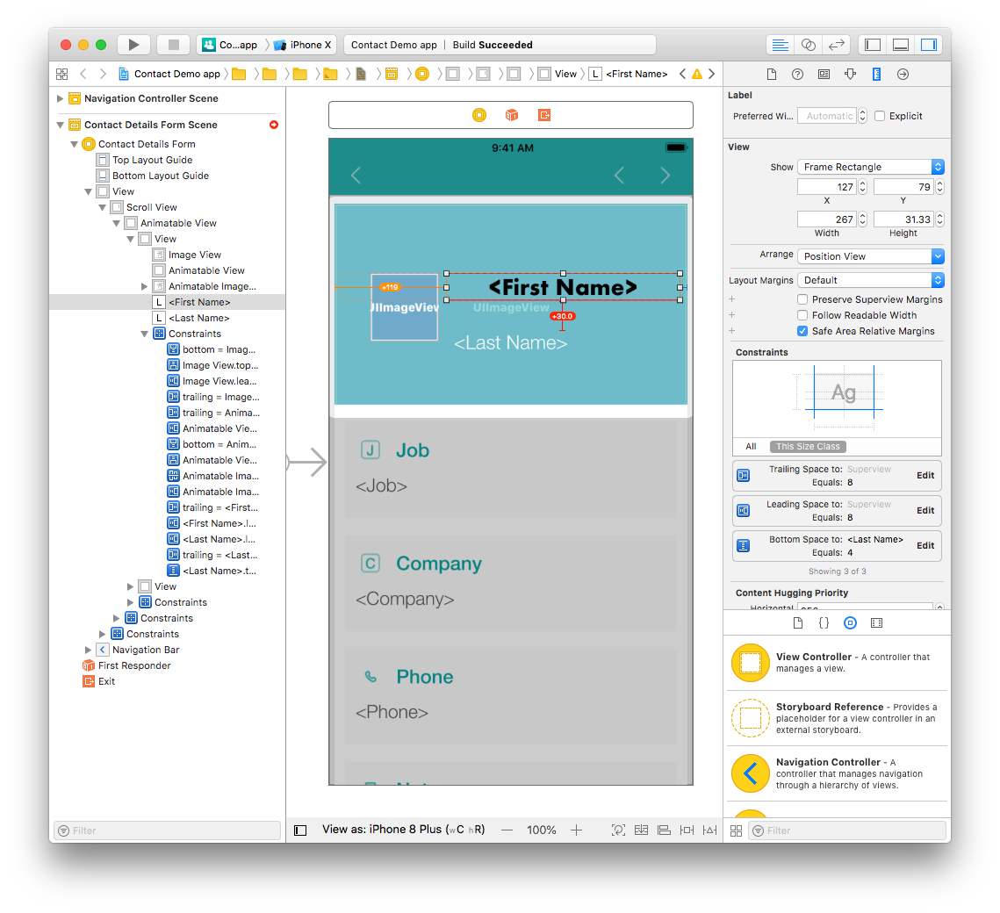

Modifiez les contraintes restantes :

* Supprimez les contraintes de leading space et de bottom space à partir du Size inspector.
* Ajoutez une contrainte de leading space en cliquant sur le bouton **Add New Constraints** pour placer le libellé First Name à droite de la photo de profil.
* Appuyez sur la touche Ctrl et faites glisser le libellé First Name vers la photo de profil. Sélectionnez la contrainte supérieure dans le menu pour aligner les deux éléments vers le haut.

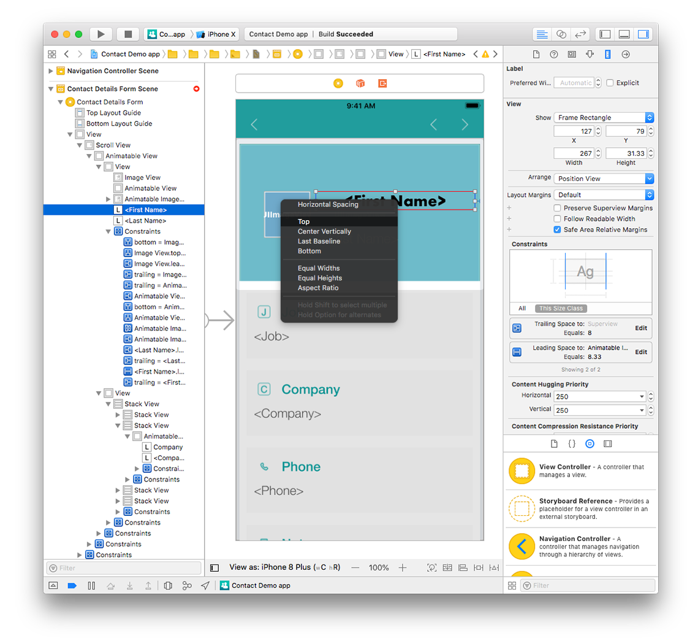

#### Pour finir, concentrons-nous sur le libellé Last Name.

Modifiez l'emplacement et la largeur :

* Sélectionnez le premier libellé Last Name à partir de l'Interface Buider
* Remplacez la valeur 386 pixels de la largeur par 267 pixels.
* Remplacez la valeur 8 pixels de X par 127 pixels et la valeur 144.33 pixels de Y par 118.33 pixels.

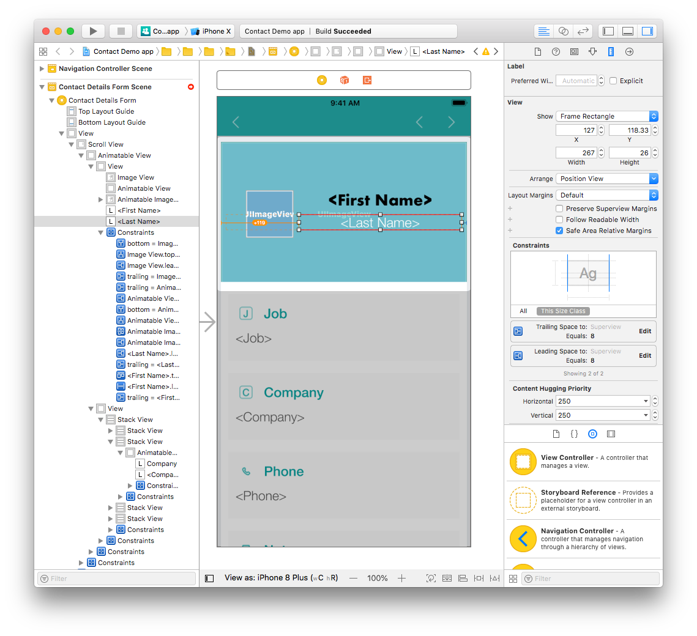

Modifiez les contraintes restantes :

* Supprimez les contraintes de leading space à partir du Size inspector.
* Ajoutez des contraintes d'espace principal et d'espace supérieur en cliquant sur le bouton Add New Constraints.

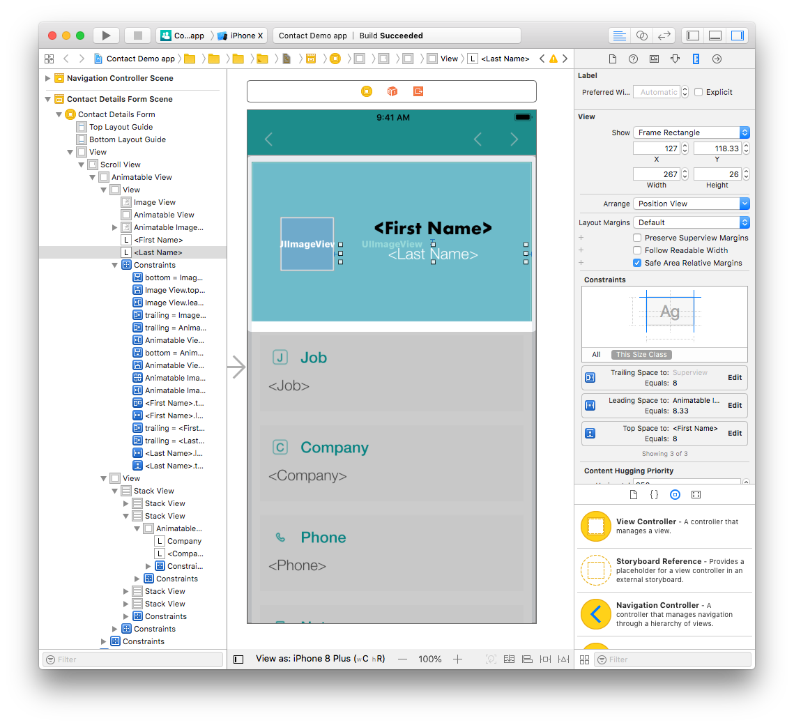

Vos deux libellés sont maintenant repositionnés.

Voyons les résultats dans le simulateur !

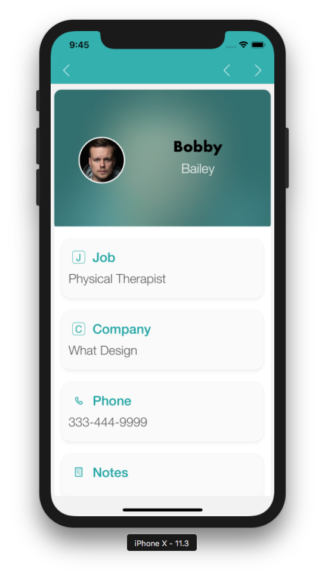

Hum... Cela ne correspond pas exactement à ce que nous souhaitions.

* Sélectionnez les libellés First Name et Last Name et remplacez l'alignement centré par un alignement à gauche dans l'Attributes inspector.

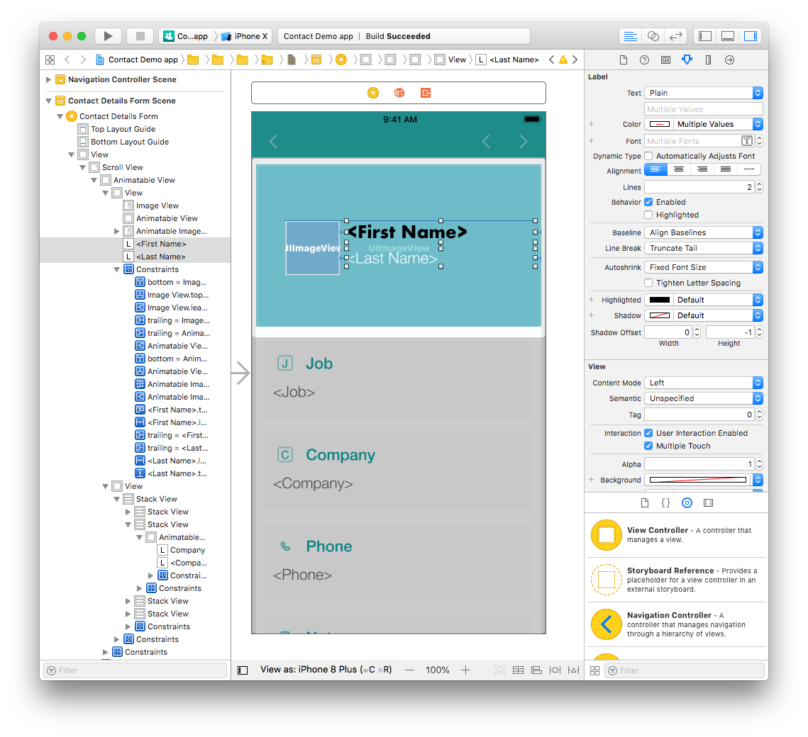

* Sélectionnez ensuite la photo de profil et double-cliquez sur la contrainte de leading space.
* Remplacez la valeur 40.67 pixels de la constante par la valeur 80 pixels.

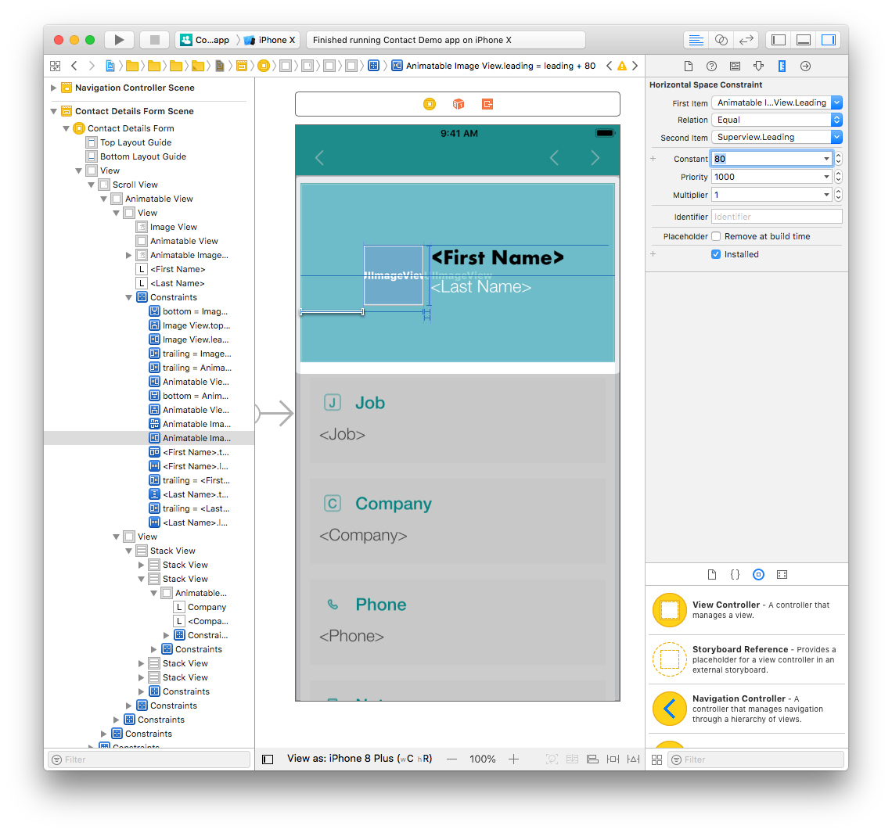

C'est beaucoup mieux ! Désormais, toutes les contraintes sont appliquées et les libellés sont conformes aux autres contraintes.

Comme vous avez pu le voir, la personnalisation de votre application est très simple !
