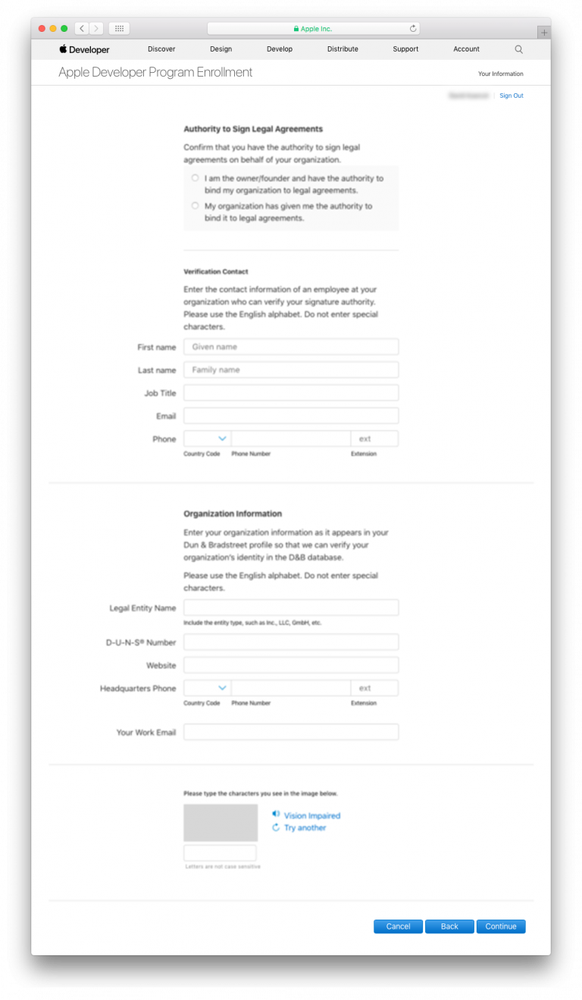
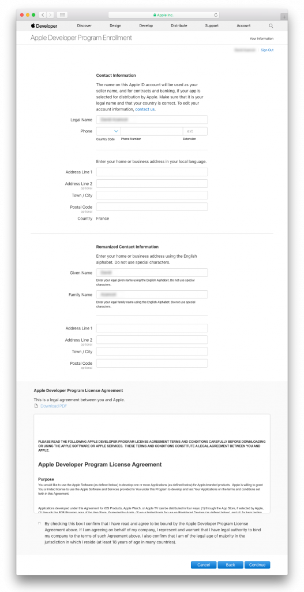

> **OBJECTIFS**
> 
> Choose the appropriate Apple Developer Program.

Pour **distribuer une application iOS**, votre compte Apple Developer doit être valide. Apple propose deux programmes de développement :

* **[Apple Developer Program](https://developer.apple.com/programs/)** **for organization** or **for individual** – $99/year
* **[Apple Enterprise Developer Program](https://developer.apple.com/programs/enterprise/)** – $299/year

Les différences majeures entre les deux programmes sont :

* **Apple Developer Program (pour les entreprises ou pour les particuliers)** vous permet de distribuer une ou plusieurs applications **sur l'App Store**.

* **Apple Developer Enterprise Program** fournit UNIQUEMENT aux employés d'une entreprise les ressources nécessaires pour le développement et la distribution d'**applications propriétaires ou internes**.

For **test purposes** you can use a Free Apple Developer Program.

Voici un tableau comparatif des différentes catégories d’adhésion en tant que développeur :

:::info

To enroll in any **Apple Developer Program**, your Apple ID must be associated with an email address using your organization’s domain name.

:::

:::info Free Apple Developer account

If you want to join the Apple Developer Program for free, you can create a free Apple ID and use it to access a limited set of developer-oriented privileges. Therefore, follow only Steps 1 and 2, then launch Xcode > Preferences > Accounts, Add your Apple ID and sign in ! :::

## ÉTAPE 1. Identifiant Apple

Si vous n’avez pas d'identifiant Apple, passez à l'[Étape 2](#step-2-create-your-apple-id).

Si vous possédez déjà un identifiant Apple, passez à l'[Étape 3](#step-3.-d-u-n-s-number).

## ÉTAPE 2. Créez votre identifiant Apple

Cliquez sur la [page de création de l'identifiant Apple](https://appleid.apple.com/).

* Remplissez le formulaire et répondez aux questions de sécurité.
* Vous recevrez un code de vérification par e-mail.
* Entrez le code de vérification pour valider la création de votre compte.

* Une fois que vous obtenez votre identifiant Apple, passez à l’Étape 3.

## ÉTAPE 3. Numéro D-U-N-S

:::info

This step is not included for the **Apple Developer Program as an individual**.

:::

* Si vous n’avez pas de numéro D-U-N-S, passez à l'[Étape 4](#step-4-request-a-d-u-n-s-number).
* Si vous possédez déjà un numéro D-U-N-S, passez à l'[Étape 5](#step-5-register-as-a-developer).

## ÉTAPE 4. Demandez un numéro D-U-N-S

:::info

This step is not included for the **Apple Developer Program as an individual**.

:::

Demandez [ici](https://developer.apple.com/enroll/duns-lookup/#/search) un numéro D-U-N-S

* Remplissez le formulaire.
* Cliquez sur **Continue**.
* Vérifiez votre e-mail pour obtenir le numéro D-U-N-S.

## STEP 5. Register

### Apple Developer Entreprise and Apple Developer as an organisation

Vous pouvez souscrire [ici](https://developer.apple.com/programs/enterprise/enroll/) en tant que développeur.

* Cliquez sur le bouton **Start your Enrollment**.
* Lisez et acceptez les termes du contrat "Apple Developer Agreement".
* Click **Submit**.

### Apple Developer as an individual

* Vous pouvez souscrire [ici](https://developer.apple.com/account/) en tant que développeur .

* Lisez et acceptez les termes du contrat "Apple Developer Agreement".
* Click **Submit**.

## ÉTAPE 6. Join

:::info

This step is not included for the **Apple Developer Enterprise Program**.

:::

### Apple Developer Program as an Organisation

* Vous pouvez souscrire [ici](https://developer.apple.com/enroll/enterprise/) à l'Apple Developer Program.

### the Apple Developer Program as an Individual

* Cliquez sur **Join the Apple Developer Program** au bas de la page.

## ÉTAPE 7. Enroll

### Apple Developer Program as an Organisation

* Cliquez sur le bouton **Start your Enrollment**.
* Select **Company / Organization** from the Entity Type dropdown list.
* Cliquez sur **Continue**.

* Remplissez le formulaire.
* Cliquez sur **Continue**.

* Apple procède à une vérification interne qui peut prendre habituellement jusqu'à six jours ouvrables. Une fois la demande d’inscription reçue, Apple s'assure que vous êtes habilité à lier votre organisation aux accords juridiques de l'Apple Developer Program.
* Généralement, Apple vous appelle pour vérifier que le contact principal existe et que ce dernier a demandé à souscrire à l'Apple Developer Enterprise Program.
* Vous recevrez ensuite un autre e-mail vous invitant à finaliser la souscription.

### Apple Developer Program pour les particuliers

* Cliquez sur le bouton **Start your Enrollment**.
* Sélectionnez **Individuals / Sole Proprietor / Single Person Business** dans la liste déroulante "Entity Type".
* Cliquez sur **Continue**.

* Remplissez le formulaire
* Lisez et acceptez les termes du contrat de licence "Apple Developer Program License Agreement".
* Cliquez sur **Continue**.

### Apple Developer Enterprise Program

* Vous pouvez souscrire [ici](https://developer.apple.com/enroll/enterprise/) à l'Apple Developer Enterprise Program.
* Cliquez sur le bouton **Start your Enrollment**.
* Select **Company / Organization** from the Entity Type dropdown list.
* Cliquez sur **Continue**.

* Remplissez le formulaire.
* Cliquez sur **Continue**.

## ÉTAPE 8. Vérification d’Apple

:::info

This step is  included only for the **Apple Developer Enterprise Program**.

:::

* Apple procède à une vérification interne qui peut prendre habituellement jusqu'à six jours ouvrables. Une fois la demande d’inscription reçue, Apple s'assure que vous êtes habilité à lier votre organisation aux accords juridiques de l'Apple Developer Program.
* Généralement, Apple vous appelle pour vérifier que le contact principal existe et que ce dernier a demandé à souscrire à l'Apple Developer Enterprise Program.
* Vous recevrez ensuite un autre e-mail vous invitant à finaliser la souscription.

## ÉTAPE 9. Finalisez votre souscription

* Une fois que votre demande de souscription est acceptée, vous pouvez procéder au paiement.

* Lorsque vous aurez finalisé votre achat, vous recevrez un e-mail de confirmation de votre adhésion au programme.

Félicitations ! You are now ready to deploy and publish your applications!

