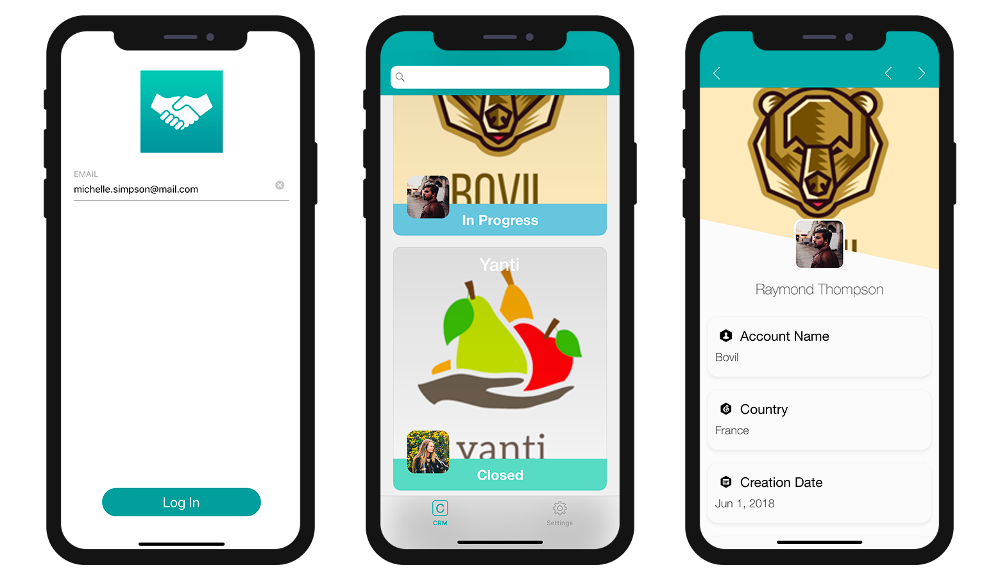

For the moment, if you build the Starter project app and enter "michelle.simpson@mail.com" as the login email (one of the account managers), you'll see **all manager contracts and statuses** (*Closed* and *In Progress*).

Comme indiqué précédemment, nous souhaiterions que les chargés de clientèle puissent consulter leurs contrats *en cours* (In progress) en se connectant à leur application mobile via leur e-mail. Pour ce faire :

* Accédez à la **section "Données"**
* Faites un clic droit dans le champ **filtre de recherche** pour faire apparaitre les **boutons Champs, Comparateurs et Opérateurs**.
* Cliquez sur le bouton **Champs** et sélectionnez **Status**.
* Cliquez sur le bouton **Comparateurs** et sélectionnez **Égal à**.
* Si vous souhaitez afficher les contrats *ouverts*, tapez **In progress**
* N’oubliez pas de valider votre recherche en cliquant sur le bouton **Valider**, sinon vous ne pourrez pas créer votre application.

Vous devriez avoir ce résultat :

> **NOTE**
> 
> * A **filter** icon is displayed at the right of each table when a basic filter is applied to it.
> * For these kinds of filter queries, you can choose to embed data into the app or to load the data after login by checking the **Embed data into the built application** checkbox.
> * Size will be calculated at the first build for you to visualize the **size of your data**.

Si vous générez votre application et que vous tapez « michelle.simpson@mail.com » comme étant l’e-mail de connexion, vous verrez que tous les contrats *In Progress* s’affichent dans le simulateur !

Cela ne correspond pas tout à fait à ce que nous avions prévu ! Nous ne souhaitons maintenant que seuls les contrats *In Progress* de chaque chargé de clientèle soient visualisés. Finalisons donc notre recherche !

