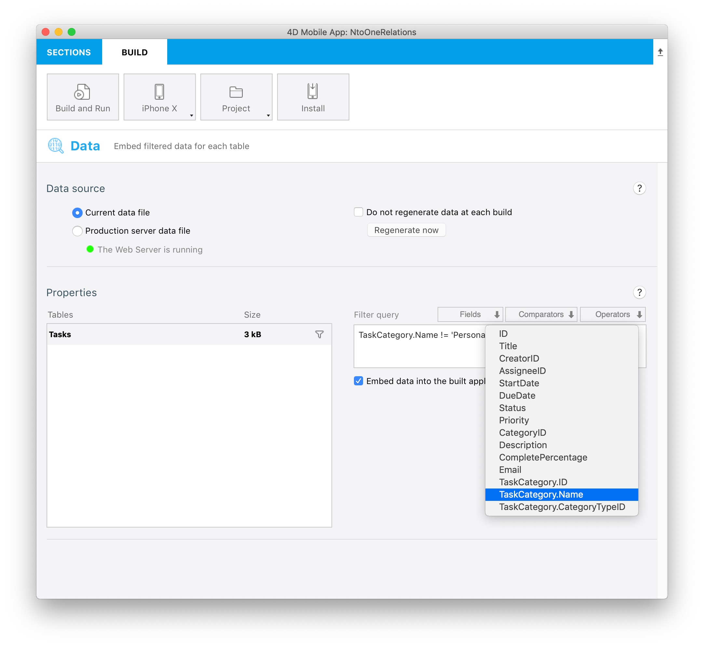

This tutorial will show you how easy it can be to include Many to one relations in your mobile projects.

:::note

In this tutorial, we will use the relation names between your tables. Giving descriptive relation names can make your project structure definition easier.

:::

Let's get started by downloading the Starter project:

<a className="button button--primary" href="https://github.com/4d-go-mobile/tutorial-ManyToOneRelations/releases/latest/download/tutorial-ManyToOneRelations.zip">Starter project</a>

Here we want to display the category for each task in the detail form of your generated app. To do so, open the **StarteriOSProject** from **Open > Mobile Project...**

Then go right to your Structure section and select the **Task table**.

### Structure section

* Vous pouvez constater que le **lien TaskCategory** est souligné

* En cliquant dessus, vous afficherez les champs disponibles à travers ce lien

* Sélectionnez le **champ Name**

* Ce champ aura le même fonctionnement que n’importe quel autre champ pour la suite de la création de l’application

* You can also filter your app content using related fields from the Data section. To do so enter `TaskCategory.Name != 'Personal'` in the Filter query field to exclude personal tasks.

 

* Vous pouvez ensuite sélectionner une **icône** et des **formats** et définir des **libellés courts et longs** dans la section Libellés et icônes

* Cliquez sur la section Formulaires et faites glisser le champ dans le formulaire détaillé Tasks

* Build and Run

You should see your related field in your app detail form !

