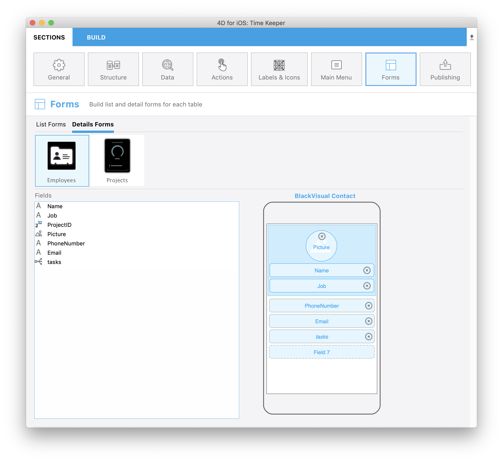
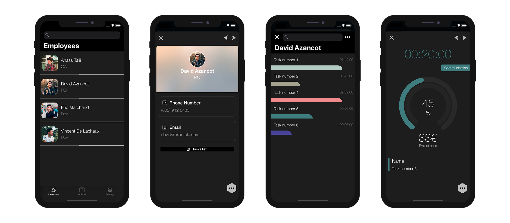

This tutorial will show you how easy it can be to include One to Many relations in your mobile project.

Let's get started by downloading the Starter project:

<a className="button button--primary"
href="https://github.com/4d-go-mobile/tutorial-OneToManyRelations/archive/c006015afeb0e134d872152f53b8cd5e4dcb59bb.zip">Starter project</a>

Dans ce tutoriel, nous allons créer une **application Task** à l'aide de 4D for iOS.

Mais d'abord, jetons un œil à la structure de notre base :

Vous remarquerez qu'il existe un lien 1 vers N nommé **tasks** qui utilisera une application iOS pour afficher les tâches (**vers N**) des employés (**1**).

Now, go straight to Open menu > Mobile project... to select *Time Keeper* and go to the **Structure section**.

## Structure section

Vous voyez ici le lien **tasks** que nous avons créé précédemment... Vous pouvez le publier !

Il aura le même fonctionnement que n’importe quel autre champ pour la suite de la création de l’application.

:::tip

On mouse over, a tip displays the table name originating the relation.

:::

## Labels & Icons section

The One to Many relation is now available in the **Labels and Icons** section.

It is important to know that including a One to Many relation will create a button into the genrated iOS app.

So, in the Labels & Icons section you will define:

* un libellé de bouton
* une icône de bouton
* a title that will be displayed in the destination view (to indicate where you come from for example).

## Forms section

* Cliquez sur la section Formulaires et déposez le lien *tasks* dans le formulaire détaillé Employee Task.

## Build and Run

1. A partir du formulaire Lise Employee, cliquez sur un employé
2. Cela permettra d'ouvrir le formulaire détaillé des employés, où vous devriez voir apparaître un nouveau **bouton Relation** !
3. Cliquez sur ce bouton Relation pour afficher les tâches de l'employé.

Well done! You've successfully included One to Many relations in your mobile project.

Téléchargez le projet final :

<a className="button button--primary"
href="https://github.com/4d-go-mobile/tutorial-OneToManyRelations/releases/latest/download/tutorial-OneToManyRelations.zip">Download</a>

