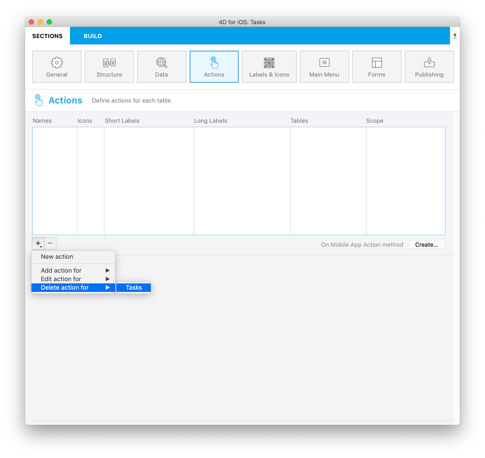
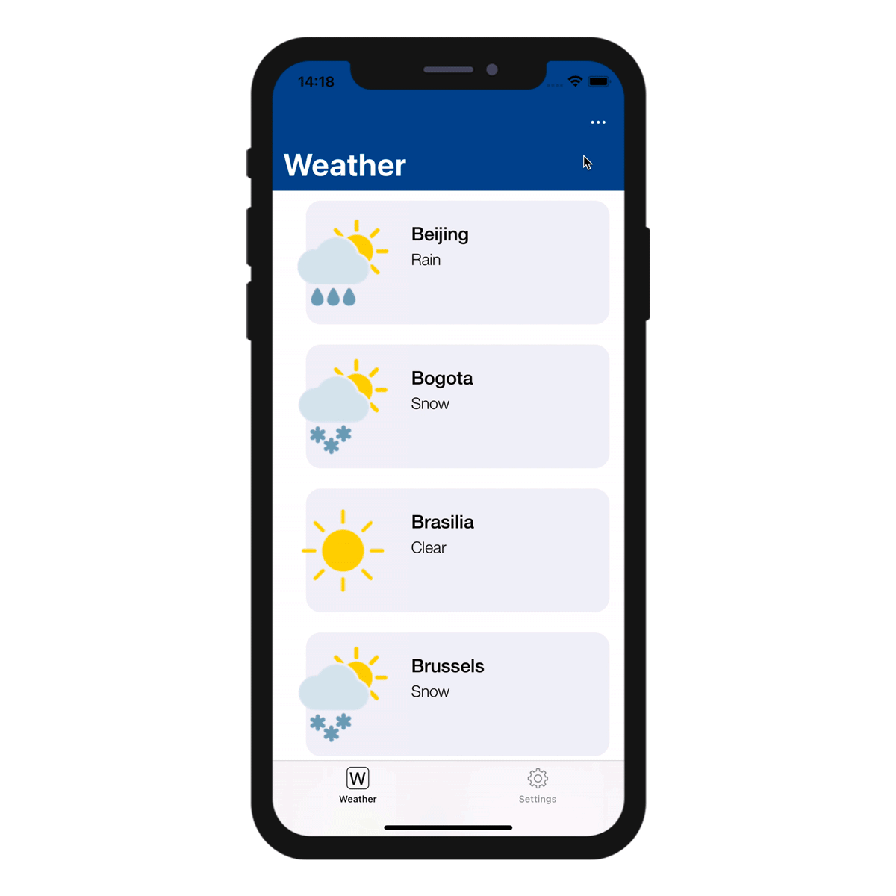

Cette section vous permet :

* de créer des actions permettant d'exécuter du code 4D à partir de votre application iOS.
* de définir et d'ajouter des paramètres à vos actions.

:::info 4D for Android

This section is currently not available in 4D for Android.

:::

## Éditeur de projet

### Créez votre application

Vous pouvez créer de nouvelles actions en cliquant sur le bouton +, situé en-dessous du tableau d'Actions. Une nouvelle ligne apparaîtra alors dans le tableau.

Vous définirez ensuite les éléments suivants :

* **Noms :** Définissez le nom de l'action à utiliser dans la méthode base [Sur une action app mobile](https://developer.4d.com/4d-for-ios/docs/en/actions.html#on-mobile-app-action) pour lancer votre code 4D.
* **Icônes :** Sélectionnez une icône pour votre action à partir de la librairie d'icônes. Vous pouvez également ajouter votre propre icône à l'aide de ce [tutorial]`(using-icons.html)`.
* **Libellés long et court :** Définissez les libellés correspondant aux actions que vous souhaitez afficher dans votre application.
* **Table :** Sélectionnez la table à laquelle vous souhaitez appliquer une action.
* **Portée :** Choisissez d'appliquer l'action à une **entité** ou à une **table**.


### Ajoutez des paramètres à votre action

Vous pouvez ajouter des **paramètres d'action** et **éditer** des données directement depuis votre application.

Pour chaque paramètre, vous pouvez éditer les propriétés suivantes :

* Le nom
* Le libellé long
* Le libellé court
* Format
* Les contraintes (définir des valeurs minimales ou maximales)
* Le placeholder
* La définition d'un champ obligatoire
* La valeur par défaut


Vous êtes libres de choisir l'ordre des paramètres à l'aide du glisser-déposer.

Voici les différents **formats** que vous pouvez sélectionner en tant que paramètre :

<table>

<tr>
<th colspan="2"  style={{textAlign: 'center'}}>TEXTE</th>
</tr><tr style={{textAlign: 'center'}}>
<th>Format</th><th>Description</th>
</tr><tr>
<td>Texte</td><td>Première lettre de la chaîne en majuscule</td>
</tr><tr>
<td>Adresse mail</td><td>Clavier iOS optimisé pour la saisie de l'e-mail</td>
</tr><tr>
<td>Numéro de téléphone</td><td>Clavier iOS pour la saisie des numéros de téléphone.</td>
</tr><tr>
<td>Compte</td><td>Clavier iOS optimisé pour la saisie du nom d'utilisateur</td>
</tr><tr>
<td>Mot de passe</td><td>Clavier optimisé pour la gestion des mots de passe</td>
</tr><tr>
<td>URL</td><td>Clavier iOS optimisé pour la saisie de l'URL</td>
</tr><tr>
<td>Code postal</td><td>Clavier iOS optimisé pour la saisie du code postal</td>
</tr><tr>
<td>Zone de texte</td><td>Inclut plusieurs lignes de texte dans un même champ</td>
</tr><tr>
<td>Code barres</td><td>Extraire la valeur associée au code-barres. Formats pris en charge : EAN8, EAN13, Code 39, Code 93, Code 128, QR Code, UPC, PDF417</td>
</tr>
<tr>
<td colspan="2"></td>
</tr>

<tr>
<th colspan="2" style={{textAlign: 'center'}}>NUMERIQUE</th>
</tr><tr style={{textAlign: 'center'}}>
<th>Format</th><th>Description</th>
</tr><tr>
<td>Numérique</td><td>Nombres avec décimales</td>
</tr><tr>
<td>Entier</td><td>Nombres sans décimales</td>
</tr><tr>
<td>Scientifique</td><td>Notation scientifique</td>
</tr><tr>
<td>Pourcentage</td><td>Notation en pourcentage</td>
</tr><tr>
<td>Nombre en lettres</td><td>Convertit les nombres en chaînes</td>
</tr>
<tr>
<td colspan="2"></td>
</tr>

<tr>
<th colspan="2" style={{textAlign: 'center'}}>DATE</th>
</tr><tr style={{textAlign: 'center'}}>
<th>Format</th><th>Description</th>
</tr><tr>
<td>Date</td><td>Nov 23, 1937</td>
</tr><tr>
<td>Date courte</td><td> 11/23/37</td>
</tr><tr>
<td>Date longue</td><td>November 23, 1937</td>
</tr><tr>
<td>Date complète</td><td>Tuesday, November 23, 1937</td>
</tr><tr>
<td colspan="2"></td>
</tr>

<tr>
<th colspan="2" style={{textAlign: 'center'}}>HEURE</th>
</tr><tr style={{textAlign: 'center'}}>
<th>Format</th><th>Description</th>
</tr><tr>
<td>Heure</td><td>3:30 PM</td>
</tr><tr>
<td>Durée</td><td>2 hours 30 minutes</td>
</tr>
<tr>
<td colspan="2"></td>
</tr>

<tr>
<th colspan="2" style={{textAlign: 'center'}}>BOOLÉEN</th>
</tr><tr style={{textAlign: 'center'}}>
<th>Format</th><th>Description</th>
</tr><tr>
<td>Booléen</td><td></td>
</tr><tr>
<td>Coche</td><td></td>
</tr>

<tr>
<td colspan="2"></td>
</tr>
<tr>
<th colspan="2" style={{textAlign: 'center'}}>IMAGES</th>
</tr>
<tr>
<td>Signature</td><td>Permet d'effectuer une signature avec le doigt</td>
</tr>

</table>

## Actions prédéfinies

Les projets 4D mobile comprennent trois actions (prédéfinies) pour gérer le contenu de votre application :

* Editer
* Ajouter
* Supprimer
* Partager
* Trier

### Ajouter

Les projets 4D mobile simplifient la création des **actions d'ajout**.

Vous n'avez qu'à sélectionner l'option **Action d'ajout pour**, accessible à partir du **bouton +**, situé en-dessous de la table Actions.


Puis, **sélectionnez la table** que vous souhaitez associer à l'action d'ajout.

Cela **créera automatiquement** tous les paramètres dans l'éditeur de projets et vous permettra de modifier chaque valeur d'un champ.

Pour ce genre d'actions, vous constaterez que toutes les **propriétés** sont déjà saisies à des fins pratiques, à droite de la liste de paramètres.


### Editer

La création des **actions d'édition** suit le même principe que les actions d'ajout, à l'exception du fait que vous ne serez pas en mesure de définir des valeurs par défaut à partir de la section Actions.


### Supprimer

La création des **actions de suppression** suit le même principe que les actions d'édition. La seule différence est que cette action vous permet de supprimer une entité.

Pour créer une action de suppression, sélectionnez l'option **Supprimer l'action pour**, accessible à partir du **bouton +** en-dessous du tableau d'actions.

Ce type d'actions doit être utilisé avec précaution.



### Partager

Sélectionner l'**action Partager** permettra à vos utilisateurs de partager du contenu avec d'autres utilisateurs. You just need to select the scope:

- **entity**: to share content from a detail form
- **table**: to share a list form

See the [Deep Linking](../special-features/deep-linking.md) page for more details.

### Sort action

**Sort actions** are useful to:

- define a default sort order for the table list forms
- allow your mobile users to choose a list sort order

When you create a sort action for a table, you need to select the first field on which the sort will be done:


The field is added to the Sort Criteria list. An ascending sort order is set by default, but you can change it using the **Sort order** menu.

You can sort entities in more than one field. Each field you sort is referred to as a sort level. For example, the results of a two-level ascending sort of the `lastName` and `firstName` fields would produce a list such as this:

```4d
Aardvark, Anthony
Aardvark, Artemis
Aardvark, Arthur
...
Zygote, Elena
Zymosian, Elmer
```

To add one or more sort level(s) in the Sort Criteria list, select the **+** button under the list and configure each level:


#### Sort order menu on the mobile app

When you define more than one sort action for a table, mobile users automatically benefit from a **sort** menu. It contains all the predefined sort actions:




> When only one sort action is defined for a table, the **sort** menu is not displayed on the mobile app side.

### On Mobile App Action

The [On Mobile App Action]`(https://livedoc.4d.com/4D-Language-Reference-17-R5/Database-Methods/On-Mobile-App-Action-database-method.301-4286697.en.html)` database method is available to call all of your 4D methods.

After creating all of your actions, just click on the Create button from the Actions table to automatically generate a *Case of* code block that includes all your action names in the *On Mobile App Action* method.

:::note notes

- You can refresh the selection after executing an action using `$out.dataSynchro:=True`.
- You can notify the app user when action has been executed using `$out.statusText:="Message you want to display"`.
- You can also decide to force close the Edition form using `$out.close:=True`.

:::

## Offline mode actions

The user of an app can draft, store and queue action requests, even if he’s working offline (adding a customer's phone number, uploading a picture, printing an invoice or a quote, deleting an address, etc.).  All these tasks are placed in the Pending actions list until the network is accessible. Once the user is online, all pending actions are consistently synchronized, executed and then visible in the Completed actions list.

Pending tasks can be visualized and opened from:

•   *The Settings screen*

It displays a summary and a history of all pending and completed tasks.


•   *The List & Detail forms*

They display all the tasks related to the table or to the entity that you are currently viewing.


:::note notes

- The "Share" predefined action is only executable online
- Actions are editable while pending, but they can no longer be modified once they switch to the "Completed" mode.

:::

### Update pending tasks that failed

Due to your server business logic, some tasks could be rejected. For mobile users, it is then possible to edit and to retry sending the relevant pending tasks. To do so, you can display a status text describing, in the "Complete" actions history, the reason of the failure. For example, you can reject an action sent by a mobile user to the server and inform him that the operation has failed. In that case, you can set the `success` value to `False` and provide a message in `statusText`, as follows:

 ```4d
 $response:=New object("success"; False; "statusText"; "Operation failed"))
 ```
 You can even add some errors by action parameters for the `alphaField` parameter, for example:

  ```4d
$response.errors:=New collection(New object("parameter"; "alphaField"; "message"; "Alpha field must contains a valide value")
  ```


## iOS app Side

In your iOS app, actions are available in different ways in your List and Detail forms, depending on the templates you select in the Forms section.

### Table List forms

* **Entity action:** Swipe left on a cell to display the available actions in a List form. A "More" button is displayed if you've defined more than three actions per entity.


* **Table actions:** A generic actions button is available in the navigation bar to display a list of available table actions.


:::tip

Actions will be displayed in the same order as defined in the Action section.

:::

### Collection List forms

* **Entity action:** Depending on the template, actions are displayed by clicking on a generic button or by maintaing the pressure on a cell.


* **Table actions:** Like the Table List forms, a generic Actions button is available in the navigation bar to display a list of availble table actions.


### Detail forms

As with Table actions in List forms, a generic Actions button is available in the navigation bar to display all your entity actions in a list.


### Edition forms

If you have created an Edit or an Add action, as soon as you select it from the action list, an **Edition form** will appear.


From here, you can:

* edit all of your fields by selecting them, and
* validate or cancel your modifications using the **Done** or **Cancel** buttons (available in the navigation bar).

For your convenience, the Edition form includes a few **special features**:

* The keyboard type depends on the selected parameter type in the Action section.
* You can go to the next or previous field using the arrow on top of the keyboard.
* The iOS keyboard can be closed by touching anywhere outside of a field.
* Indication is given to the user when a value is not valid.
* The view focuses on empty mandatory fields when the user clicks the Done button.

## Que faire ensuite ?

* Un [tutorial]`(actions-getting-started.html)` est disponible pour vous guider tout au long du **processus de définition d'une action**.

* Un autre [tutorial]`(action-custom-template.html)` vous guidera tout au long de **l'intégration des TAG d'action** dans des modèles personnalisés.

* Un dernier [tutorial]`(action-parameters.html)` vous guidera tout au long du processus de **définition des paramètres d'action**.
