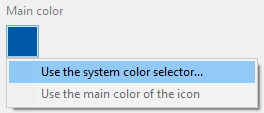

Cette page vous permet de définir les informations principales de votre application.

## OS cible

Sélectionnez l'OS (système d'exploitation) mobile pour lequel vous souhaitez créer l'application. Ce paramètre définira les options de l'éditeur mobile disponibles.

- Sur macOS, vous pouvez sélectionner **Android**, **iOS**, ou **les deux cibles**
- Sous Windows, vous pouvez sélectionner uniquement la cible **Android**.

## Organisation

**Nom :** Nom de votre entreprise, ou votre nom.

**Identifiant :** Saisissez l'identifiant bundle de votre entreprise. Cela servira à identifier votre application. Le nom du produit que vous saisissez est concaténé pour créer le "Bundle ID" en utilisant la notation inverse du service des noms de domaine (voir **ID** ci-dessous). Ce bundle ID doit être unique à votre application.

Par exemple, si le nom de votre entreprise est " MonEntreprise" et que le nom de votre application est "MonApp", vous pouvez choisir "com.MonEntreprise" comme identifiant bundle de votre entreprise et le bundle ID de votre application sera "com.MonEntreprise.MonApp".

:::note

Le nom Bundle ID ne doit pas contenir d'espace ni de caractères spéciaux tels que "*,%,/". They are automatically filtered and replaced with -.

:::

## Produit

**Nom :** Le nom de votre application. Comme indiqué ci-dessus, le nom du produit est utilisé pour créer le "Bundle ID". Ce Bundle ID doit être identique au Bundle ID que vous avez créé dans votre compte Apple Development.

:::note

Le nom Bundle ID ne doit pas contenir d'espace ni de caractères spéciaux tels que "*,%,/". They are automatically filtered and replaced with -.

:::

**Version :** La version de votre application. Add version numbers in ascending, sequential order starting with 1.0.

**ID:** (Bundle ID): This area is automatically generated as a composition of your organization identifier and product name. It is not editable.

**Copyright:** Your app's copyright. The mobile editor suggests a copyright format but you can create your own.

**Icons:** Master icon that will be used in various locations in you app. You just need to designate your icon and the mobile editor generates all of the required formats for you, in accordance with standard mobile guidelines.

To select an icon:

- Drag and drop a picture directly into the icon area, or
- Use the image menu to select or copy your picture.

You can also double-click the area to display the picture selection dialog box.

:::note

On Windows, you must use an "image file" (*.public.image).

:::

Once the icon is selected, the mobile editor automatically creates all required icons for the app. You can access the generated icon formats by selecting **Show the icons folder** in the image menu.

### Couleur principale

This menu allows you to select how to define the main color of your app. The main color is used to generate a custom color scheme for your app.

- **Use the system color selector**: displays the system color picker in which you can designate the main color
- **Use the main color of the icon**: let the mobile editor determine automatically the main color from your app's icon.

At any time, you can reset the main color and get back to the icon's preset main color, by clicking on "Use the main color of the icon".

## Développeur

**Name:** This field is automatically prefilled with your user account name. You can enter any name.

**Team:** Your Developer Account Team ID, that will be used during the deployment phase. This ID can be get from your Developer Account. 
