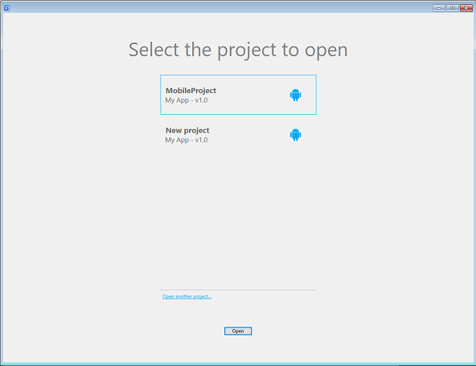

L'éditeur 4D Mobile Project vous permet de concevoir, tester et générer vos projets mobiles natifs pour iOS et Android à l'aide d'une interface graphique. La fenêtre a deux onglets : **Sections** et **Build**.

Dans l'onglet **Sections**, vous trouverez toutes les étapes nécessaires à la création de votre application mobile :

* Général
* Structure
* Données
* Actions
* Libellés et icônes
* Menu
* Forms
* Publishing

Dans l’onglet **Build**, vous trouverez des outils intégrés pour générer et tester votre application mobile :

* Build and Run
* Simulator selection
* Project and product browser
* Install

L'éditeur de projet 4D Mobile est disponible depuis l'environnement de développement de l'application **4D** (une licence 4D Developer Pro est exigée).

Un projet mobile 4D est fortement lié à un modèle de données 4D. Pour pouvoir créer ou ouvrir un projet mobile 4D, vous devez préalablement ouvrir la base de données de projet 4D associée.

## Créer un projet mobile

Pour créer un nouveau projet mobile :

1. Démarrez votre application 4D et ouvrez le projet 4D pour lequel vous souhaitez créer un projet mobile.
2. Sélectionnez **Nouveau > Projet mobile ** à partir du menu **fichier** ou du menu de la barre d'outils.

:::note

Vous avez besoin d'une licence 4D Developer Pro pour ouvrir l'éditeur 4D mobile.

:::

La boîte de dialogue d'accueil s'affiche :

3. Nommez votre projet puis cliquez sur **Continuer**.

L'éditeur Projet mobile est affiché et l'architecture du fichier mobile est automatiquement créée dans votre projet 4D.

## Ouvrir un projet mobile

Pour ouvrir un projet mobile :

1. Démarrez votre application 4D et ouvrez le projet 4D pour lequel vous souhaitez ouvrir le projet mobile.
2. Sélectionnez **Ouvrir > Projet mobile ** à partir du menu **fichier** ou du menu de la barre d'outils.

La boîte de dialogue de sélection des projets mobiles s'affiche. Elle contient la liste des projets mobiles déjà définis pour la base de données courante :

L'icône sur le côté gauche indique si le projet a été créé pour Android, iOS, ou les deux.

3. Double-cliquez sur le projet pour l'ouvrir, ou bien sélectionnez le projet et cliquez sur **Ouvrir**.

### Open another project

The **Open another project...** link allows you to select any valid [`.4dmobileapp`](#mobile-project-architecture) file that is not listed in the dialog box.

:::warning

The selected mobile project must match the current data model, otherwise it will be updated and may not work as expected.

:::

## Deleting a mobile project

To delete a mobile project, just remove the mobile project folder from the 4D project folder.

## Mobile project architecture

Mobile projects are created inside the main 4D project folder:

- My4DProject (*main 4D project folder*)
    + Mobile Projects
        * MyMobileProject
            - project.4dmobileapp
            - *other files and folders*

