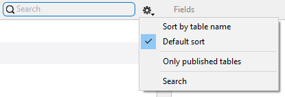

Cette page affiche toutes les tables et tous les champs qui sont exposés en tant que ressources REST dans la base de données 4D, y compris les attributs de relation (basés sur les relations plusieurs à un et un à plusieurs). En fait, la page affiche une vue similaire à celle du [datastore ORDA](https://developer.4d.com/docs/ORDA/overview.html).

Utilisez cette page pour définir un sous-ensemble de votre structure physique à répliquer pour les appareils mobiles en sélectionnant les tables et les champs spécifiques à publier.

- Les tables publiées seront automatiquement ajoutées comme onglets de votre application.
- Published scalar fields will be available when defining your [list and detail forms].
- Published relation fields (many-to-one and one-to-many) will be available when defining your [list and detail forms] and come with additional navigation features such as a Relation button.

:::note

Les tables et champs suivants ne sont pas listés dans cette page :

- Les tables et champs qui ne sont pas conformes aux règles d'[ORDA](https://developer.4d.com/docs/ORDA/dsmapping.html#structure-mapping).
- Les tables et champs dont le nom commence par "`__`" (double tiret bas).

:::

## Sélection des tables et des champs à publier

Une table est publiée lorsqu'au moins un de ses champs est publié. Lorsqu'une table est publiée, elle est affichée en **gras**.

Pour sélectionner un champ à publier, cliquez sur un nom de table puis cliquez sur le champ dans la liste à droite. Vous pouvez également :

- Appuyez sur la **barre d'espace** pour sélectionner/désélectionner un champ
- Utilisez **Ctrl+clic** pour sélectionner tous les champs
- Utilisez **Publier** et **Tout publier** dans le menu local de la liste des champs.

### Filtrage des listes

Lorsqu'une liste a le focus, vous pouvez filtrer son contenu en utilisant la zone de recherche et un menu local :

- Zone de **Recherche** : entrez les caractères à rechercher dans les noms de tables ou de champs
- **Trier par nom de table**/**Trier par nom de champ**: trier la liste par nom. Par défaut, les listes sont triées par date de création
- **Seulement les tables publiées**/**Seulement les champs publiés**: afficher uniquement les tables ou les champs qui ont été sélectionnés (publiés)

## Types de champs pris en charge

L'éditeur mobile affiche automatiquement la liste des champs qui sont éligibles à l'application mobile, en fonction de leur type :

- Tous les [types de champs scalaires 4D](https://developer.4d.com/docs/Concepts/data-types.html) sauf [BLOB](https://developer.4d.com/docs/Concepts/blob.html) et [Objet](https://developer.4d.com/docs/Concepts/object.html).
- Les attributs de relation (N vers 1 et 1 vers N) sont pris en charge et peuvent être sélectionnés comme des champs. Ils ont des icônes spécifiques :

Icône du lien N vers 1 :  

Icône du lien 1 vers N : 

:::info

Les noms sont basés sur les noms des liens dans l'éditeur de structure 4D, voir la page [Correspondance de la structure ORDA](https://developer.4d.com/docs/fr/ORDA/dsmapping.html#structure-mapping).

:::

## Utilisation des relations

:::info 4D for Android

This feature is currently not available in 4D for Android.

:::

### Les relations 1 vers N

Vous pouvez inclure **des relations 1 vers N** dans vos projets et afficher une liste de champs associés dans une nouvelle page de votre application.

Il vous suffit de :

* publier au moins un champ de la table cible (N)
* publier la relation à partir de la table source (1)

Then, when your related fields are published, they can be used like any other field. So you will be able to:

* Define relations properties in the [Labels and Icons](labels-and-icons.md) page.
* Drop the One to Many relation in a Detail form from the [Forms](forms.md) page to create a link between a detail form and a related table. A Relation button will be automatically created in detail forms to go straight to the related view.

:::tip Tutorial

See the [**One to Many relations tutorial**](../tutorials/relations/one-to-many-relations) for a detailed example of One to Many relation integration in a mobile project.

:::

### Many to One relations

**Many to one relations** can be used like any other field in the app creation process. When you select a Many to One relation in the field list, you can to select which field(s) from the related table to publish in your app:

You just need to click on the relation name, then select the field(s):

By default, all eligible fields of the related table are published.

:::tip Tutorial

See the [**Many to One relations tutorial**](../tutorials/relations/many-to-one-relations) for a detailed example of Many to One relation integration in a mobile project.

:::

### Many to Many relations

Using the Structure page, you can publish Many to One and One to Many relations from your parent Many to One relations. It means that you can display Many to Many relations in your app and move directly from a List form to another List form.

:::tip Tutorial

See the [**Relation interactions**](../tutorials/relations/relation-interactions) for a detailed example of Many to One relation integration in a mobile project.

:::

## Incremental reload

### Allow structure adjustments

For the best user experience, 4D for iOS and 4D for Android implement an automatic feature for the incremental reload of data. It means that only new, modified or deleted data from the database will be updated to the app. This optimization enhances drastically loading time.

To enable this optimization, 4D for iOS and 4D for Android need the following structure elements:

* A `__DeletedRecords` table to store deleted records
* and `__GlobalStamp` fields to store modification stamps for each published table in your mobile application

You can let the 4D mobile editor do all the work for you and add the necessary structure elements: just select **Allow 4D to make necessary structure adjustments for an optimized mobile data update** option.

:::note

These optimizations are required for both local and server databases.

:::

### Pull to refresh!

On the mobile app side, your data is updated each time you launch your app and each time your app goes foreground, to get constant updated data.

In normal use, simply swipe down from any listform to reload your data.

From iPhone settings, you can now reset your app data and find information about your app.

:::note

When an important maintenance operation is performed on the database side (Recover by tag / Restoration / Compacting) a Full reload is necessary on the mobile app. In this case, the admin shall notify mobile app users.

::: 
