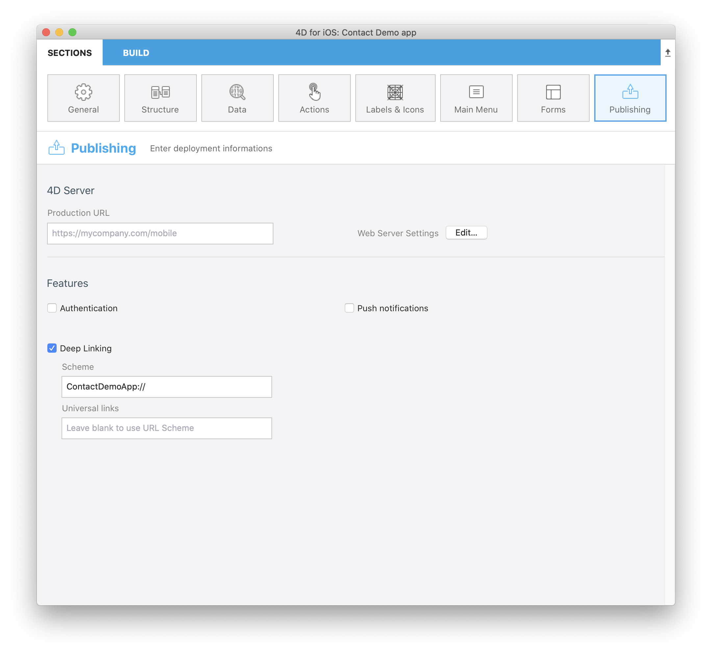

Thanks to the **deep linking** feature, you can share the content that you're currently viewing with all of your collegues. Here's an illustration demonstrating deep linking:


There are two ways to implement deep linking in iOS: **URL scheme** and **Universal Links**. While URL schemes are a well-known method for deep linking, Universal links are the new way that Apple has implemented to easily connect your webpage and your app under the same link.

:::info 4D for Android

Deep linking feature is currently not available in 4D for Android.

:::

## Comparison of deep linking modes

### URL Scheme

Here is a comparison between the two options which are available in the project editor:

| AVANTAGES                 | INCONVÉNIENTS                       |
| ------------------------- | ----------------------------------- |
| Easy to implement         | Always requires permission          |
| No extra backend required | Doesn't work if app isn't installed |
|                           | Doesn't work in Android             |

### Universal links

| AVANTAGES                           | INCONVÉNIENTS                  |
| ----------------------------------- | ------------------------------ |
| Doesn't require permission          | Static backend with SSL needed |
| Doesn't open the browser            | More complex to implement      |
| Compatible with Android             |                                |
| Fallback URL if app isn't installed |                                |

## Custom URL Scheme

At the simplest level, URL schemes allow users to open an app from other apps. But the true power of URL schemes is in the ability to perform specific actions as your app opens.


### Custom URL scheme in the project editor

It's very simple to include an URL scheme to your mobile app. Let's see an example:

1. Select the **Share** predefined action from the [**Action** page](../project-definition/actions.md) and select the scope:
    *   entity - to share content from a detail form
    *   table - to share a list form
2. Check the **Deep Linking** feature in the **Publishing** section of the project editor
3. The URL Scheme information is automatically filled in with the app name that you previously defined in the [**General** page](../project-definition/general.md). However, you can still edit it:



4. Fill in your **On Mobile App Action** method, for example:

```4d

// On Mobile App Action database method

var $1 : Object  // Information provided by mobile application
var $0 : Object  // Information returned to mobile application

var $action : Object
$action:=MobileAppServer.Action.new($1)

Case of 

    : ($1.action="shareContact")

        $0:=$action.shareContext()

    Else 

        $0:=New object("success"; False;"statusText"; "Unknown action send to server")

End case 

```

5. Build your app.


### Using URL Schemes in you mobile app

1. Click on the **Action** button to display all of your currently available actions
2. Select the **Share** action that you previously defined in the project editor
3. A new view appears to allow you to start sharing content
4. Select the share method you want to use
5. Send it.

## Universal Links

Universal links provide several key benefits that aren't available with custom URL schemes. Specifically, universal links are:

* **Unique**: Unlike custom URL schemes, universal links can’t be claimed by other apps because they use standard HTTP or HTTPS links to your website.

* **Secure**: When users install your app, iOS verifies that your website allows your app to open URLs on its behalf. Only you can create and upload the file granting this permission to your web server, so the association of your website with your app is secure.

* **Flexible**: Universal links work even when your app is not installed. In this case, tapping a link to your website opens the content in Safari.

* **Simple**: A single URL works for both your website and your app.

* **Private**: Other apps can communicate with your app without needing to know if your app is installed.

### Universal Links in the Project Editor

To include Universal links into your app, the process is quite similiar to the URL Schemes process:

1. Select the **Share** predefined action from the [**Action** page](../project-definition/actions.md) and select the scope:
    *   entity - to share a content from a detail form
    *   table - to share a list form
2. Activate the **Deep Linking** feature in the **Publishing** section in the project editor
3. Enter your website URL in the **Universal links** field
4. Fill in your **On Mobile App Action** method, for example:

```4d

// On Mobile App Action database method

var $1 : Object  // Information provided by mobile application
var $0 : Object  // Information returned to mobile application

var $action : Object
$action:=MobileAppServer.Action.new($1)

Case of 

    : ($1.action="shareContact")

        $0:=$action.shareContext()

    Else 

        $0:=New object("success"; False;"statusText"; "Unknown action send to server")

End case 

```

5. Build your app.
6. Trigger universal links from the the **On Web Connection** method, for example:

```4d
// On Web Connection database method

var $1; $2; $3; $4; $5; $6 : Text
var $handler : Object

$handler:=MobileAppServer.WebHandler.new()
Case of
    : ($handler.handle($1; $2; $3; $4; $5; $6))
        // Managed by default mobile code
    Else
        // Your web code
End case

```


## Deep Linking and Push notifications

A great thing about Deep Linking is that it is completely compatible with [push notifications](push-notification.md). This means that you can send deep links to your users and lead them directly to the right page.

As you can see, this feature opens a large range of possibilities. Deep linking is a crucial feature in today’s apps, especially as users consume content faster and faster. This feature brings them directly to the desired location. So we strongly recommend that you use it in your mobile apps.

:::tip

Refer to the [**4D Mobile App Server** component documentation](https://github.com/4d-for-ios/4D-Mobile-App-Server/blob/master/Documentation/Classes/PushNotification.md) for more information on how to combine push notifications and deep linking.

:::


