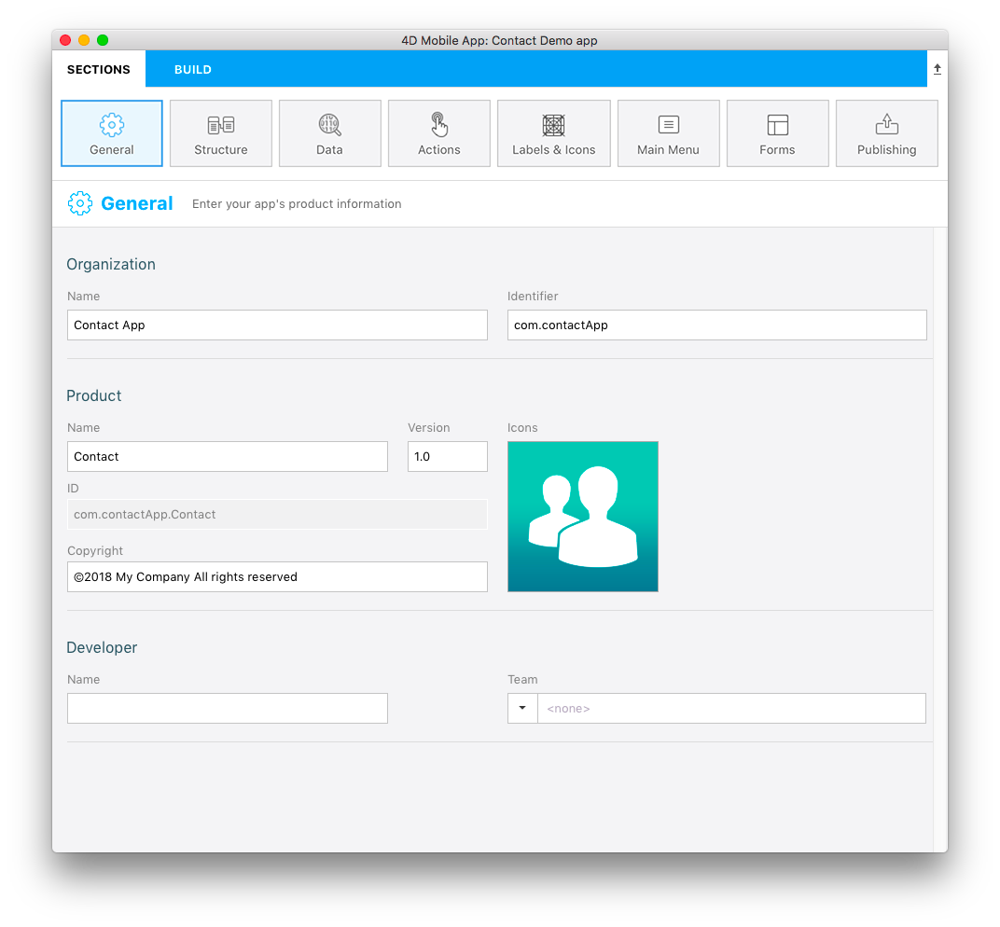
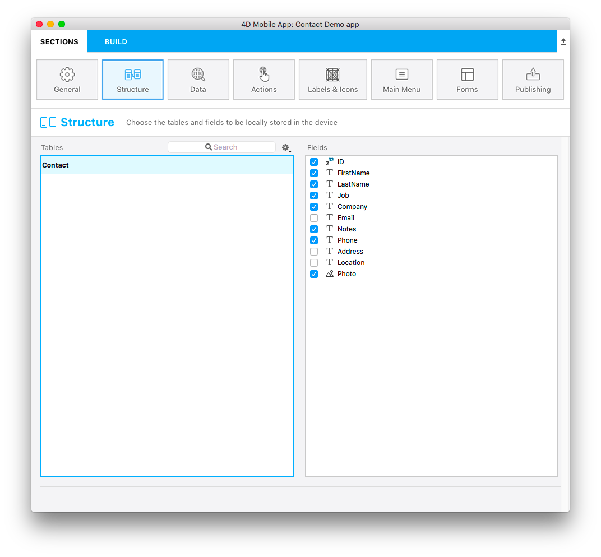
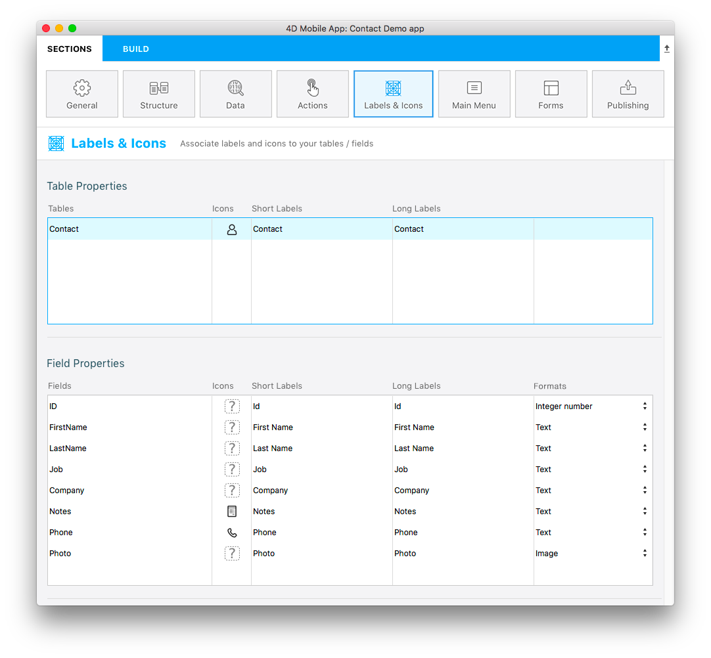
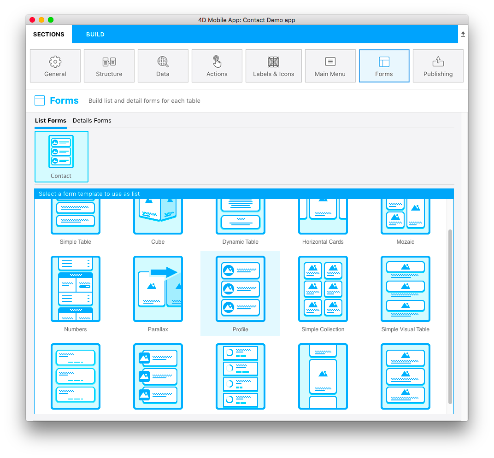
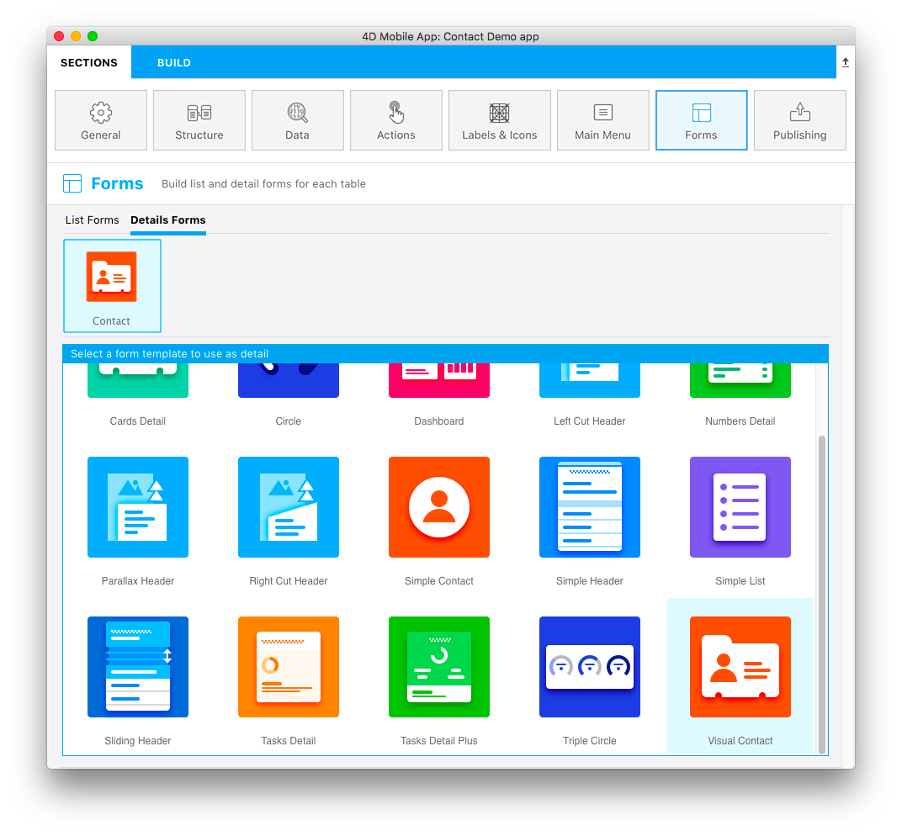

Bienvenue dans le créateur d'applications mobiles de 4D. Ce tutoriel vous permettra de vous lancer directement dans le développement mobile pour iOS et Android avec 4D.

:::note Rappel

Avant de commencer, veuillez vérifier que votre configuration répond aux [exigences](../getting-started/prérequis.md) matériels et logiciels pour le développement de projets mobiles 4D.

:::

**Scénario :** Vous êtes un commercial et souhaitez consulter vos coordonnées lorsque vous êtes en déplacement. Nous allons créer une application Répertoire mobile pour iOS et/ou Android pour rechercher des noms de contacts à partir d'une liste, puis afficher les détails de chaque contact. Nous l'appellerons "Contact".

## ÉTAPE 1. Téléchargez le projet Starter

Téléchargez et dézippez notre projet Starter 4D. Il contient un fichier de base de données et l'icône du projet, (mais qui n'inclut pas encore de projet mobile).

<a className="button button--primary" href="https://github.com/4d-go-mobile/tutorial-ContactApp/archive/acbb699c3c9d9edd3a8bbb715e87c17140b7e15f.zip">Projet Starter</a>

## ÉTAPE 2. Créez le projet mobile

Lancez votre application 4D et sélectionnez "Contact.4DProject". Elle contient une structure de base de données très simple avec une seule table.

Cliquez sur **Nouveau > Projet mobile**. Dans l'écran de bienvenue, nommez votre projet mobile.

Cliquez sur **Continue**.

Des composants supplémentaires sont nécessaires pour développer un projet Android. Cliquez sur **OK** pour les télécharger :

## ÉTAPE 3. Page Général

Vous pourrez configurer ici les principales informations de votre application :

* **Cible :** plateforme(s) mobile(s) à créer

:::note

Si vous êtes sous Windows, seul **Android** est disponible. Si vous êtes sur macOS, vous pouvez sélectionner à la fois **Android** et **iOS**.

:::

* **Organisation :** Nom de votre entreprise et identifiant de l'application.
* **Produit :**
    * **Nom :** Nom de l'application. Appelons-la « Contacts ».
    * **ID :** (Bundle ID) généré automatiquement et composé de l’identifiant de votre entreprise et du nom de votre produit.
    * **Version** and **Copyright:** Leave the version as 1.0 and define your app's copyright.
    * **Icons:** Select a target OS and drag and drop icons for your app into the area.
* **Developer:**
    - **Name:** Automatically filled from the user name on your computer.
    - **Team**: Developer team reference from your developer account. You can leave it empty to build your application on the Simulator only.

## ÉTAPE 4. Page Structure

This is where you define the subset of data to expose to mobile devices. Select the table(s) in the left area and the field(s) in the right area.

For our example, select **ID**, **First Name**, **Last Name**, **Job**, **Company**, **Phone**, **Notes**, and **Photo**.

> We highly recommend publishing your primary key in order to identify each record of the database.

## STEP 5. Page libellés et icônes

:::note

[**Data**](project-definition/data.md) and [**Actions**](project-definition/actions.md) pages allow to configure your app's data and to trigger code on the server. To keep this example simple, we will use default behaviors.

:::

Select **Labels & Icons** page. Here you can define some labels and icons that will be used throughout the app for the tables, fields, and relations.

* Short labels and long labels are automatically used by the app depending on the available space.
* To define a table icon, click on the **Icons** column for the table. The icon library appears and you can select an icon to illustrate the table or field. You can also opt to leave the icon column empty, a default icon will be generated.
* Select at least one icon for your fields: the editor will generate default icons for all remaining fields. You can also simply leave all fields empty to not display any field icons.

## ÉTAPE 6. Forms

Nous avons presque terminé, mais il faut d’abord configurer la mise en page de l’application. En choisissant des Formulaires Liste et des Formulaires détaillés.

* Sélectionnez un modèle de formulaire Liste pour afficher votre table sous forme de liste. Pour notre application Contacts, nous allons utiliser le modèle **Profile**.

À ce stade, la partie inférieure de la fenêtre de configuration a changé, en passant de la sélection du modèle à la définition du contenu.

* Glissez et déposez les champs que vous souhaitez afficher sur le modèle, à savoir, "Last Name" dans le champ de recherche et le champ "Titre". Le champ de recherche et le champ Section sont facultatifs. Pour le moment, laissez le champ Section vide.

Enfin, nous allons définir le formulaire détaillé.

* Sélectionnez un template qui répond au mieux à vos besoins. Pour notre application Contacts, nous allons utiliser le modèle **Visual Contact**.

* Glissez et déposez le contenu dans les sections appropriées du modèle de formulaire détaillé, à savoir, First Name, Last Name et Photo.

## ÉTAPE 7. Générez l’application

Passons maintenant à la phase la plus amusante ! Il est temps de créer votre application et de la tester sur le Simulateur pour voir le résultat final !

* Cliquez sur l’onglet **Génération**.
* Sélectionnez un appareil à utiliser en tant que Simulateur en cliquant sur le bouton "appareil".
* Cliquez sur  **Générer et exécuter**.
* Patientez quelques secondes et voilà ! Votre application mobile est créée !

## Que faire ensuite ?

Dans ce tutoriel, nous avons fait le tour des étapes de création d’une application basique. Vous devriez maintenant être en mesure de créer, par vous-mêmes, de simples applications. Of course, many other options and features are available. Vous pouvez à présent cliquer sur le bouton **Projet final** ci-dessous pour télécharger l'application Contact finale.

<a className="button button--primary"
href="https://github.com/4d-go-mobile/tutorial-ContactApp/releases/latest/download/tutorial-ContactApp.zip">PROJET FINAL</a>

