Now it's time to create your iOS detail form interface with Xcode.

Voici le résultat que nous souhaitons obtenir :

For this template, we're going to add a:

* Une photo de profil dans l'en-tête
* Un champ à dupliquer

## Ouvrir le fichier storyboard avec Xcode

Dans un premier temps, ouvrez votre fichier storyboard dans Xcode.

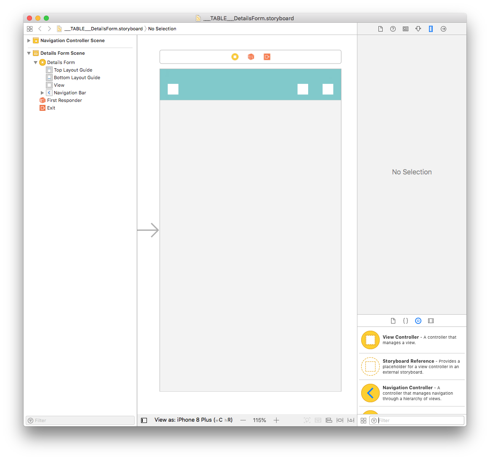

It's quite empty, so let's add some content!

## Ajouter une "Scroll View"

Pour que notre formulaire détaillé soit déroulant, la première étape consiste à faire glisser et déposer une « Scroll View » (vue de défilement) depuis la **Bibliothèque d'objets**.

À partir du **Size inspector** (sur le côté droit de l’Interface Builder), définissez la largeur de la Scroll vue à 359 et la valeur de sa hauteur à 667. Définissez ensuite la valeur de X sur 8 et la valeur de Y sur 0.

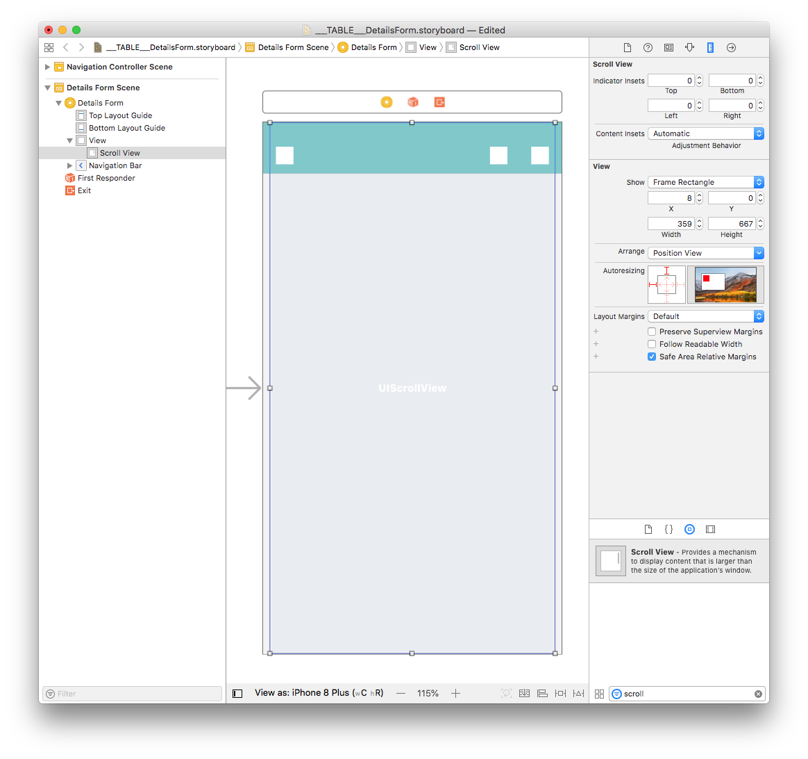

Ajoutez ensuite quatre contraintes en cliquant sur le bouton **Add New Constraints** (Trailing: 8, Leading: 8, Top: 0, et Bottom: Multiple) comme suit :

## Ajouter une "Vertical Stack View"

Glissez et déposez une "Vertical Stack View" depuis la **bibliothèque d'objets** vers la "Scroll view". A partir du **Size inspector** (sur le côté droit de l’Interface Builder), définissez ensuite la largeur de la vue sur 359 et sa hauteur sur 202. Enfin, définissez la valeur de X sur 0 et la valeur de Y sur 8.

La hauteur et la largeur de la "Stack View" étant définies par les éléments qu'elle contient, nous allons configurer les dimensions et les contraintes plus tard.

## Ajouter des vues au Stack Views

Glissez et déposez une vue depuis la **bibliothèque d'objets** vers la Stack View que vous venez d’ajouter à votre Storyboard. Nommons-la **Field View 1**.

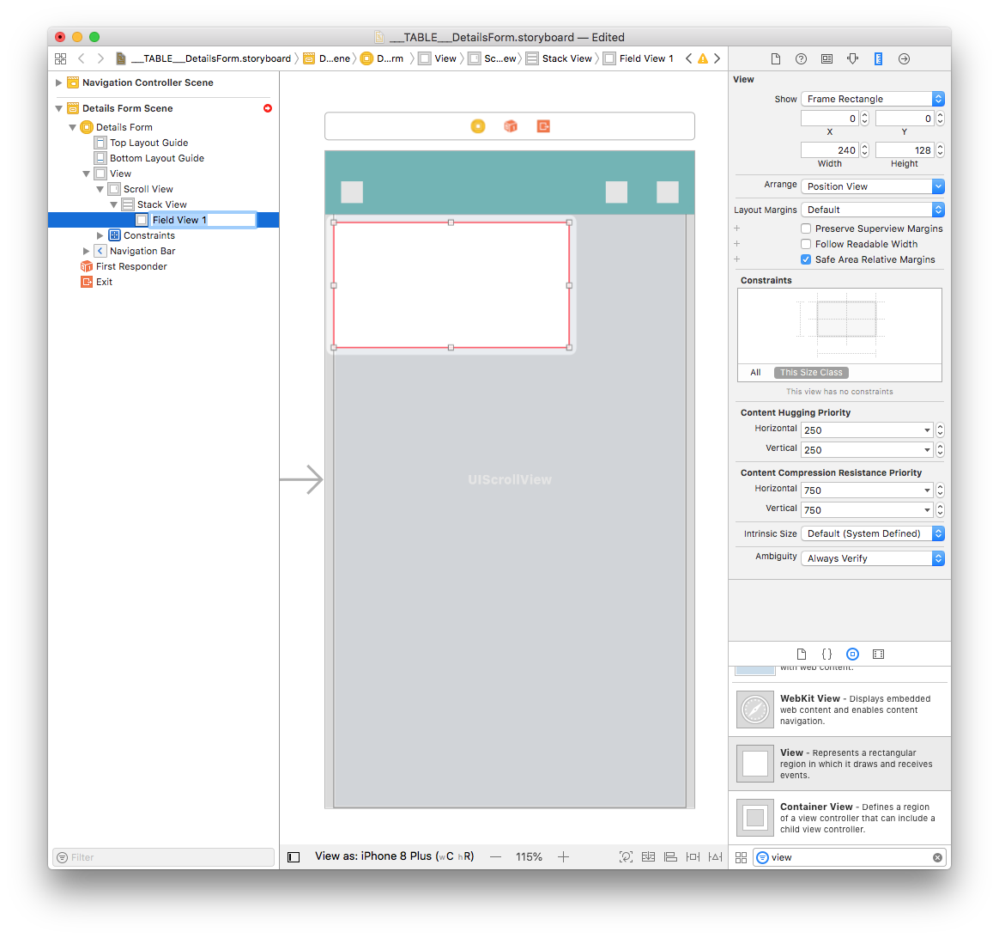

Faites ensuite glisser directement une autre vue depuis la **bibliothèque d'objets** et déposez-la dans le "Document Outline" au même niveau que Field View 1 (pour l’intégrer à la Stack View) et nommez-la **Field View 2**.

Pour ajouter des espaces entre les vues, sélectionnez votre "Stack View" et affectez-lui une valeur d’espacement de 8 (dans l’Attributes Inspector).

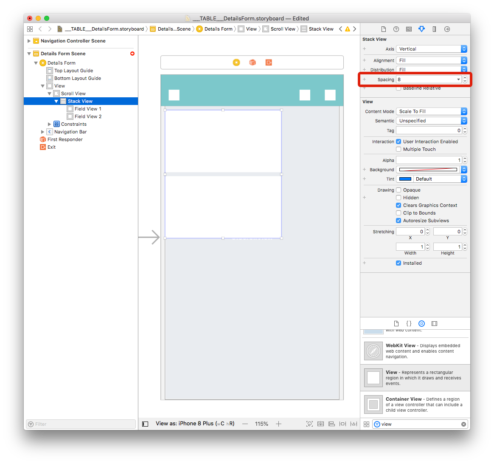

Sélectionnez **Field View 1** et **Field View 2** et définissez, dans le **Size inspector** (à droite de l'Interface Builder), la valeur de la largeur sur 359 et celle de la hauteur à 97.

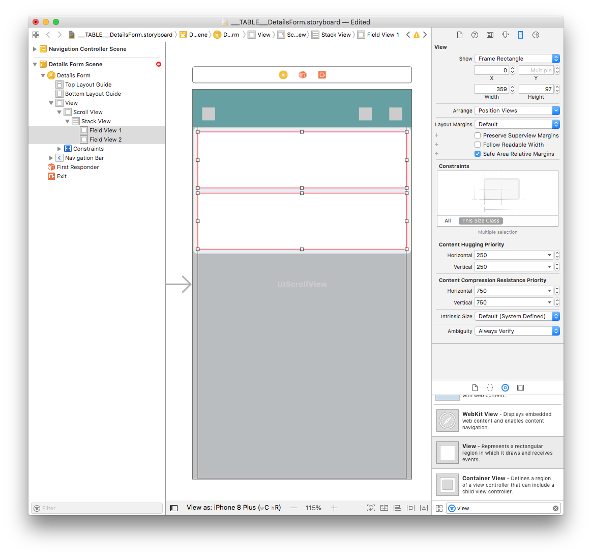

Sélectionnez **Field View 1** et ajoutez trois contraintes en cliquant sur le bouton **Add New Constraints button** (Trailing: 0, Leading: 0 et Top: 0) :

Pour que les "Stack View" et "Scroll View" soient de la même largeur, vous devez ajouter une contrainte :

Press **Ctrl** and drag the Stack View to the Scroll View. Lorsque vous relâchez le bouton de la souris, l’Interface Builder affiche un menu avec une liste de contraintes éventuelles. Sélectionnez "Equal Width" !

Ajoutez ensuite quatre contraintes avec la Stack View en cliquant sur le bouton **Add New Constraints** (Trailing: 0, Leading: 0, Top: 8, et Bottom: 0) comme suit :

Voilà ce qui s'affichera lorsque les contraintes auront été ajoutées :

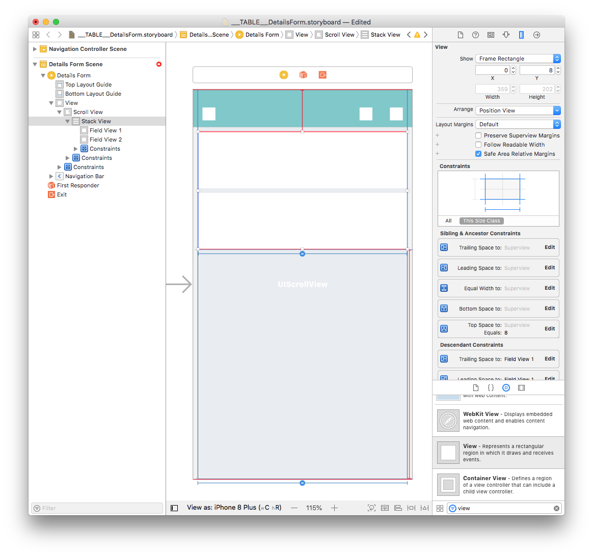

Maintenant que vous disposez de deux vues dans votre Stack View et que vous avez défini les contraintes, concentrons-nous sur Field View 1.

## Ajoutez une Image View au Field View 1

À partir de l'**Object library** (la bibiliothèque d'objets), glissez-déposez une  **Image View** (une vue d'image) dans Field View 1.

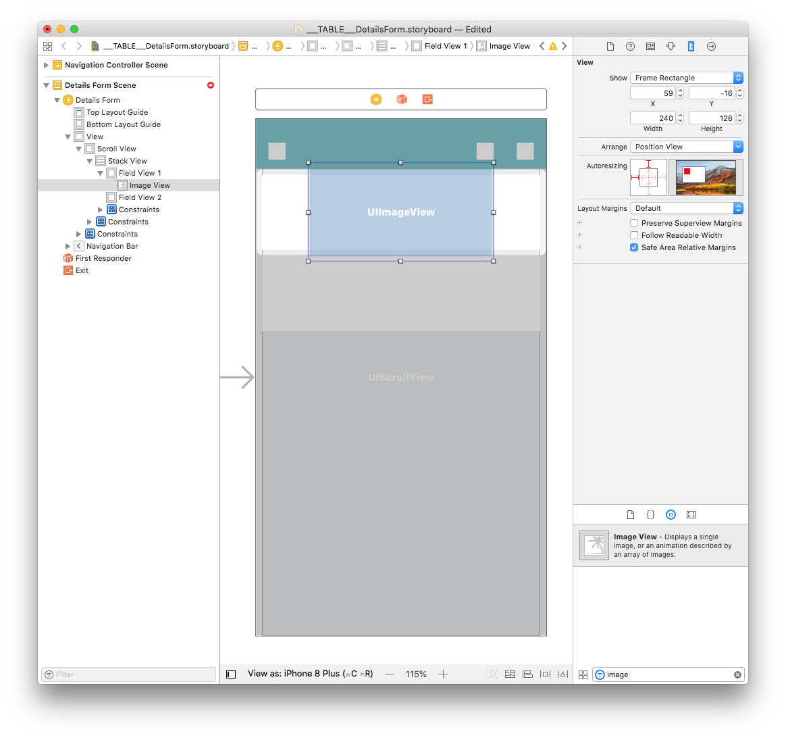

À partir du **Size inspector** (à droite de l’Interface Builder), définissez la largeur de l'Image View sur 359 et sa hauteur sur 97. Définissez ensuite la valeur de X sur 0 et la valeur de Y sur 0.

Ajoutez ensuite quatre contraintes en cliquant sur le bouton **Add New Constraints** (Trailing: 0, Leading: 0, Top: 0, et Bottom: 0) comme suit :

Dans le **Size inspector**, remplacez la valeur **Default** de l'Intrinsic Size par **Placeholder**.

## Ajouter des libellés au Field View 2

### Libellé Titre

Dans la **bibliothèque d'objets**, glissez-déposez un **Libellé** dans Field View 2 et définissez la largeur sur 342 et la hauteur sur 22. Définissez ensuite la valeur de X sur 8 et la valeur de Y sur 8.

Double click on the label and name it "`___FIELD_LABEL___`". Ensuite, à partir de l'**attribute inspector**, sélectionnez la police **Helvetica Neue Light 18.0** et la couleur **BackgroundColor** :

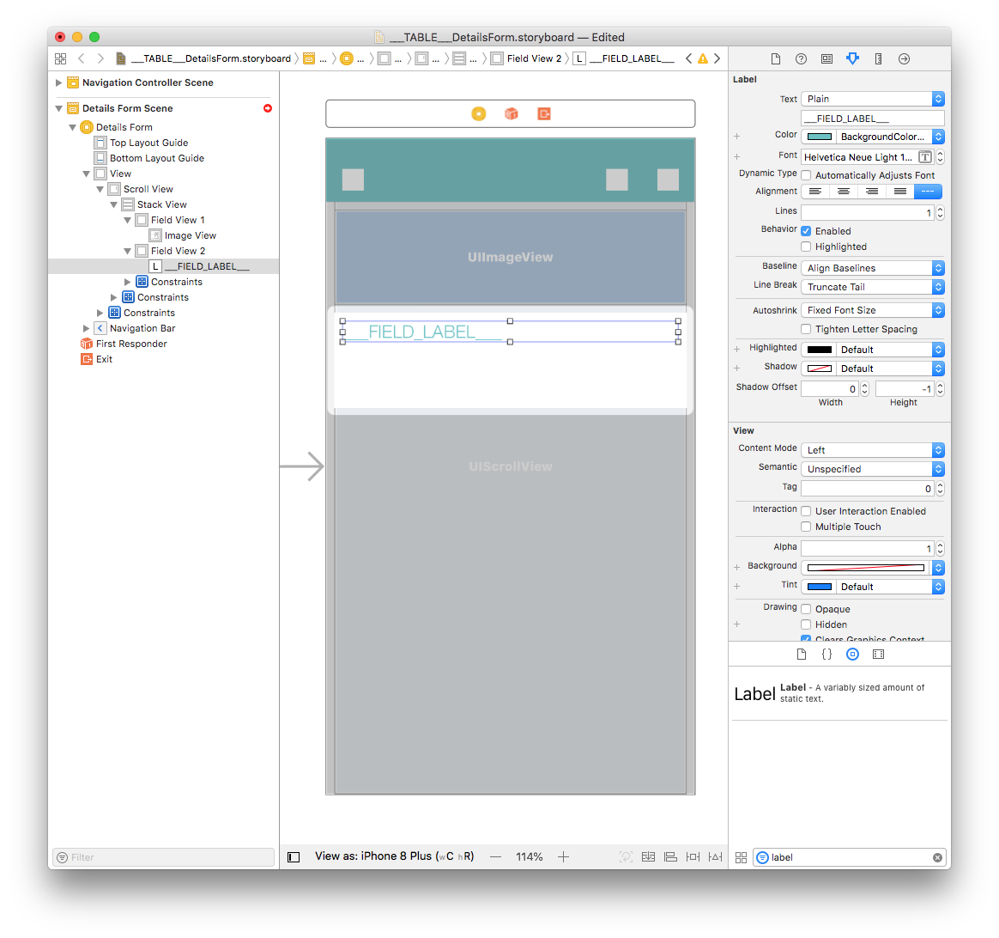

### Libellé Contenu

Dupliquez le libellé Titre et définissez la largeur du libellé dupliqué sur 339 et sa hauteur sur 44. Définissez ensuite la valeur de X sur 12 et la valeur de Y sur 37.

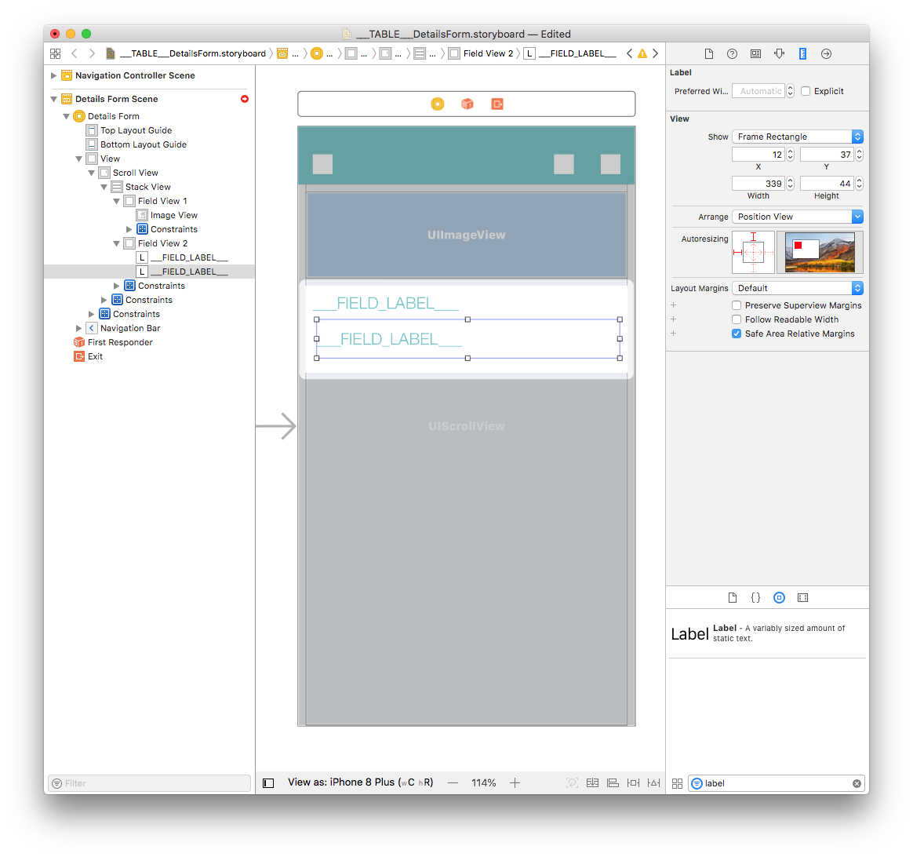

Double click on the label and name it "`<___FIELD_LABEL___>`". Ensuite, à partir de l'**attribute inspector**, sélectionnez la police **Helvetica Neue Light 20.0** et la couleur **Black Color** :

Sélectionnez les deux libellés Contenu et Titre et ajoutez quatre contraintes en cliquant sur le bouton **Add New Constraints** (Trailing: 8, Leading: Multiple, Top: Multiple, et Bottom: Multiple) comme suit :

La partie sur les éléments graphiques est terminée ! All of your constraints are well defined.

## Comment entrer des données dans vos cellules

### Image View
Sélectionnez votre Vue Image, cliquez sur **Identity inspector** et allez dans User Defined Runtime Attributes. Cliquez sur le **bouton +** pour ajouter une ligne.

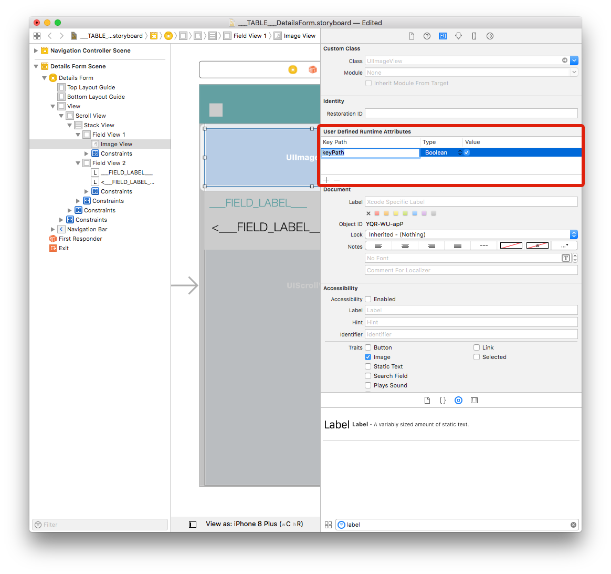

* **Key Path**: Start with bindTo to activate binding on the component. Enter `bindTo.record.___FIELD_1___`

* **Type**: Always `String`

* **Value**: The attribute name. Enter `___FIELD_1_BINDING_TYPE___`

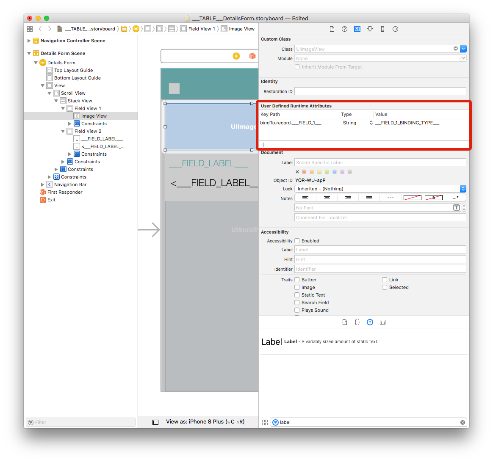

### Libellés

Pour le **premier libellé**, nous allons ajouter plusieurs lignes, principalement pour afficher des icônes :

You also need to set the Class to `IconLabel` and check the **Inherit Module From Target** checkbox as we can see below:

Select the **second label** and add a row in the Defined Runtime Attributes:

* **Key Path**: `bindTo.record.___FIELD___`

* **Type**: `String`

* **Value**: `___FIELD_BINDING_TYPE___`

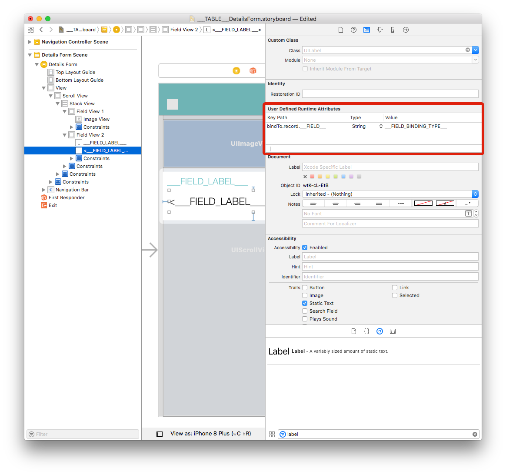

## Ajouter des TAGS aux cellules dupliquées

Field View 2 inclut des éléments qui seront dupliqués, pour vous permettre d'avoir autant de champs que d'éléments définis dans l’éditeur de projet.

Each storyboard element has an Object ID. For example, if you select Field View 2 and go to the **Identity inspector**, you'll see its Object ID:

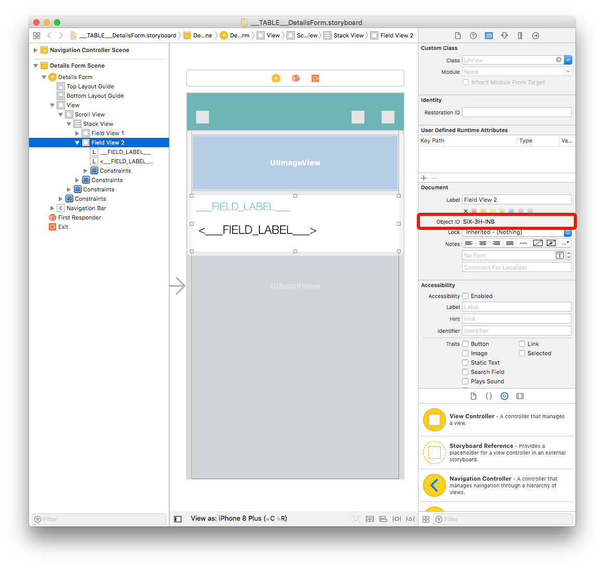

Pour informer l'éditeur de projet que tous les éléments compris dans cette vue seront dupliqués, nous devons ajouter TAG à chaque élément et à chaque contrainte.

Le processus est un peu délicat... Nous allons commencer par ouvrir le fichier storyboard avec l'éditeur de code de votre choix !

### Field View 2

* Sélectionnez **Field View 2** et obtenez ses identifiants d'objet à partir de l'Identity Inspector (à droite de l'Interface Builder). Dans notre projet, l'identifiant de Field View 2 est le suivant : **SiX-3H-lNB**.

* Recherchez cet identifiant dans le code xml du storyboard et remplacez-le par **TAG-FD-001** à chaque fois qu'il apparait. Soyez prudent, car, comme vous pouvez le voir, l'identifiant de cet objet est mentionné plusieurs fois !

Sauvegardez le fichier xml du storyboard. Comme vous pouvez le voir, l'identifiant d'objet de Field View 2 a été modifié dans le storyboard dans Xcode :

### Premier libellé

* Obtenez l'identifiant d'objet du **premier libellé** à partir de l'Identity Inspector et remplacez-le par **TAG-FD-002** chaque fois qu’il apparaît dans le code xml du storyboard.

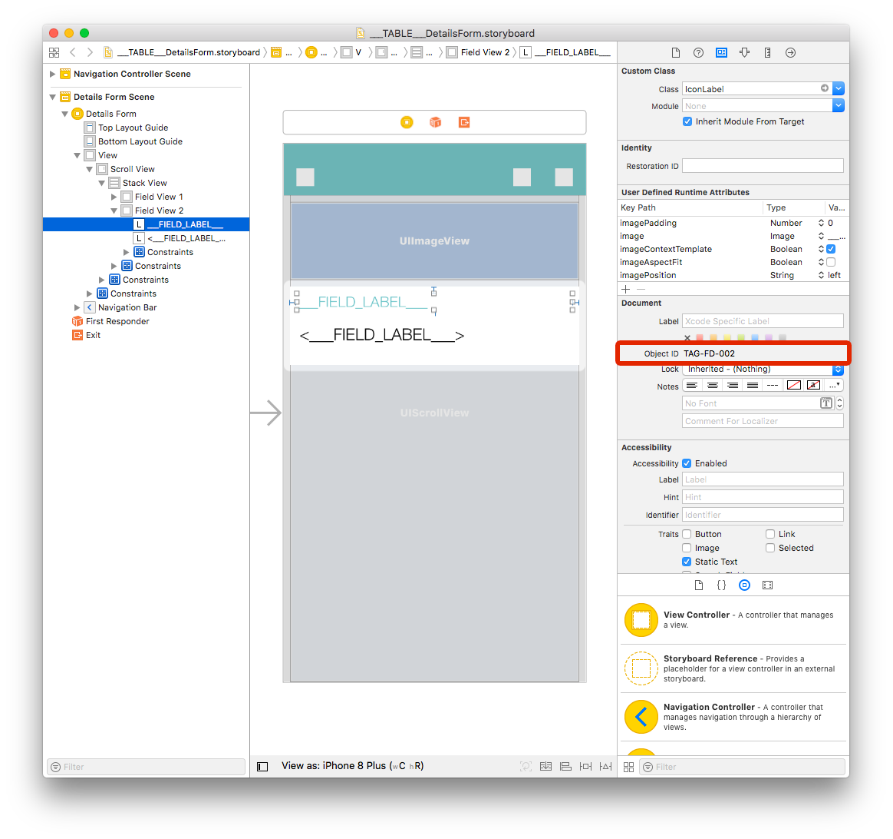

Done with the first label.

### Deuxième libellé

* Obtenez ensuite l'identifiant d'objet du **deuxième libellé** à partir de l'Identity Inspector et remplacez-le par **TAG-FD-003** chaque fois qu’il apparaît dans le code xml du storyboard.

Et voilà !

### Contraintes

Les deux libellés contiennent des contraintes que nous devons également identifier :

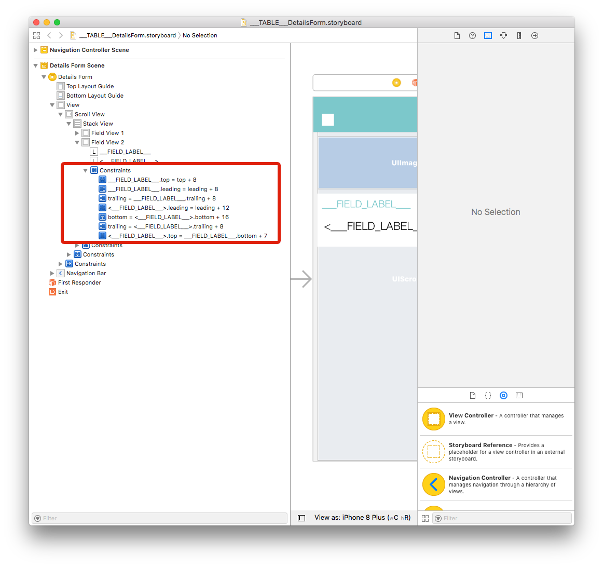

Tout comme pour View Field 2 et le libellé, obtenez tous les identifiants d'objets des **7 Contraintes** depuis l’Identity Inspector et remplacez-les par : **TAG-FD-004**, **TAG-FD-005**, **TAG-FD-006**, **TAG-FD-007**, **TAG-FD-008**, **TAG-FD-009** and **TAG-FD-010**.

Ouvrez votre éditeur de projet, sélectionnez votre modèle de formulaire détaillé depuis la section Formulaires, puis cliquez sur Créer & exécuter.

Not bad for a first attempt!

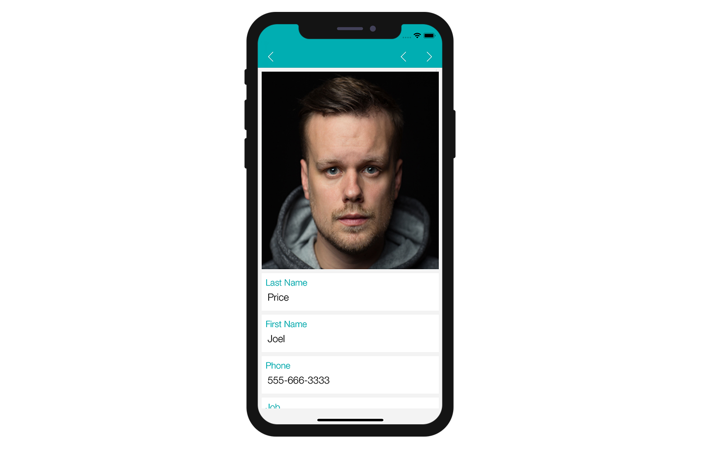

Field View 2 a bien été dupliqué ! Voyons comment rendre cette application un peu plus intéressante !

### Personnaliser votre application

Nous allons ajouter un bord arrondi à l'Image View et à Field View 2.

Sélectionnez votre Vue Image et ajoutez les deux lignes suivantes dans la zone User Defined Runtime Attributes :

* **Key Path**: `cornerRadius`

* **Type**: `Number`

* **Value**: `12`

et

* **Key Path**: `layer.masksToBounds`

* **Type**: `Boolean`

* **Value**: Check the box

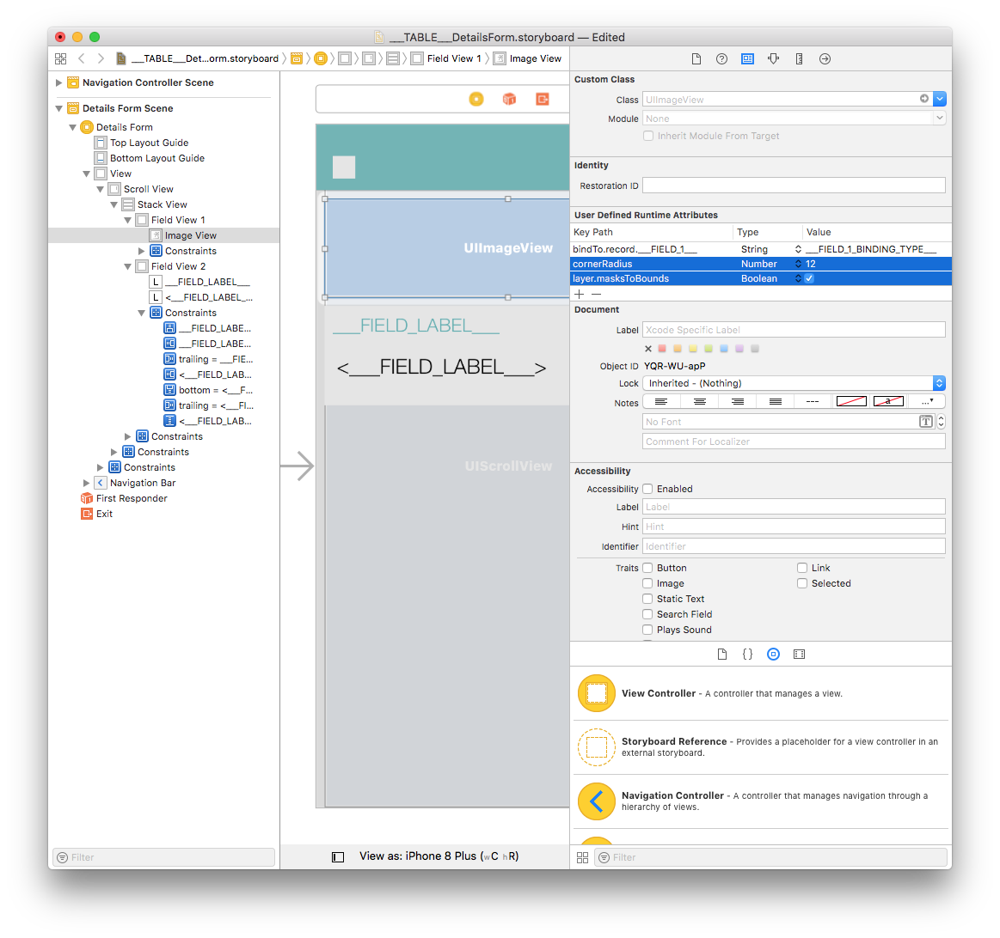

Sélectionnez ensuite Field View 2 et ajoutez ce qui suit :

* **Key Path**: `cornerRadius`

* **Type**: `Number`

* **Value**: `12`

Vous pouvez désormais créer votre projet depuis l'éditeur de projet !

## Que faire ensuite ?

In this tutorial, we've covered the basics for creating detail form templates. You can now create simple templates on your own using the Starter project resources.

Download the completed template folder:

<a className="button button--primary"
href="https://github.com/4d-for-mobile/tutorial-CustomDetailForm/releases/latest/download/tutorial-CustomDetailForm.zip">Download</a>

