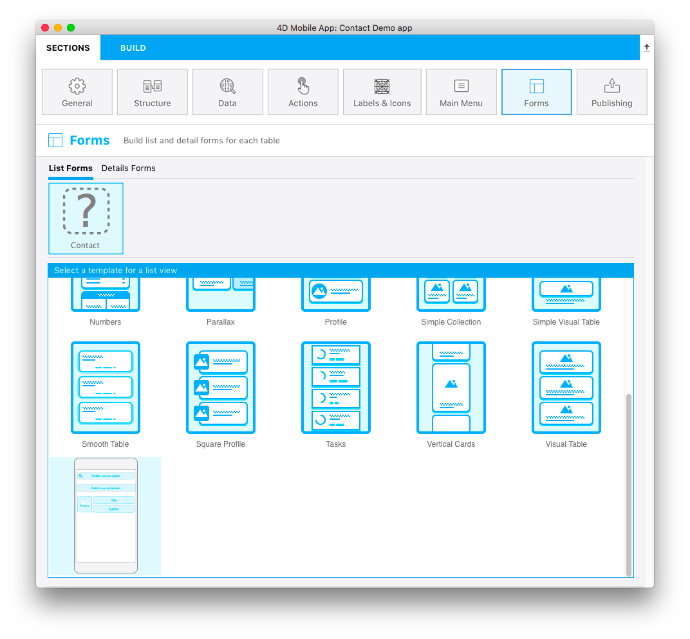
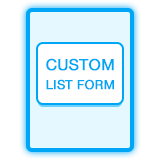

Vous avez la possibilité de créer votre propre icône pour le modèle de formulaire Liste.

It must be 160x160 px and must be named **layoutIconx2.png**.

L’icône sera utilisée :

* au-dessus du nom de la table, une fois que le modèle est sélectionné, et
* dans la fenêtre de sélection des modèles dans la **section Formulaires**

If this icon is missing from your list form template folder, the [**template.svg**](list-form-template.md) file will be displayed in the template selector window and a question mark icon will be displayed above each table that's missing an icon.

You can use any image software to create the png list form template icon.

