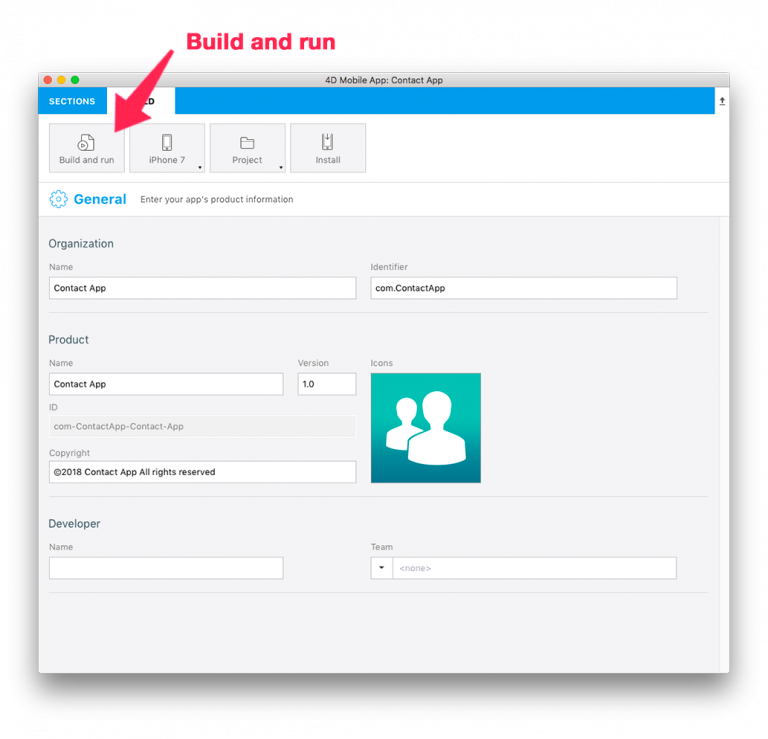

> **OBJECTIFS**
> 
> * Open a 4D for iOS project from the Project Editor.
> * Customize the generated 4D for iOS app.

4D for iOS vous génère une application iOS native modifiable et personnalisable avec Xcode. Jetons un œil au processus !

> **NOTE**
> 
> If you customize your project on Xcode and rebuild it from the Project Editor All of your modifications will be lost!

We'll use the [contact application](../create-your-first-app) we created.

Download the Starter project:

<a
  className="button button--primary"
  href="#">
  Download
</a>

## ÉTAPE 1. Créez votre projet iOS

* Si vous n’avez pas encore créé votre projet, passez à l’étape 2.
* Si vous avez déjà créé votre projet, passez à l’étape 3.

## ÉTAPE 2. Générez votre projet

From the Project Editor BUILD tab:

* Sélectionnez un appareil à utiliser en tant que Simulateur en cliquant sur le bouton "appareil".
* Cliquez sur le bouton **Créer & exécuter**.

## ÉTAPE 3. Ouvrez votre projet avec Xcode

From the Project Editor BUILD tab:

* Cliquez sur Projet > Ouvrir le produit avec Xcode

Now you're ready to start working on your 4D for iOS project in Xcode.