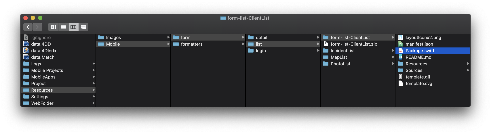
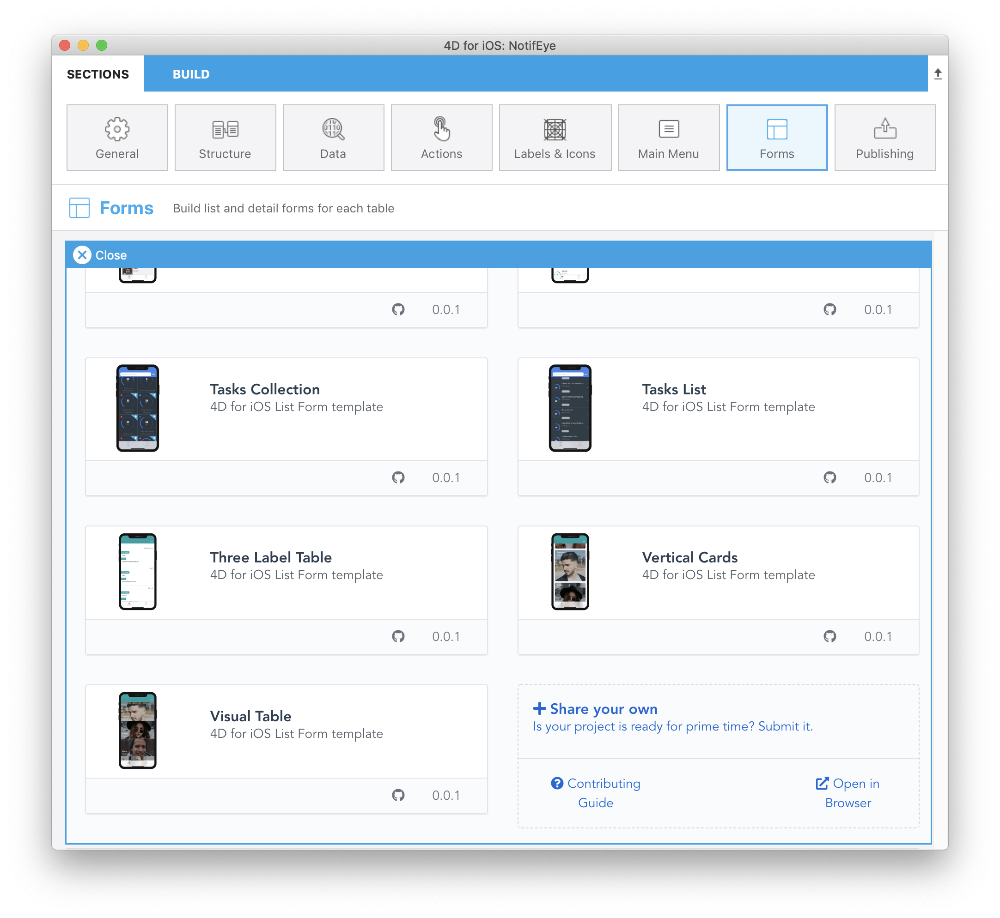

> **OBJECTIFS**
> 
> Open and update a template from the gallery and improve it

## Ouvrir un template

Pour modifier un modèle téléchargé depuis la galerie :

* La première chose à faire est d'aller dans votre dossier *YourDatabase.4dbase/Resources/Mobile/form/list*.

* Vous pouvez voir que le modèle que vous venez de télécharger précédemment est disponible.
* Décompressez et ouvrez-le
* Puis, double-cliquez sur le fichier package.swift.

* Cela ouvrira automatiquement Xcode avec toutes les sources pour vous permettre de modifier votre modèle.

## Mettez à jour votre modèle

De là, vous pourrez ajouter du code Swift et optimiser votre modèle stroybord.

C'est si facile à utiliser !

Par exemple, mettons à jour la couleur et la police FIELD_1_LABEL à l'aide de l'inspecteur d'attributs.

Ensuite, une fois que vous avez amélioré vos modèles, vous pouvez utiliser votre modèle en le sélectionnant dans le sélecteur de modèles Formulaires de l'éditeur de projet.

## Partagez votre modèle

Lorsque votre modèle est prêt et que vous avez apporté des améliorations significatives, vous souhaiterez probablement le partager.

Un bouton de partage est directement accessible en bas du sélecteur de modèles !

Tout le processus de partage est détaillé sur la page de contribution, où les bonnes procédures sont décrites, pour vous aider dans le processus de partage.

## Que faire ensuite ?

You could try following the [contribution guide](https://github.com/4d-go-mobile/gallery/blob/master/.github/CONTRIBUTING.md#how-do-you-add-a-package) to share your templates in github and make them appear in the project editor.

