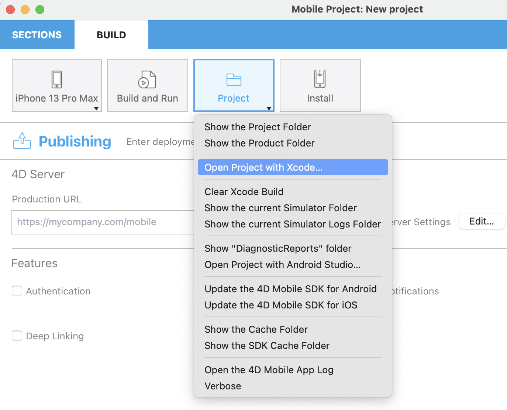

Il se peut que vous rencontriez des problèmes lors de l'utilisation de l'éditeur de projet 4D mobile ou de votre application iOS ou Android. La lecture des fichiers journaux peut fournir des informations utiles dans ce genre de cas.

Pour accéder aux fichiers journaux, appuyez sur la touche **Alt** et sélectionnez **Project** dans le panneau GENERATION de l'éditeur de projet :

Des éléments de menu de débogage supplémentaires apparaissent pour le [simulateur sélectionné](../project-definition/build-panel#using-the-simulator) :

* **Ouvrir les journaux du simulateur** : vous pouvez y trouver le dossier `CrashReporter MobileInstallation`

* **Ouvrez les rapports Diagnostic du simulateur**

* **Ouvrir le dossier du simulateur courant**

* **Ouvrir le dossier du simulateur d'application** : ouvre un sous-menu pour chaque application

## Comment déboguer votre application

Une fois que votre application est terminée et que le résultat du simulateur est satisfaisant, vous pouvez la tester sur votre smartphone, que vous travailliez sur 4D for iOS ou 4D for Android.

Pour ce faire, dans l'éditeur de projet, assurez-vous d'avoir branché votre smartphone, puis sélectionnez votre appareil physique dans la liste et cliquez sur le bouton "Compiler et exécuter".

:::note

The **Updating the list of devices...** button enables to refresh the list of available devices.

:::

4D shall then build the application and install it on the connected device.

:::note

If you're an Android developer, you need to add an extra step to the debug process. More details [here](from-your-android-device-and-android-studio.md).

:::
