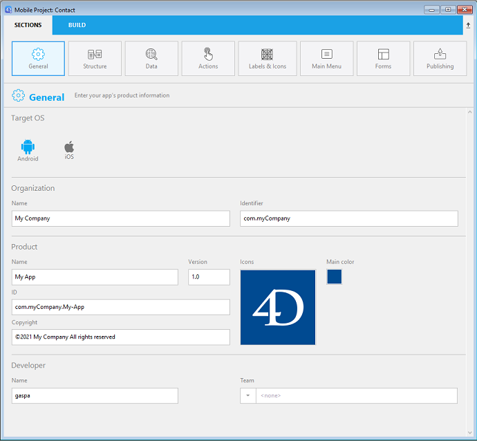

Cette page vous permet de définir les informations principales de votre application.

## OS cible

Sélectionnez l'OS (système d'exploitation) mobile pour lequel vous souhaitez créer l'application. Ce paramètre définira les options de l'éditeur mobile disponibles.

- Sur macOS, vous pouvez sélectionner **Android**, **iOS**, ou **les deux cibles**
- Sous Windows, vous pouvez sélectionner uniquement la cible **Android**.

## Organisation

**Nom :** Nom de votre entreprise, ou votre nom.

**Identifiant :** Saisissez l'identifiant bundle de votre entreprise. Cela servira à identifier votre application. Le nom du produit que vous saisissez est concaténé pour créer le "Bundle ID" en utilisant la notation inverse du service des noms de domaine (voir **ID** ci-dessous). Ce bundle ID doit être unique à votre application.

Par exemple, si le nom de votre entreprise est " MonEntreprise" et que le nom de votre application est "MonApp", vous pouvez choisir "com.MonEntreprise" comme identifiant bundle de votre entreprise et le bundle ID de votre application sera "com.MonEntreprise.MonApp".

:::note

Le nom Bundle ID ne doit pas contenir d'espace ni de caractères spéciaux tels que "*,%,/". Ils sont filtrés automatiquement et remplacés par -.

:::

## Produit

**Nom :** Le nom de votre application. Comme indiqué ci-dessus, le nom du produit est utilisé pour créer le "Bundle ID". Ce Bundle ID doit être identique au Bundle ID que vous avez créé dans votre compte Apple Development.

:::note

Le nom Bundle ID ne doit pas contenir d'espace ni de caractères spéciaux tels que "*,%,/". Ils sont filtrés automatiquement et remplacés par -.

:::

**Version :** La version de votre application. Ajoutez les numéros de version par ordre séquentiel et ascendant en commençant par 1.0.

**ID :** (Bundle ID) : Cette zone est automatiquement générée en tant que composition de l'identifiant de votre entreprise et du nom du produit. Elle n'est pas modifiable.

**Copyright :** Les droits d’auteur de votre application. L'éditeur mobile vous propose un format de droit d’auteur, mais vous avez également la possibilité de créer votre propre format.

**Icônes :** Icône principale qui sera utilisée à divers endroits dans votre application. You just need to designate your icon and the mobile editor generates all of the required formats for you, in accordance with standard mobile guidelines.

Pour sélectionner une icône :

- Glissez et déposez une image directement dans la zone d'icône, ou
- Utilisez le menu image pour sélectionner ou copier votre image.

Vous pouvez également double-cliquer sur la zone pour afficher la boîte de dialogue de sélection d'image.

:::note

Sous Windows, il faut utiliser un "fichier image" (*.public.image).

:::

Une fois l'icône est sélectionnée, l'éditeur mobile crée automatiquement toutes les icônes nécessaires pour l'application. Vous pouvez accéder aux formats d'icônes générés en sélectionnant **Montrer le dossier des icônes** dans le menu image.

### Couleur principale

Ce menu vous permet de choisir comment définir la couleur principale de votre application. The main color is used to generate a custom color scheme for your app.

- **Use the system color selector**: displays the system color picker in which you can designate the main color
- **Use the main color of the icon**: let the mobile editor determine automatically the main color from your app's icon.

At any time, you can reset the main color and get back to the icon's preset main color, by clicking on "Use the main color of the icon".

## Développeur

**Nom :** Ce champ est prérempli automatiquement avec le nom de votre compte utilisateur. Vous pouvez saisir un nom quelconque.

**Team :** Votre ID d'équipe de compte développeur, qui sera utilisée pendant la phase de déploiement. This ID can be get from your Developer Account (see (https://idmsa.apple.com/IDMSWebAuth/signin?appIdKey=891bd3417a7776362562d2197f89480a8547b108fd934911bcbea0110d07f757&path=%2Faccount%2F&rv=1).
