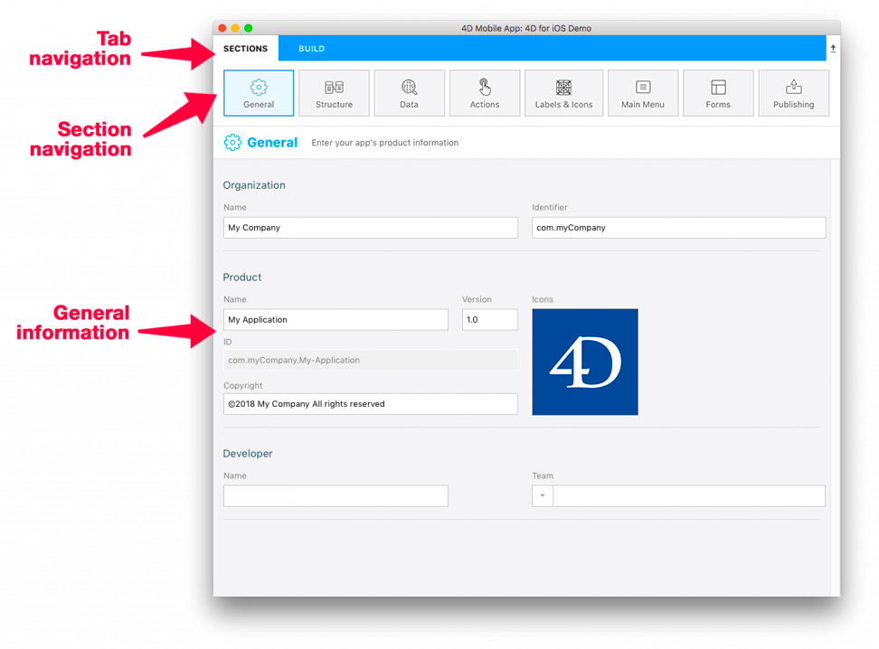

L'éditeur 4D Mobile Project vous permet de concevoir, tester et générer vos projets mobiles natifs pour iOS et Android à l'aide d'une interface graphique. La fenêtre a deux onglets : **Sections** et **Build**.

Dans l'onglet **Sections**, vous trouverez toutes les étapes nécessaires à la création de votre application mobile :

* Général
* Structure
* Données
* Actions
* Libellés et icônes
* Menu
* Forms
* Publishing

Dans l’onglet **Build**, vous trouverez des outils intégrés pour générer et tester votre application mobile :

* Build and Run
* Simulator selection
* Project and product browser
* Install

L'éditeur de projet 4D Mobile est disponible depuis l'environnement de développement de l'application **4D** (une licence 4D Developer Pro est exigée).

Un projet mobile 4D est fortement lié à un modèle de données 4D. Pour pouvoir créer ou ouvrir un projet mobile 4D, vous devez préalablement ouvrir la base de données de projet 4D associée.

## Créer un projet mobile

Pour créer un nouveau projet mobile :

1. Démarrez votre application 4D et ouvrez le projet 4D pour lequel vous souhaitez créer un projet mobile.
2. Sélectionnez **Nouveau > Projet mobile ** à partir du menu **fichier** ou du menu de la barre d'outils.

:::note

Vous avez besoin d'une licence 4D Developer Pro pour ouvrir l'éditeur 4D mobile.

:::

La boîte de dialogue d'accueil s'affiche :

3. Nommez votre projet puis cliquez sur **Continuer**.

L'éditeur Projet mobile est affiché et l'architecture du fichier mobile est automatiquement créée dans votre projet 4D.

## Ouvrir un projet mobile

Pour ouvrir un projet mobile :

1. Démarrez votre application 4D et ouvrez le projet 4D pour lequel vous souhaitez ouvrir le projet mobile.
2. Sélectionnez **Ouvrir > Projet mobile ** à partir du menu **fichier** ou du menu de la barre d'outils.

La boîte de dialogue de sélection des projets mobiles s'affiche. Elle contient la liste des projets mobiles déjà définis pour la base de données actuelle :

L'icône sur le côté gauche indique si le projet a été créé pour Android, iOS, ou les deux.

3. Double-cliquez sur le projet pour l'ouvrir, ou bien sélectionnez le projet et cliquez sur **Ouvrir**.

### Ouvrir un autre projet

Le lien **Ouvrir un autre projet...** vous permet de sélectionner n'importe quel fichier[`.4dmobileapp`](#mobile-project-architecture) valide qui n'est pas listé dans la boîte de dialogue.

:::warning

Le projet mobile sélectionné doit correspondre au modèle de données actuel, sinon il sera mis à jour et risque de ne pas fonctionner comme prévu.

:::

## Supprimer un projet mobile

Pour supprimer un projet mobile, il suffit de supprimer le dossier du projet mobile du dossier du projet 4D.

## Architecture de Projet mobile

Les projets mobiles sont créés dans le dossier principal du projet 4D :

- MonProjet4D (*dossier principal du projet 4D*)
    + Mobile Projects
        * MonProjetMobile
            - project.4dmobileapp
            - *autres fichiers et dossiers*

