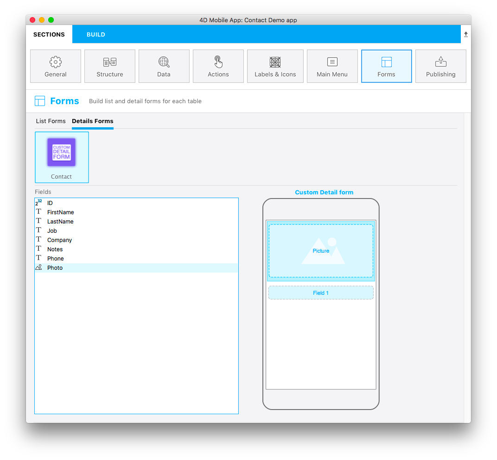

The `template.svg` file is a basic template representation. Dans ce fichier svg, vous définirez des zones afin d'ajouter des champs à votre modèle de formulaire détaillé depuis l’éditeur de projet.

Voici une version finale :



This template has dynamic field numbering, meaning that this template will allow you to add an **image** and you can put **as many fields** as you need. Ainsi, lors de la création de votre formulaire détaillé dans la section Formulaires et lors du glisser-déposer d'un champ, un nouveau champ vide apparait en dessous du champ précédent pour vous permettre d'ajouter un nouveau champ :


```

```

Let’s focus on the different parts of this svg file and what you'll need to edit.

## Title

```xml
<title>Custom Detail form</title>
```

Add the title for your template here.

## Area position, height and width and type
You can define position, height, and width for all of your fields. This process is the same as [the one you use for custom list forms](../creating-list-forms/list-form-svg-file.md#area-position-height-width-and-type).

### Propriétés des champs

```xml
//1
<g id="f" visibility="hidden" ios:dy="35">

//2
<rect class="bg field" x="14" y="0" width="238" height="30"/>

//3
<textArea id="f.label" class="label" x="14" y="8" width="238">field[n]</textArea>

//4
<rect id="f" class="droppable field multivalued" x="14" y="0" width="238" height="30" stroke-dasharray="5,2" ios:type="0,1,2,4,8,9,11,25,35"/>

//5
<use id="f.cancel" x="224" y="1" xlink:href="#cancel" visibility="hidden"/>
</g>
```

1. Position de toute la zone Y
2. Position, hauteur et largeur de la zone d'arrière-plan
3. Définir la position de la zone de texte et la largeur
4. Define the droppable field position, height, and width, as well as accepted [**field types**](../creating-list-forms/list-form-svg-file.md#iostypes) (all types are accepted in this example)
5. Définir un bouton "Annuler" qui s’affichera pour effacer le contenu courant

### Zone ImageField

```xml
//1
<g transform="translate(0,60)">

//2
<rect class="bg field" x="15" y="0" width="236" height="65"/>

//3
<path class="picture" transform="translate(10 0) scale(6)"/>

//4
<textArea id="f1.label" class="label" x="15" y="25" width="236">$4DEVAL(:C991("picture"))</textArea>

//5
<rect id="f1" class="droppable field" x="15" y="0" width="236" height="65" stroke-dasharray="5,2" ios:type="3" ios:bind="fields[0]"/>

//6
<use id="f1.cancel" x="222" y="20" xlink:href="#cancel" visibility="hidden"/>
</g>
```

1. Position de toute la zone Y
2. Position, hauteur et largeur de la zone d'arrière-plan
3. Icône affichant une image dans imageField
4. Définir la position de la zone de texte et la largeur
5. Define the droppable field position, height, and width, as well as accepted [**field types**](../creating-list-forms/list-form-svg-file.md#iostypes)
6. Définir un bouton "Annuler" qui s’affichera pour effacer le contenu courant

Now that you have an **icon**, a **basic template description** in the manifest.json file, and your **svg file**, let's move on to the fun part with Xcode!


:::tip

To make field type definition easier, 4D for iOS allows you to include field types with **positive values** and also exclude field types with **negative values**. For example, `ios:type="-3,-4"` will allow you to drag and drop every field except images and dates. To include all types, just type `ios:type="all"`.

:::
