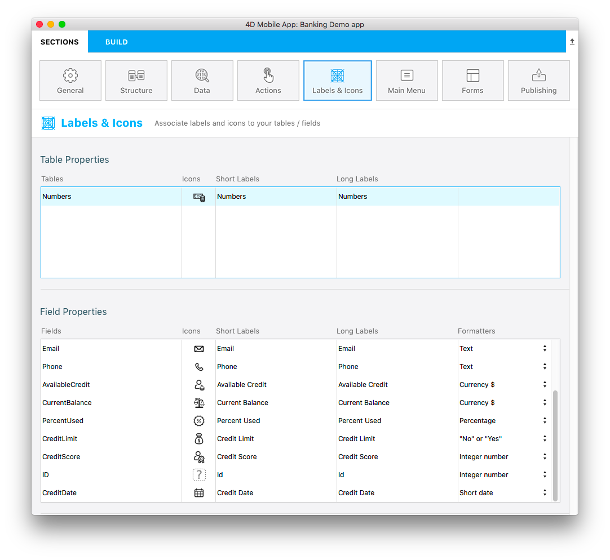

Dans Sections, cliquez sur Libellés et icônes. Vous verrez qu’une nouvelle colonne Formats est disponible dans les Propriétés des champs :

Vous pouvez y sélectionner des formats spécifiques en fonction de vos besoins. Nous allons attribuer le format monnaie au champ "Available Credit" :

Nous ferons de même pour tous les autres champs :

* Attribuez le format **Monnaie $** au champ "Current Balance"
* Attribuez le format **Pourcentage** au champ "Percent Used"
* Attribuez le format **Oui ou non** au champ "Credit Limit"
* Attribuez le format **Date courte** au champ "Credit Date"

