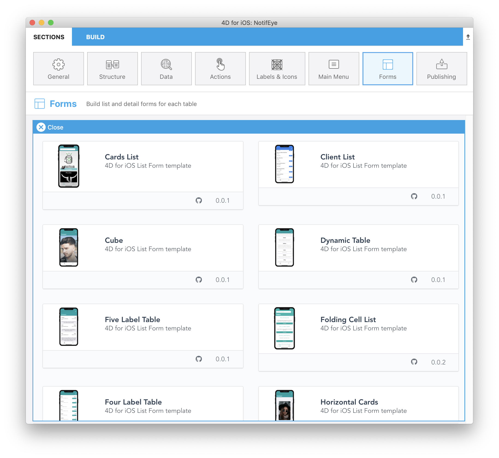
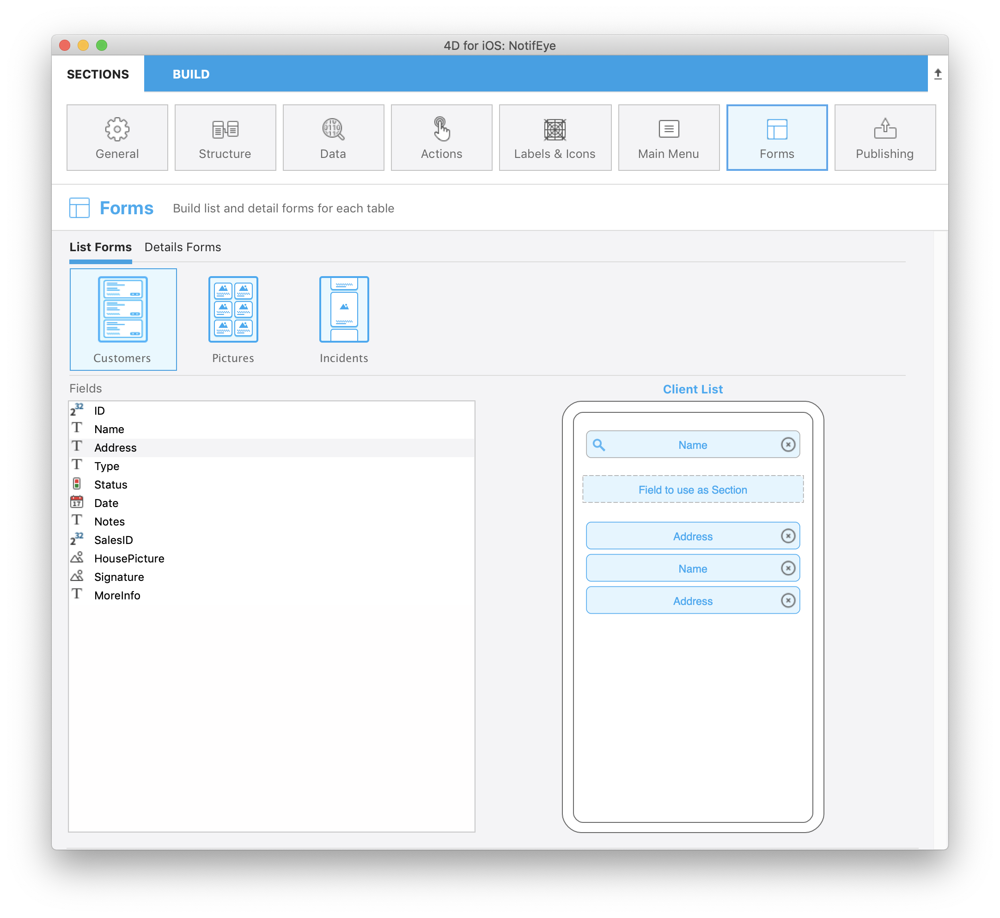

> **OBJECTIFS**
> 
> Dowload a template from the gallery and improve it

## Installer un template depuis la galerie

Accédez à la section Formulaires et sélectionnez l'une de vos tables pour choisir un formulaire Liste.

Comme vous pouvez le voir, une icône «Plus» est disponible en bas.

Just click on that icon to display the entire list.

Then, the only thing you have to do is selecting the template that suits your needs and 4D for iOS will handle all the installation process to help you work faster and more efficiently.

Sélectionnez le modèle Client List.

Comme vous pouvez le voir, le modèle est automatiquement inclus dans votre projet et vous pouvez directement commencer à travailler dessus sans attendre.

Une icône github s'affiche en haut à gauche de l'icône de votre modèle dans le sélecteur de modèle Forms pour indiquer qu'elle provient de Github.

Comme vous pouvez le voir, il est très simple d'inclure de nouveaux modèles dans votre projet et vous pouvez directement commencer à travailler dessus sans attendre.

Alors, maintenant que vous avez téléchargé votre modèle, vous voudrez peut-être apporter des modifications pour que le modèle corresponde parfaitement à vos besoins.

