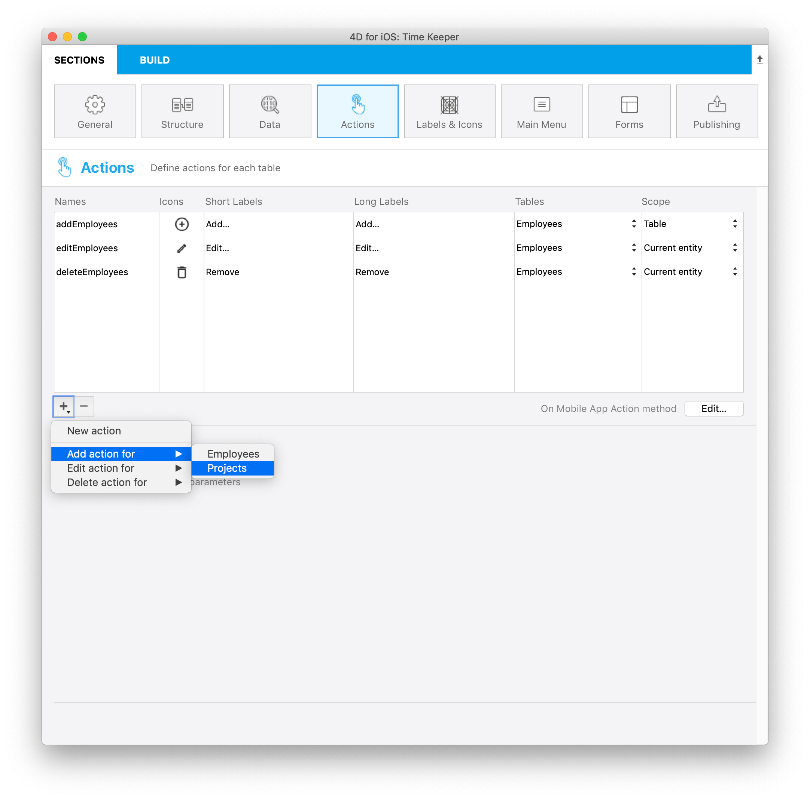

We are now going to go a little bit further and **create a task for a specific employee**.

It is very easy to create an entity using **parent Entity** !

Commençons par télécharger le Projet Starter :

<div className="center-button">
<a className="button button--primary"
href="https://github.com/4d-go-mobile/tutorial-RelationsActions/archive/6c649733f5efd3c799e4e04c05a85e17eeadf7f0.zip">Projet Starter</a>
</div>

## Créer une action addProject

* Ouvrez l'éditeur de projet et cliquez sur la section Action.

* Add a `addProject` Action




## Sur une action app mobile

The only thing you have to do is defining the **addProject** action in the **On Mobile App Action method** as follows :

```4d
: ($request.action="addProjects")

$o:=New object(\
"dataClass";$context.dataClass;\
"parent";$context.parent;\
"entity";$context.entity;\
"parameters";$parameters)

$result:=addProject ($o)


```

## Méthode addProject


Then enter thoses lines in your **addProject Method**:

```4d
C_OBJECT($0)
C_OBJECT($1)

C_OBJECT($entity;$in;$out)

$in:=$1
$out:=New object("success";False)

If ($in.dataClass#Null)

    $entity:=ds[$in.dataClass].new()  //Créer une référence

    For each ($key;$in.parameters)

        $entity[$key]:=$in.parameters[$key]

    End for each 

    $primaryKey:=$in.parent.primaryKey   //Lire clé primaire parente 

    $parent:=ds[$in.parent.dataClass].get($primaryKey)

  $inverseRelationName:=$in.entity.relationName   //Lire nom du lien parent

    $entity[$inverseRelationName]:=$parent

    $status:=$entity.save()  //sauvegarder l'entité

    $out.success:=True  // notifier l'application que l'action est réussie

    $out.dataSynchro:=True  // notifier l'application pour mettre à jour la sélection

    $out.statusText:="Task added"

    $out.close:=True

Else 

    $out.errors:=New collection("No Selection")

End if 

$0:=$out

```

And that's it you can then add some task to your employees easily using the parent Entity !

Téléchargez le projet final :

<div className="center-button">
<a className="button button--primary"
href="https://github.com/4d-go-mobile/tutorial-RelationsActions/releases/latest/download/tutorial-RelationsActions.zip">Download</a>
</div>