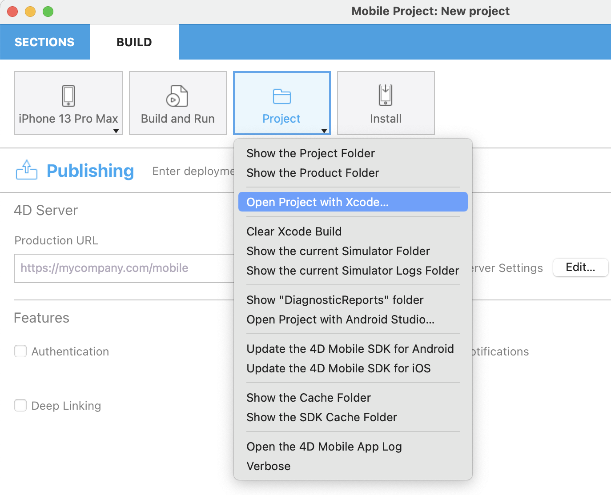
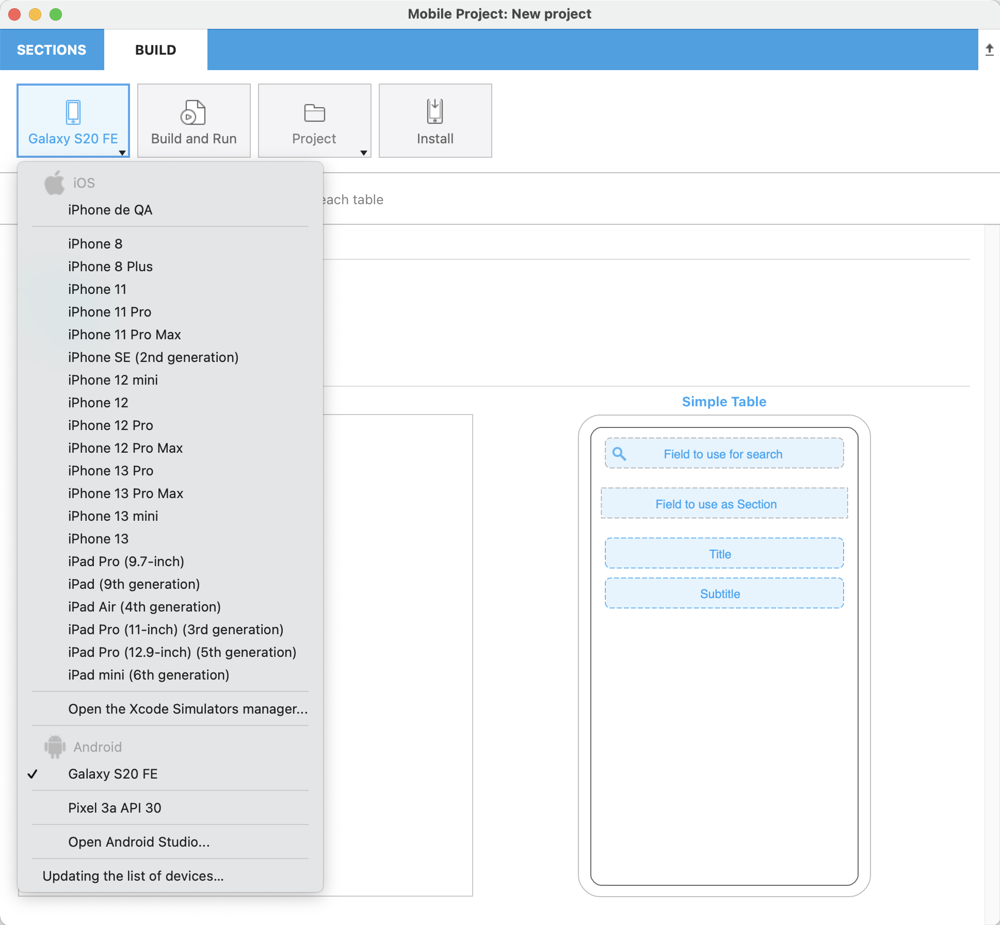

Il se peut que vous rencontriez des problèmes lors de l'utilisation de l'éditeur de projet 4D mobile ou de votre application iOS ou Android. La lecture des fichiers journaux peut fournir des informations utiles dans ce genre de cas.

Pour accéder aux fichiers journaux, appuyez sur la touche **Alt** et sélectionnez **Project** dans le panneau GENERATION de l'éditeur de projet :

Des éléments de menu de débogage supplémentaires apparaissent pour le [simulateur sélectionné](../project-definition/build-panel#using-the-simulator) :

* **Ouvrir les journaux du simulateur** : vous pouvez y trouver le dossier `CrashReporter MobileInstallation`

* **Ouvrez les rapports Diagnostic du simulateur**

* **Ouvrir le dossier du simulateur courant**

* **Ouvrir le dossier du simulateur d'application** : ouvre un sous-menu pour chaque application

## How to debug your app

Once your app is complete and the simulator’s result is satisfactory, you may want to test it on your smartphone, whether you're working on 4D for iOS or 4D for Android..

To do so, in the Project editor, make sure you have plugged your smartphone, then select your physical device from the list and click on the “Build and Run" button.

:::note

The **Update the list of devices...** button enables to refresh the list of available devices.

:::

4D shall then build the application and install it on the connected device.

:::note

If you're an Android developer, you need to add an extra step to the debug process. More details [here](from-your-android-device-and-android-studio.md).

:::
