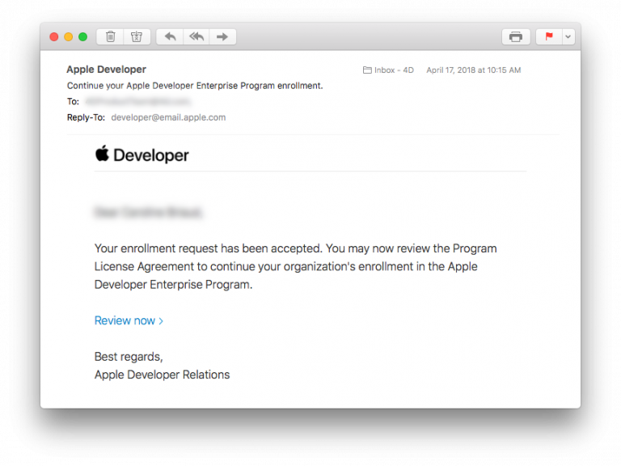

> **OBJECTIFS**
> 
> Choose the appropriate Apple Developer Program.

Pour **distribuer une application iOS**, votre compte Apple Developer doit être valide. Apple propose deux programmes de développement :

* **[Apple Developer Program](https://developer.apple.com/programs/)** **for organization** or **for individual** ($99/year) - Allows you to distribute app(s) **on the App Store**.
* **[Apple Developer Enterprise Program](https://developer.apple.com/programs/enterprise/)** ($299/year) - Provides resources ONLY for developing and distributing **proprietary, in-house apps** to employees

For **test purposes** you can use a **Free Apple Developer Program** (*Sign in with Apple ID*, see below).

Voici un tableau comparatif des différentes catégories d’adhésion en tant que développeur :

:::info

To enroll in any **Apple Developer Program**, your Apple ID must be associated with an email address using your organization’s domain name.

:::

:::info Free Apple Developer account

If you want to join the Apple Developer Program for free, you only need to create a free Apple ID and sign in with it. Therefore, follow only Steps 1 and 2, then launch Xcode > Preferences > Accounts, Add your Apple ID and sign in! :::

## ÉTAPE 1. Créez votre identifiant Apple

If you already have an Apple ID, go to [Step 2](#step-2-request-a-d-u-n-s-number).

Cliquez sur la [page de création de l'identifiant Apple](https://appleid.apple.com/).

* Remplissez le formulaire et répondez aux questions de sécurité.
* Vous recevrez un code de vérification par e-mail.
* Entrez le code de vérification pour valider la création de votre compte.

## ÉTAPE 2. Demandez un numéro D-U-N-S

:::info

This step is not necessary for the **Apple Developer Program as an individual**.

:::

* If you already have a D-U-N-S Number, go to [Step 3](#step-3-register).

Demandez [ici](https://developer.apple.com/enroll/duns-lookup/#/search) un numéro D-U-N-S

* Remplissez le formulaire.
* Cliquez sur **Continue**.
* Vérifiez votre e-mail pour obtenir le numéro D-U-N-S.

## ÉTAPE 3. Register

For **Apple Developer Enterprise Program** and **Apple Developer as an organisation**, you can register as a developer [here](https://developer.apple.com/programs/enterprise/enroll/).

For **Apple Developer as an individual**, you can register as a developer [here](https://developer.apple.com/account/).

Then, read and accept the *Apple Developer Agreement* and **Submit**.

## ÉTAPE 4. Join

:::info

This step is not necessary for the **Apple Developer Enterprise Program**.

:::

For **Apple Developer Program as an Organisation**, you can sign up for the Apple Developer Program [here](https://developer.apple.com/enroll/enterprise/).

For **Apple Developer Program as an Individual**, click on **Join the Apple Developer Program** at the bottom of the page.

## STEP 5. Enroll

* Cliquez sur le bouton **Start your Enrollment**.
* From the Entity Type dropdown list, select:
    - **Company / Organization** (for Apple Developer Enterprise Program and Apple Developer Program as an Organisation).
    - **Individuals / Sole Proprietor / Single Person Business** (for Apple Developer Program as an individual).

* Complete the form and Click on **Continue**.

## ÉTAPE 6. Vérification d’Apple

:::info

This step is  only necessary for the **Apple Developer Enterprise Program**.

:::

* Apple procède à une vérification interne qui peut prendre habituellement jusqu'à six jours ouvrables. Une fois la demande d’inscription reçue, Apple s'assure que vous êtes habilité à lier votre organisation aux accords juridiques de l'Apple Developer Program.
* Généralement, Apple vous appelle pour vérifier que le contact principal existe et que ce dernier a demandé à souscrire à l'Apple Developer Enterprise Program.
* Vous recevrez ensuite un autre e-mail vous invitant à finaliser la souscription.

## ÉTAPE 7. Finalisez votre souscription

* Une fois que votre demande de souscription est acceptée, vous pouvez procéder au paiement.

* Lorsque vous aurez finalisé votre achat, vous recevrez un e-mail de confirmation de votre adhésion au programme.

Félicitations ! You are now ready to deploy and publish your applications!
