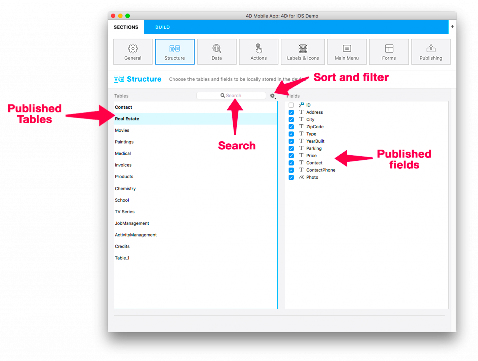
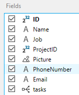
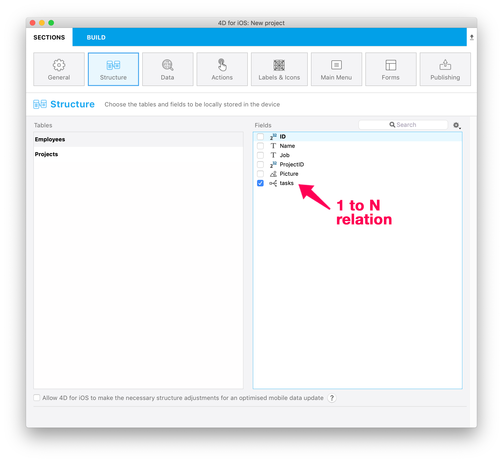
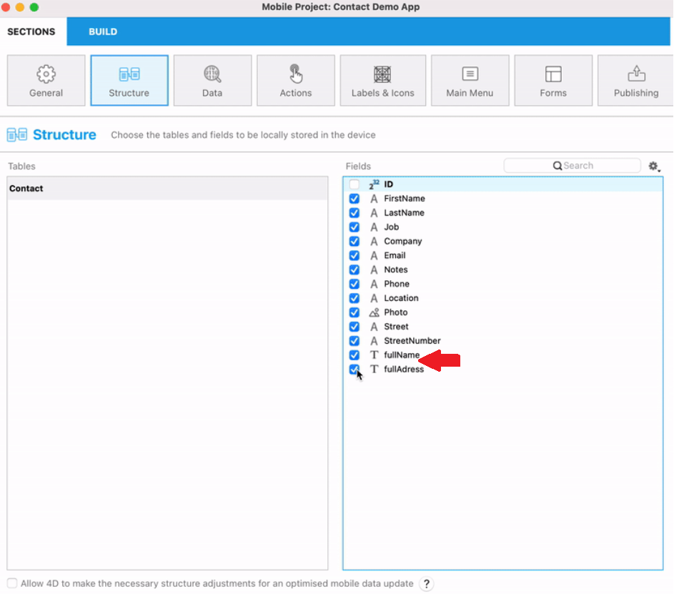
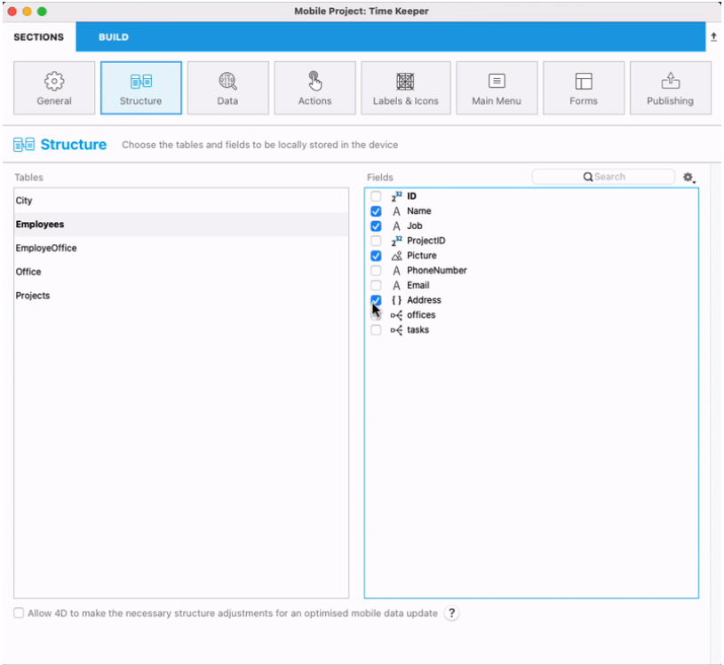
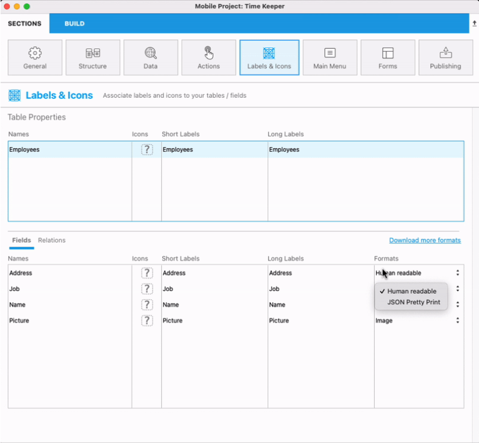
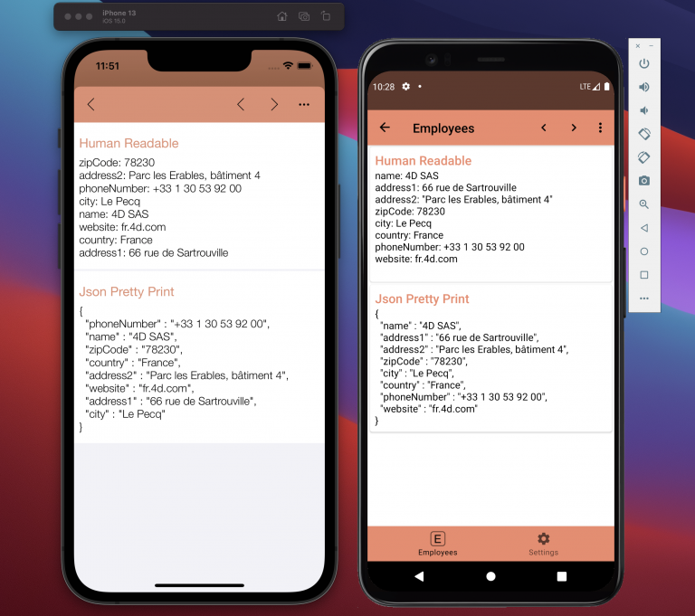

Cette page affiche toutes les tables et tous les champs qui sont exposés en tant que ressources REST dans la base de données 4D, y compris les attributs de relation (basés sur les relations plusieurs à un et un à plusieurs). En fait, la page affiche une vue similaire à celle du [datastore ORDA](https://developer.4d.com/docs/ORDA/overview.html).




Utilisez cette page pour définir un sous-ensemble de votre structure physique à répliquer pour les appareils mobiles en sélectionnant les tables et les champs spécifiques à publier.

- Les tables publiées seront automatiquement ajoutées comme onglets de votre application.
- Les champs scalaires publiés seront disponibles lors de la définition de vos [formulaires liste et formulaires détaillés](https://developer.4d.com/go-mobile/docs/project-definition/forms/).
- Les champs de liens publiés (N vers 1 et 1 vers N) seront disponibles lors de la définition de vos [formulaires liste et formulaires détaillés](https://developer.4d.com/go-mobile/docs/project-definition/forms/) et sont dotés de fonctionnalités de navigation supplémentaires comme un bouton Relation.


:::note

Les tables et champs suivants ne sont pas listés dans cette page :

- Les tables et champs qui ne sont pas conformes aux règles d'[ORDA](https://developer.4d.com/docs/ORDA/dsmapping.html#structure-mapping).
- Les tables et champs dont le nom commence par "`__`" (double tiret bas).

:::

:::note

Seuls les attributs calculés dont les valeurs évoluent dans le temps - dépendant uniquement d'autres attributs de la même DataClass - seront mis à jour sur l'application mobile.

:::

## Sélection des tables et des champs à publier

Une table est publiée lorsqu'au moins un de ses champs est publié. Lorsqu'une table est publiée, elle est affichée en **gras**.

Pour sélectionner un champ à publier, cliquez sur un nom de table puis cliquez sur le champ dans la liste à droite. Vous pouvez également :

- Appuyez sur la **barre d'espace** pour sélectionner/désélectionner un champ
- Utilisez **Ctrl+clic** pour sélectionner tous les champs
- Utilisez **Publier** et **Tout publier** dans le menu local de la liste des champs.


### Filtrage des listes

Lorsqu'une liste a le focus, vous pouvez filtrer son contenu en utilisant la zone de recherche et un menu local :


- Zone de **Recherche** : entrez les caractères à rechercher dans les noms de tables ou de champs
- **Trier par nom de table**/**Trier par nom de champ**: trier la liste par nom. Par défaut, les listes sont triées par date de création
- **Seulement les tables publiées**/**Seulement les champs publiés**: afficher uniquement les tables ou les champs qui ont été sélectionnés (publiés)


## Types de champs pris en charge

L'éditeur mobile affiche automatiquement la liste des champs qui sont éligibles à l'application mobile, en fonction de leur type :



- Tous les [types de champs scalaires 4D](https://developer.4d.com/docs/Concepts/data-types.html) sauf [BLOB](https://developer.4d.com/docs/Concepts/blob.html).
- [Les champs objet](https://doc4d.github.io/go-mobile/docs/next/project-definition/structure/#object-attributes)
- [Champs calculés](#computed-attributes)
- [Les attributs d'alias](#alias-attributes) renvoyant **des valeurs scalaires** (affichées en *italique*).
- Les attributs de relation (N vers 1 et 1 vers N) sont pris en charge et peuvent être sélectionnés comme des champs. Ils ont des icônes spécifiques :
    - Icône du lien N vers 1 :  
    - Icône du lien 1 vers N : 

:::info

Les noms sont basés sur les noms des liens dans l'éditeur de structure 4D, voir la page [Correspondance de la structure ORDA](https://developer.4d.com/docs/fr/ORDA/dsmapping.html#structure-mapping).

:::


## Utilisation des relations

### Les relations 1 vers N

Vous pouvez inclure **des relations 1 vers N** dans vos projets et afficher une liste de champs liés dans une nouvelle page de votre application.

Il vous suffit de :

* publier au moins un champ de la table cible (N)
* publier la relation à partir de la table source (1)



Puis, lorsque vos champs liés sont publiés, ils peuvent être utilisés de la même manière que les autres champs. Vous pourrez ainsi :

* Définir les propriétés des relations dans la page [Libellés et icônes](labels-and-icons.md).
* Déposer la relation 1 vers N dans un formulaire détaillé depuis la page [Formulaires](forms.md) pour créer un lien entre un formulaire détaillé et une table liée. Un bouton Relation sera automatiquement créé dans les formulaires détaillés pour accéder directement à la vue liée.

:::tip Tutorial

Voir le [**tutoriel des relations 1 vers N**](../tutorials/relations/one-to-many-relations) pour un exemple détaillé d'intégration d'une relation 1 vers N dans un projet mobile.

:::


### Les relations N vers 1

**Les relations N vers 1** peuvent être utilisées comme n'importe quel autre champ dans le processus de création d'une application. Lorsque vous sélectionnez une relation N vers 1 dans la liste des champs, vous pouvez sélectionner le(s) champ(s) de la table correspondante à publier dans votre application :


Il vous suffit de cliquer sur le nom de la relation, puis de sélectionner le(s) champ(s) :


Par défaut, tous les champs éligibles de la table correspondante sont publiés.

:::tip Tutorial

Voir le [**tutoriel des relations N vers 1**](../tutorials/relations/many-to-one-relations) pour un exemple détaillé d'intégration d'une relation N vers 1 dans un projet mobile.

:::


### Les relations N vers N

Using the Structure page, you can publish Many to One and One to Many relations from your parent Many to One relations. It means that you can display Many to Many relations in your app and move directly from a List form to another List form.


:::tip Tutorial

See the [**Relation interactions**](../tutorials/relations/relation-interactions) for a detailed example of Many to One relation integration in a mobile project.

:::

## Champs calculés

Whether you're working on Android or iOS, you can display [**computed attributes**](https://developer.4d.com/docs/ORDA/ordaClasses.html#computed-attributes-1) in your app once it is generated, by configurating them from the project editor. Computed attributes are the result of several fields combined into one field. You will then be able to use this computed attribute as any other field in your mobile app creation process, which means that you will visualize and publish it from the Structure section.

:::info

In mobile projects, only **scalar** computed attributes are supported (i.e. computed attributes where the [`get` function](https://developer.4d.com/docs/ORDA/ordaClasses.html#function-get-attributename) returns a scalar value (text, boolean, date, time, number)).

:::


For instance, instead of having two splitted attributes such as the street number and the street name, or the first name and the last name, you can gather both of them in a single attribute that you can name "fullAddress" and "fullName".

The process is actually quite simple!

### 4D Side

In your code, specify the attributes you want to use and the computed attribute you want to get, using the [*Class extends*](https://developer.4d.com/docs/Concepts/classes.html#class-extends-classname) and [exposed Function](https://developer.4d.com/docs/ORDA/ordaClasses.html#exposed-vs-non-exposed-functions) syntax, as follows:

```4d 
Class extends Entity

exposed Function get fullName->$fullName : Text
    $fullName:=This.FirstName+" "+This.LastName

exposed Function set fullName($fullName : Text)
$splitName:=Split string($fullName; "/")
If ($splitName.length=2)
    This.FirstName:=$splitName[0]
    This.LastName:=$splitName[1]
Else 
    // ERROR    
End if

exposed Function get fullAddress->$fullAddress : Text
    $fullAddress:=This.StreetNumber+" "+This.Street+" - "+This.Location

exposed Function set fullAddress($fullAddress : Text)
$splitAddress:=Split string($fullAddress; "/")
If ($splitAddress.length=3)
    This.StreetNumber:=$splitAddress[0]
    This.Street:=$splitAddress[1]
    This.Location:=$splitAddress[2]
Else 
    // ERROR    
End if
```

### Project editor side

In the project editor, once the code is written, your computed attributes become available, ready to be published and used as any other field in the creation process:


In the **Structure** panel:

The `exposed` computed attributes are displayed in the list of attributes of a `dataclass`.



In the **Label & Icons** panel (Icons/short and long labels/formats):


In the **Forms** panel:

The computed attributes present in the data model are, like the fields, available in the list of fields of the Forms panel (list and detail). They behave in the same way as the storage attributes of the datastore.


In the **Data** panel, computed attributes are displayed in the list linked to the "Fields" button of the query filter box.

:::note 4D for iOS

- Computed attributes can be used with Sort actions.
- A computed attribute without a setter (readOnly) is not available for an Add or Edit action.
- When Add or Edit presets actions are created (if the setter is available and if 4D allows it), computed attributes parameters shall be available when linked to a field.

:::note 4D for iOS

### Mobile app side

In the generated mobile application, on iOS or Android, both single attributes and computed attributes are displayed.


## Attributs de type alias

Sur Android ou iOS, vous pouvez utiliser [**les attributs de type alias**](https://developer.4d.com/docs/fr/ORDA/ordaClasses.html#alias-attributes)** scalaires** dans votre application mobile. An alias attribute is built above another attribute of the data model, named *target* attribute. The target attribute can belong to a related dataclass (available through any number of relation levels) or to the same dataclass. An alias attribute stores no data, but the path to its target attribute.

Alias attibutes must be **exposed** to be available to the editor. They are displayed in *italics*.

In mobile projects, only **scalar** alias attributes are supported, which means that the [kind](https://developer.4d.com/docs/API/DataClassAttributeClass.html#kind) of the last element of the target attribute path must be "storage". Other kinds are not supported.


Scalar alias attributes can be:

- [selected and published](#selecting-tables-and-fields-to-publish) like standard fields in the structure editor,
- used to [filter data](../project-definition/data#filter-queries),
- linked to fields as [parameters](../project-definition/actions#add-parameters-to-your-action) for **add** and **edit** preset actions,
- used as any other fields in the [Label & Icons section](../project-definition/labels-and-icons),
- dropped and displayed in [forms](../project-definition/forms).

:::caution

Scalar alias attributes **cannot be used** as [parameters for sort actions](../project-definition/actions#sort-action).

:::


## Object attributes

From the **Structure** section, you can select, use and display all [types](https://developer.4d.com/go-mobile/docs/project-definition/structure/#supported-field-types) of attributes in your mobile projects (text, dates, time, integers, etc), including **[object attributes](https://developer.4d.com/docs/Concepts/object.html)** (JSON format). In the field list, object attributes are distinguished by their **{}** icon.



You can use an object attribute as any other field in the other sections of the project editor (Data, labels & icons, Forms, etc. except for the Actions section).

From the **Labels&Icons** section, two formats are available to display your object attributes:

- **Human-readable** (YAML): the default format that displays a human-readable structured data in the mobile app
- **JSON Pretty Print**: the format that displays an indented JSON in the mobile app



Here's the result on the generated app:



### Filter queries

You can use [filter queries](https://developer.4d.com/go-mobile/docs/project-definition/data#filter-queries) specific to object attributes in order to return and display filtered data. To do so, simply insert your attribute and property in the Filter query of the **[Data](https://developer.4d.com/go-mobile/docs/project-definition/data)** section.

For instance, consider a Clients table with an Address object-type attribute containing several objects with the following key/values:


```4d
{
    $Obj:=New object
    $Obj.name:="4D SAS"
    $Obj.address1:="66 rue de Sartrouville"
    $Obj.address2:="Parc les Erables, bâtiment 4"
    $Obj.zipCode:="78230"
    $Obj.city:="Le Pecq"
    $Obj.country:="France"
    $Obj.phoneNumber:={
        "OfficePhone":"+33 1 30 53 92 00"
        "HomePhone":"+33 1 30 53 92 00"
    }
    $Obj.email:=[
        "john@test.com"
        "john@4d.com"
    ]
    $Obj.website:="fr.4d.com"
}
```


#### Filter by a simple object's value

If you want to display data filtered by an object, such as a list of your clients only based in France, you need to filter your query by country to get only the records containing the `France` value. Therefore, insert the following syntax in the Filter query field:

```4d

Address.country = "France"

```
#### Filter by a collection's value

If you want to display data filtered by an element of a collection, such as a specific client's email contained in a collection, you need to filter your query by email to get only the records containing the `john@4d.com` value. Therefore, insert the following syntax in the Filter query field:

```4d

Address.email[] = "john@4d.com"

```


## Incremental reload

### Allow structure adjustments

For the best user experience, 4D for iOS and 4D for Android implement an automatic feature for the incremental reload of data. It means that only new, modified or deleted data from the database will be updated to the app. This optimization enhances drastically loading time.

To enable this optimization, 4D for iOS and 4D for Android need the following structure elements:

* A `__DeletedRecords` table to store deleted records
* and `__GlobalStamp` fields to store modification stamps for each published table in your mobile application

You can let the 4D mobile editor do all the work for you and add the necessary structure elements: just select **Allow 4D to make necessary structure adjustments for an optimized mobile data update** option.

:::note

These optimizations are required for both local and server databases.

:::

### Pull to refresh

On the mobile app side, your data is updated each time you launch your app and each time your app goes foreground, to get constant updated data.

In normal use, simply swipe down from any listform to reload your data.

From iPhone settings, you can reset your app data and find information about your app.

:::note

When an important maintenance operation is performed on the database side (Recover by tag / Restoration / Compacting) a Full reload is necessary on the mobile app. In this case, the admin shall notify mobile app users.

::: 


