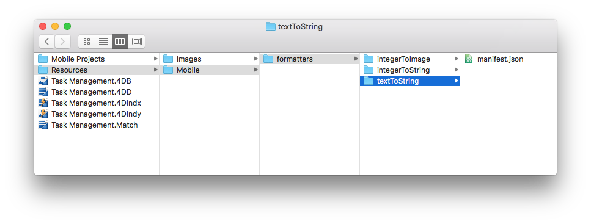
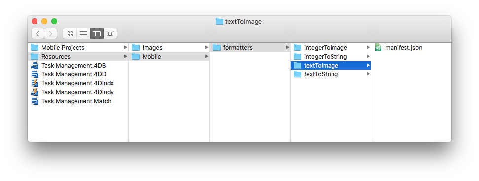

> **OBJECTIFS**
> 
> Create your first data formatters.

> **CONDITIONS PRÉALABLES**
> 
> Click [here](requirements.html) to see what you'll need to get started!

Dans ce tutoriel, nous vous guiderons dans la création de divers exemples de formats.


From the **Labels & Icons** section, you can choose pre-packaged formats.

> **Available formats:**
> 
> * **Text**: Text
> * **Date**: Date, Short date, Long date, Full date
> * **Time**: Time, Short time, Duration, Integer number
> * **Boolean**: "No" or "Yes", "False" or "True"
> * **Integer**: Integer number, Decimal number, Real number, Percentage, Ordinal number, Currency $, Currency €, Currency ¥, Spell Out

Commençons par télécharger le Projet Starter :

<div className="center-button">
<a className="button button--primary"
href="https://github.com/4d-go-mobile/tutorial-DataFormatter/releases/latest/download/tutorial-DataFormatter.zip">Download</a>
</div>

## Téléchargez le projet Starter

Pour commencer, téléchargez le **Projet Starter**, qui comprend :

* Les dossiers **integerToImage_Images** et **textToImage_Images**, qui contiennent des images (à utiliser ultérieurement pour les formats contenant des images)
* Un fichier **Task Management.4dbase** (accompagné d'une application de projet mobile prêt à l'emploi)

<div className="center-button">
<a className="button button--primary" href="https://github.com/4d-go-mobile/tutorial-CustomDataFormatter/archive/66d7eea49bc3353f73dbf784ee06283b3a332d0b.zip">Projet Starter</a>
</div>

Vous êtes maintenant prêts à créer vos premiers formats !

## Créez le dossier formatters

Créez d'abord un dossuer *Task Management.4dbase/Resources/Mobile/formatters*.


## Formats des entiers

### Nombre entier vers chaîne

* Créez un dossier **integerToString** dans le dossier Formats que vous venez de créer.
* Créez ensuite un fichier **manifest.json** dans le dossier **integerToString**.


Voici le contenu du fichier **manifest.json** :

```json
{
   "name": "integerToString",

   "type": ["integer"],

   "binding": "localizedText",

   "choiceList": {"0":"UX designer","1":"Developer","2":"QA","3":"Product Owner"}
}
```

1. **name** : le nom du format
2. **type** : le type de format 4D que vous souhaitez utiliser
3. **binding** : soit **localized text** pour les chaînes soit **imageNamed** pour les images
4. **choiceList** : valeurs mappées

### Nombre entier vers image

* Créez un dossier **integerToImage** dans le dossier **Formats** que vous venez de créer.

* Créez un fichier **manifest.json** dans le dossier **textToImage**.


* Créez ensuite un dossier **Images** dans le dossier **integerToImage**. Vous pouvez ajouter les images de **integerToImage_Images** (dans StarterProject.zip) dans ce nouveau dossier.


Voici le contenu du fichier **manifest.json** :


```json
{
   "name": "integerToImage",

   "type": ["integer"],

   "binding": "imageNamed",

   "choiceList": {"0":"todo.png","1":"inprogress.png","2":"pending.png","3":"done.png"},

   "assets": {
      "size": {
         "width": 40, "height": 40
      }
   }
}
```
1. **name** : le nom du format
2. **type** : le type de format 4D que vous souhaitez utiliser
3. **binding** : soit **localized text** pour les chaînes soit **imageNamed** pour les images
4. **choiceList** : valeurs mappées
5. **assets** : ajuster la taille d'affichage (largeur et hauteur)

## Formats texte

### Texte vers chaîne

* Créez un dossier **textToString** dans le dossier Formats que vous venez de créer.

* Créez un fichier **manifest.json** dans le dossier **textToString**.



Voici le contenu du fichier **manifest.json** :

```json
{
   "name": "textToString",

   "type": ["text"],

   "binding": "localizedText",

   "choiceList": {"FRA":"France","MAR":"Morocco","USA":"United States","AUS":"Australia"}
}
```

1. **name** : le nom du format
2. **type** : le type de format 4D que vous souhaitez utiliser
3. **binding** : soit **localized text** pour les chaînes soit **imageNamed** pour les images
4. **choiceList** : valeurs mappées

### Texte vers image

* Créez un dossier **textToImage** dans le dossier Formats que vous venez de créer.

* Créez un fichier **manifest.json** dans le dossier **textToImage**.



* Créez ensuite un dossier **Images** dans le dossier **textToImage**. Vous pouvez ajouter les images de **textToImage_Images** (dans StarterProject.zip) dans ce nouveau dossier.


Voici le contenu du fichier **manifest.json** :

```json
{
   "name": "textToImage",

   "type": ["integer"],

   "binding": "imageNamed",

   "choiceList": ["image1.png","image2.png","image3.png"],

   "assets": {
  "size": {
   "width": 40, "height": 40
      }
   }
}

```

## Dark mode support

Whether your device is in dark or light mode, whether you're working on iOS or Android, you can easily use the custom data formatters containing images. The pictures will be adapted depending on the phone's color mode.

### Tintable color

To optimize the color contrast of your black and white images on your app depending on the color mode (light or dark), you can set the images as follows, with the `"tintable": true` code line:

```json
{
   "name": "textToImage",
   "type": ["text"],
   "binding": "imageNamed",
   "choiceList": {"car":"car.png","plane":"plane.png","bus":"bus.png"},
   "assets": {
     "size": 54, 
     "tintable": true
     }
}
```
Here is the result in light and dark modes:

| Light mode                              |               Dark mode                |
| --------------------------------------- |:--------------------------------------:|
|  |  |


### Optimized color pictures

To optimize the color pictures displayed on your app and adapt them to your color mode, you need to have two pictures: one for the light mode, and one for the dark mode suffixed with `_dark`, as follows:


```json
{
   "name": "textToImage",
   "type": ["text"],
   "binding": "imageNamed",
   "choiceList": {"car":"car.png","plane":"plane.png","bus":"bus.png"},
   "assets": {
     "size": 54
   }
}
```
Here is the result in light mode and in dark mode:

| Light mode                                 |                 Dark mode                 |
| ------------------------------------------ |:-----------------------------------------:|
|  |  |

## Ouvrir un projet mobile

Open the Task Management.4dbase with 4D and go to File > open > Mobile Project... to open the **Tasks**

Next, go to the **Labels & Icons section** in the project editor. All of your formatters are available for the different field types you  previously defined in the different formatter manifest.json files:

* Sélectionnez le format **integerToString** pour **Job field**
* Sélectionnez le format **textToString** pour **Country field**
* Sélectionnez le format **integerToImage** pour **Task Status**
* Sélectionnez le format **textToImage** pour **Manager**


## Build your 4D for iOS app

Build your 4D of iOS app and you'll see that your data formatter is well applied depending on the credit limit.


Download the completed formatter template folder:

<div className="center-button">
<a className="button button--primary" href="https://github.com/4d-go-mobile/tutorial-CustomDataFormatter/releases/latest/download/tutorial-CustomDataFormatter.zip">Download</a>
</div>

And you're done! 
