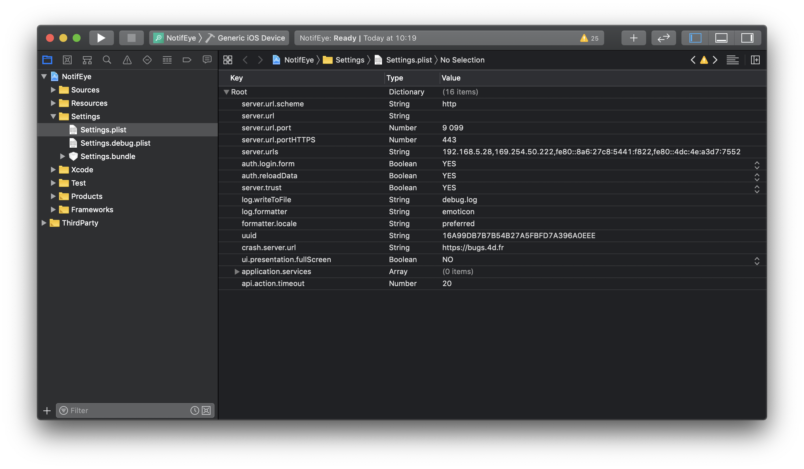
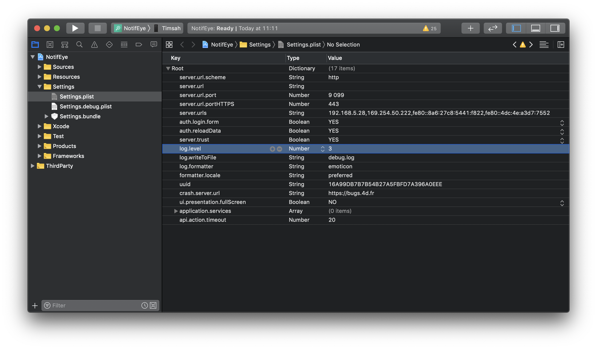

## Debug from Xcode
Si vous rencontrez des problèmes au cours de la phase de création, vous pouvez ouvrir votre projet généré avec Xcode en sélectionnant l'option **Ouvrir le produit avec Xcode** dans le menu **Projet**.

A partir de là, vous pouvez **lancer votre application** dans le simulateur en cliquant sur le **bouton Générer** et obtenir tous les journaux en bas de l'espace de travail Xcode.

### Enregistreur

Un enregistreur est un objet qui vous permettra d'enregistrer et de tracer.

Pour ce faire, nous utilisons [XCGLogger](https://github.com/DaveWoodCom/XCGLogger).

Vous trouverez la définition des paramètres de l'enregistreur dans votre projet Xcode/Settings/Settings.plist.

### Niveaux

Vous pouvez filtrer et afficher différents niveaux de journalisation dans votre console en ajoutant log.level dans votre fichier Settings.plist.

Pour cela, ajoutez une ligne en faisant un clic droit dans le fichier Settings.plist et entrez :
* log.level comme clé
* Nombre comme type
* 3 comme valeur (par exemple)

Les **valeurs disponibles** sont les suivantes :

* 0 pour verbose
* 1 pour le débogage
* 2 pour info (valeur par défaut)
* 3 avertissement
* 4 erreur
* 5 sévère

Donc, pour cet exemple, si vous définissez la valeur log.level sur 3, vous obtiendrez un **avertissement, une erreur et un sévère** dans votre console Xcode.

### Format

Vous pouvez afficher différents indicateurs visuels dans la console Xcode pour **mettre en évidence différents types de journaux**.

Pour ce faire, il vous suffit d'ouvrir votre projet Xcode/Settings/Settings.plist

#### Émoticônes

 * prefixes[.verbose] = "🗯"
 * prefixes[.debug] = "🔹"
 * prefixes[.info] = "ℹ️"
 * prefixes[.warning] = "⚠️"
 * prefixes[.error] = "‼️"
 * prefixes[.severe] = "💣"

#### Cercles

* prefixes[.verbose] = "🔘"
* prefixes[.debug] = "🔵"
* prefixes[.info] = "⚪"
* prefixes[.warning] = "☢️"
* prefixes[.error] = "🔴"
* prefixes[.severe] = "⚫"

## Debug from your iPhone

:::info

This feature requires that you have enabled the [Apple Device Developer Mode](../getting-started/requirements.md#apple-device-developer-mode).

:::

From your app, if you have a crash, you can display, edit and send feedback.

Pour ce faire :
* Accédez aux paramètres de votre iPhone
* Recherchez votre application en déroulant la liste
* Activez les commentaires (feedback)

À partir de là, il vous suffit de rouvrir votre application. Une feuille d'action apparaîtra pour vous permettre de :
* Envoyer des messages
* Suggérer une amélioration
* Afficher le journal courant
* Signaler un problème

