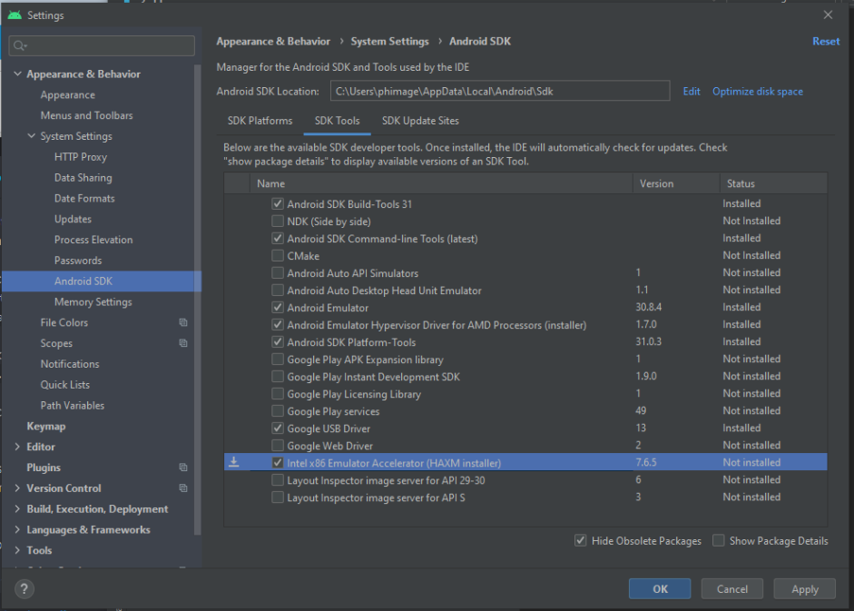

4D for iOS et 4D for Android nécessitent une configuration minimale spécifique.

## Configuration système

Les prérequis système sont identiques aux [prérequis système basiques de 4D](https://us.4d.com/product-download/Feature-Release).

8 Go de RAM sont recommandés.

## 4D

- **Développement**: 4D avec une licence 4D Developer Pro

- **Déploiement **: 4D Server
    - Le 4D Web Server doit être lancé.
    - Les ports HTTP et HTTPS doivent être activés et configurés correctement. HTTPS est nécessaire pour le déploiement de 4D for iOS et 4D for Android.

## iOS

[Apple configurator 2](https://itunes.apple.com/us/app/apple-configurator-2/id1037126344) installé sur votre Mac (facultatif).

Installing **Xcode** is required. Version table:

| 4D    | Swift | iOS  | Xcode                                                                                                         | macOS   |
| ----- | ----- | ---- | ------------------------------------------------------------------------------------------------------------- | ------- |
| 19 R7 | 5.7.1 | 16.0 | [14.1](https://developer.apple.com/services-account/download?path=/Developer_Tools/Xcode_14.1/Xcode_14.1.xip) | 12.5    |
| 19 R6 | 5.7   | 16.0 | [14.0](https://developer.apple.com/services-account/download?path=/Developer_Tools/Xcode_14/Xcode_14.xip)     | 12.5    |
| 19 R5 | 5.6.1 | 15.5 | [13.4](https://developer.apple.com/services-account/download?path=/Developer_Tools/Xcode_13.4/Xcode_13.4.xip) | 12.2    |
| 19.x  | 5.5   | 15.0 | 13.1                                                                                                          | 11.3    |
| 18.x  | 5.2   | 13.4 | 11.4                                                                                                          | 10.15.2 |

Historique

| 4D           | Swift | iOS  | Xcode  | macOS   |
| ------------ | ----- | ---- | ------ | ------- |
| 19 R4        | 5.6   | 15.4 | 13.3   | 12.2    |
| 19 R3        | 5.5.2 | 15.2 | 13.2.1 | 11.3    |
| 19 R2        | 5.5   | 15.0 | 13.1   | 11.3    |
| 19           | 5.5   | 15.0 | 13.1   | 11.3    |
| 18 R6        | 5.3.2 | 14.4 | 12.4   | 10.15.4 |
| 18 R5 & 18.3 | 5.3   | 14.2 | 12.2   | 10.15.4 |
| 18 R4        | 5.3   | 14.0 | 12.0   | 10.15.4 |
| 18 R3        | 5.2.4 | 13.5 | 11.5   | 10.15.2 |
| 18.2         | 5.2   | 13.4 | 11.4   | 10.15.2 |
| 18.1         | 5.1.3 | 13.3 | 11.3.1 | 10.14.4 |
| 18 R2        | 5.1.3 | 13.3 | 11.3.1 | 10.14.4 |
| 18           | 5.1   | 13.2 | 11.2   | 10.14.4 |
| 17 R6        | 5.0   | 12.2 | 10.2.1 | 10.14.4 |
| 17 R5        | 4.2.1 | 12.2 | 10.2   | 10.14.3 |
| 17 R4        | 4.2.1 | 12   | 10.1   | 10.13.6 |
| 17 R3        | 4.2   | 12   | 10.0   | 10.13.6 |
| 17 R2        | 4.1.2 | 11.4 | 9.4    | 10.13.2 |
| 17 R2        | 4.1   | 11.3 | 9.3.1  | 10.13.2 |

:::note Compatibilité

Les formateurs mis à jour pour 4D v19 R3/4D v19.2 et plus ne sont pas compatibles avec les versions précédentes de 4D.

:::

### Apple Device Developer Mode

Depuis iOS 16 et Xcode 14, vous devez activer le **Developer Mode** sur votre appareil pour pouvoir développer et déboguer.

Vous devez essentiellement basculer le "Developer Mode" interrupteur dans l'application "Settings" de votre appareil. Plus d'informations sont fournies dans la [documentation Apple](https://developer.apple.com/documentation/xcode/enabling-developer-mode-on-a-device).

## Android

Installing **Android Studio** (which includes **Android SDK**) is required. Version table:

| 4D    | Android Studio                                                      | Windows           |
| ----- | ------------------------------------------------------------------- | ----------------- |
| 19 R7 | [Dolphin 2021.3.1](https://developer.android.com/studio/archive)    | Windows 10 64-bit |
| 19 R6 | [Dolphin 2021.3.1](https://developer.android.com/studio/archive)    | Windows 10 64-bit |
| 19 R5 | [Arctic fox 2020.3.1](https://developer.android.com/studio/archive) | Windows 10 64-bit |

Historique

| 4D    | Android Studio      | Windows           |
| ----- | ------------------- | ----------------- |
| 19 R4 | Arctic fox 2020.3.1 | Windows 10 64-bit |
| 19 R3 | Arctic fox 2020.3.1 | Windows 10 64-bit |
| 19 R2 | 4.1.2               | Windows 10 64-bit |

:::note notes

- Vous pouvez créer des applications Android sur Mac et sur PC.

- Nous recommandons vivement de ne pas exécuter un émulateur accéléré par VM à l'intérieur d'une autre machine virtuelle (VM), telle que la VM hébergée par VirtualBox. Cliquez [ici](https://developer.android.com/studio/run/emulator-acceleration) pour plus de détails.

:::

### Android Studio configuration

You need to configure your Android Studio to build and debug your projects. Open the Android Studio **Preferences**, select the **Android SDK/SDK Tools** tab and make sure you have checked and installed the following elements:

- **Android SDK Build Tools 31**
- **Android SDK Command-line Tools (latest)**. By selecting this checkbox, you will be able to visualize all your virtual devices directly from the 4D mobile Project Editor.
- **Android Emulator**
- **Android SDK Platform Tools**
- **Google USB driver** (only on Windows, required to debug from an Android device)
- **Intel x86 Emulator Accelerator (HAXM installer)**

