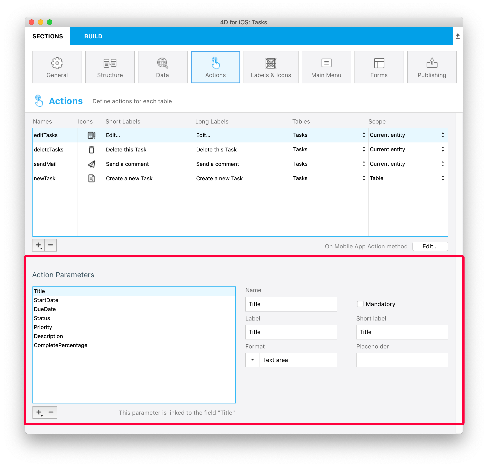
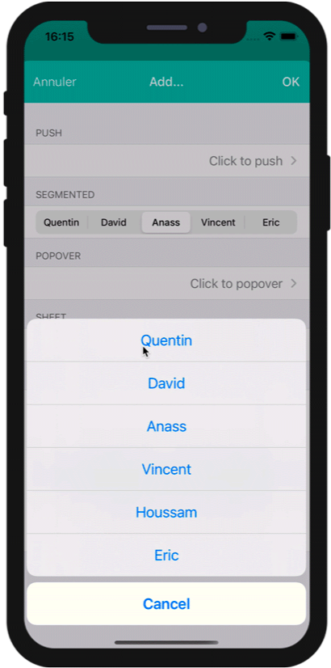

The 4D Mobile Project editor allows you to create actions to include in your mobile app.

You can use [preset actions](#preset-actions) or [custom actions](../tutorials/actions/define-first-action.md) and [define their parameters](#add-parameters-to-your-actions).

On the 4D side, you can execute 4D code in the [On Mobile App Action](../4d/on-mobile-app-action.md) database method.

Actions are automatically available in the [mobile interface](#mobile-app-side).


## Éditeur de projet

### Créez votre application

Vous pouvez créer de nouvelles actions en cliquant sur le bouton +, situé en-dessous du tableau d'Actions. Une nouvelle ligne apparaîtra alors dans le tableau.

Vous définirez ensuite les éléments suivants :

* **Names:** The action name to use in the [On Mobile App Action](../4d/on-mobile-app-action.md) database method to trigger your 4D code.
* **Icônes :** Sélectionnez une icône pour votre action à partir de la librairie d'icônes. You can also [add your own icon](labels-and-icons.md#adding-custom-icons).
* **Libellés long et court :** Définissez les libellés correspondant aux actions que vous souhaitez afficher dans votre application.
* **Table :** Sélectionnez la table à laquelle vous souhaitez appliquer une action.
* **Portée :** Choisissez d'appliquer l'action à une **entité** ou à une **table**.


:::note note

You can sort the **Names** with a drag-and-drop. This operation will set the order in which they will appear in the app's menu.

:::

### Ajoutez des paramètres à votre action

Vous pouvez ajouter des **paramètres d'action** et **éditer** des données directement depuis votre application.

Pour chaque paramètre, vous pouvez éditer les propriétés suivantes :

* Le nom
* Le libellé long
* Le libellé court
* Format
* Les contraintes (définir des valeurs minimales ou maximales)
* Le placeholder
* La définition d'un champ obligatoire
* La valeur par défaut



Vous êtes libres de choisir l'ordre des paramètres à l'aide du glisser-déposer.

Voici les différents **formats** que vous pouvez sélectionner en tant que paramètre :

<table>

<tr>
<th colspan="2"  style={{textAlign: 'center'}}>TEXTE</th>
</tr><tr style={{textAlign: 'center'}}>
<th>Format</th><th>Description</th>
</tr><tr>
<td>Texte</td><td>Première lettre de la chaîne en majuscule</td>
</tr><tr>
<td>Adresse mail</td><td>Clavier iOS optimisé pour la saisie de l'e-mail</td>
</tr><tr>
<td>Numéro de téléphone</td><td>Clavier iOS pour la saisie des numéros de téléphone.</td>
</tr><tr>
<td>Compte</td><td>Clavier iOS optimisé pour la saisie du nom d'utilisateur</td>
</tr><tr>
<td>Mot de passe</td><td>Clavier optimisé pour la gestion des mots de passe</td>
</tr><tr>
<td>URL</td><td>Clavier iOS optimisé pour la saisie de l'URL</td>
</tr><tr>
<td>Code postal</td><td>Clavier iOS optimisé pour la saisie du code postal</td>
</tr><tr>
<td>Zone de texte</td><td>Inclut plusieurs lignes de texte dans un même champ</td>
</tr><tr>
<td>Code barres</td><td>Extraire la valeur associée au code-barres. Formats pris en charge : EAN8, EAN13, Code 39, Code 93, Code 128, QR Code, UPC, PDF417</td>
</tr>
<tr>
<td colspan="2"></td>
</tr>

<tr>
<th colspan="2" style={{textAlign: 'center'}}>NUMERIQUE</th>
</tr><tr style={{textAlign: 'center'}}>
<th>Format</th><th>Description</th>
</tr><tr>
<td>Numérique</td><td>Nombres avec décimales</td>
</tr><tr>
<td>Entier</td><td>Nombres sans décimales</td>
</tr><tr>
<td>Scientifique</td><td>Notation scientifique</td>
</tr><tr>
<td>Pourcentage</td><td>Notation en pourcentage</td>
</tr><tr>
<td>Nombre en lettres</td><td>Convertit les nombres en chaînes</td>
</tr>
<tr>
<td colspan="2"></td>
</tr>

<tr>
<th colspan="2" style={{textAlign: 'center'}}>DATE</th>
</tr><tr style={{textAlign: 'center'}}>
<th>Format</th><th>Description</th>
</tr><tr>
<td>Date</td><td>Nov 23, 1937</td>
</tr><tr>
<td>Date courte</td><td> 11/23/37</td>
</tr><tr>
<td>Date longue</td><td>November 23, 1937</td>
</tr><tr>
<td>Date complète</td><td>Tuesday, November 23, 1937</td>
</tr><tr>
<td colspan="2"></td>
</tr>

<tr>
<th colspan="2" style={{textAlign: 'center'}}>HEURE</th>
</tr><tr style={{textAlign: 'center'}}>
<th>Format</th><th>Description</th>
</tr><tr>
<td>Heure</td><td>3:30 PM</td>
</tr><tr>
<td>Durée</td><td>2 hours 30 minutes</td>
</tr>
<tr>
<td colspan="2"></td>
</tr>

<tr>
<th colspan="2" style={{textAlign: 'center'}}>BOOLÉEN</th>
</tr><tr style={{textAlign: 'center'}}>
<th>Format</th><th>Description</th>
</tr><tr>
<td>Booléen</td><td></td>
</tr><tr>
<td>Coche</td><td></td>
</tr>

<tr>
<td colspan="2"></td>
</tr>
<tr>
<th colspan="2" style={{textAlign: 'center'}}>IMAGES</th>
</tr>
<tr>
<td>Signature</td><td>Permet d'effectuer une signature avec le doigt</td>
</tr>

</table>

## Actions prédéfinies

Les projets 4D mobile comprennent trois actions (prédéfinies) pour gérer le contenu de votre application :

* Ajouter
* Editer
* Supprimer
* Partager
* Trier
* Open URL

### Ajouter

Les projets 4D mobile simplifient la création des **actions d'ajout**.

Vous n'avez qu'à sélectionner l'option **Action d'ajout pour**, accessible à partir du **bouton +**, situé en-dessous de la table Actions.


Puis, **sélectionnez la table** que vous souhaitez associer à l'action d'ajout.

Cela **créera automatiquement** tous les paramètres dans l'éditeur de projets et vous permettra de modifier chaque valeur d'un champ.

Pour ce genre d'actions, vous constaterez que toutes les **propriétés** sont déjà saisies à des fins pratiques, à droite de la liste de paramètres.


### Editer

La création des **actions d'édition** suit le même principe que les actions d'ajout, à l'exception du fait que vous ne serez pas en mesure de définir des valeurs par défaut à partir de la section Actions.


### Supprimer

La création des **actions de suppression** suit le même principe que les actions d'édition. La seule différence est que cette action vous permet de supprimer une entité.

Pour créer une action de suppression, sélectionnez l'option **Supprimer l'action pour**, accessible à partir du **bouton +** en-dessous du tableau d'actions.

Ce type d'actions doit être utilisé avec précaution.


### Partager

Sélectionner l'**action Partager** permettra à vos utilisateurs de partager du contenu avec d'autres utilisateurs. You just need to select the scope:

- **entity**: to share content from a detail form
- **table**: to share a list form

See the [Deep Linking](../special-features/deep-linking.md) page for more details.

### Sort action

**Sort actions** are useful to:

- define a default sort order for the table list forms
- allow your mobile users to choose a list sort order

When you create a sort action for a table, you need to select the first field on which the sort will be done:


The field is added to the Sort Criteria list. An ascending sort order is set by default, but you can change it using the **Sort order** menu.

You can sort entities in more than one field. Each field you sort is referred to as a sort level. For example, the results of a two-level ascending sort of the `lastName` and `firstName` fields would produce a list such as this:

```4d
Aardvark, Anthony
Aardvark, Artemis
Aardvark, Arthur
...
Zygote, Elena
Zymosian, Elmer
```

To add one or more sort level(s) in the Sort Criteria list, select the **+** button under the list and configure each level:


#### Sort order menu on the mobile app

When you define more than one sort action for a table, mobile users automatically benefit from a **sort** menu. It contains all the predefined sort actions:


> When only one sort action is defined for a table, the **sort** menu is not displayed on the mobile app side.

### Open URL action

The **Open URL action** allows your mobile users to open an url from their mobile app. This action will display a web page served by 4D Server in a web area from within the mobile app.

When you select this action, you have to define the path that will be opened:


You can only define a path starting with `/`, i.e. relative to the [current 4D web folder](https://developer.4d.com/docs/WebServer/webServerConfig.html#root-folder).

This action can be set for any table and any scope (Table or Current entity). Like other actions, the Open URL action will be automatically available in the [mobile app interface](#mobile-app-side) (short or long label).

:::note

To close the web page and get back to the mobile app interface, use the `$4d.mobile.dismiss()` function from within the page (see below).

:::

#### Web Server Side

The request sent to the server contains the context of the app (current entity and/or dataclass) in the `X-QMobile-Context` header. The content of this header is formatted in JSON and encoded in base64.

:::tip

You can get the context information already decoded as object using the [**4D Mobile App Server**](https://github.com/4d/4D-Mobile-App-Server#4d-mobile-app-server) component and its [WebHandler class](https://github.com/4d/4D-Mobile-App-Server/blob/main/Documentation/Classes/WebHandler.md).

:::

Context information can be processed in the web page to return through standard 4D web server features:

- [.shtml template pages](https://developer.4d.com/docs/WebServer/templates.html)
- [On Web Connection database method](https://developer.4d.com/docs/WebServer/httpRequests.html#on-web-connection).


#### Web Area Side

For your page to interact with the mobile app, some javascript code is automatically provided in the `$4d.mobile` object. This object contains the following properties and functions:

| Property   |                  |                               | Type     | Description                                                                                                                                                      |
| ---------- | ---------------- | ----------------------------- | -------- | ---------------------------------------------------------------------------------------------------------------------------------------------------------------- |
| $4d.mobile | .action          | .name                         | string   | name of the action                                                                                                                                               |
|            |                  | .label                        | string   | label of the action                                                                                                                                              |
|            |                  | .shortlabel                   | string   | short label of the action                                                                                                                                        |
|            | .dismiss()       |                               | Function | closes the native web view                                                                                                                                       |
|            | .status(message) |                               | Function | shows a message in native app for the user <br/>message: string<br/>message: object with "message" (or "statusText") and "success" (or "level") keys |
|            | .logger          | .log(level, message : string) | Function | shows a message in native app for the developer                                                                                                                  |
|            |                  | .info(message : string)       | Function | shows a message in native app for the developer                                                                                                                  |
|            |                  | .info(message : string)       | Function | shows a message in native app for the developer                                                                                                                  |
|            |                  | .warning(message : string)    | Function | shows a message in native app for the developer                                                                                                                  |
|            |                  | .error(message : string)      | Function | shows a message in native app for the developer                                                                                                                  |
|            |                  | .debug(message : string)      | Function | shows a message in native app for the developer                                                                                                                  |
|            |                  | .verbose(message : string)    | Function | shows a message in native app for the developer                                                                                                                  |


:::info See also

Blog post: [4D for Mobile : Display Web Pages in your Mobile Apps](https://blog.4d.com/4d-for-mobile-di…your-mobile-apps/)

:::


### On Mobile App Action

The [`On Mobile App Action`](../4d/on-mobile-app-action.md) database method is available to call all of your 4D methods.

After creating all of your actions, just click on the **Create** button from the Actions table to automatically generate a *Case of* code block that includes all your action names in the *On Mobile App Action* method.

:::note notes

- You can refresh the selection after executing an action using `$result.dataSynchro:=True`.
- You can notify the app user when action has been executed using `$result.statusText:="Message you want to display"`.
- You can also decide to force close the Edition form using `$result.close:=True`.

:::

## Action input controls

### How to use a custom input from the gallery

You can easily interact with native apps by using custom input controls, which follow the same logic as [Labels & Icons custom formatters](labels-and-icons.md) with native code.

To do so, you can create your own input controls with native code, or you can download a few input controls from our [gallery](https://4d-go-mobile.github.io/gallery/#/type/input-control), depending on what you need for your app. Drop them into a specific “inputControls” folder (`mybase/Resources/mobile/inputControls`), unzip them and drag them into this newly created folder. They will then be available and selectable from the project editor input controls menu, in the parameter properties of the action.

For example, if you want to get a client's phone number from your mobile contact list, the *phoneContact* input control template enables you to automatically fill your client's phone number field.

 

Bear in mind that all input controls from the gallery are open source and available on Github. So feel free to share your own input controls or your feedback on the [4D Forum](https://discuss.4d.com/).

### Input control selection

Action input controls display formatted elements (values, pictures) in your mobile apps. These elements are automatically included in your action form, more specifically in a choice list, in order to select one of the values and to use it as a parameter. These choice lists can be either static or dynamic:
- **Static** choice lists (predefined choices hard coded in json) that are located in an 'inputControls' folder (`mybase/Resources/mobile/inputControls`) in a manifest.json file. They are defined by several elements, as follows:

| Property               | Type               | Description                                                                                             |
| ---------------------- | ------------------ | ------------------------------------------------------------------------------------------------------- |
| **"name"**             | text               | action input control name                                                                               |
| Optional **"binding"** | text               | "imageNamed" to bind on images (Images must be in a subfolder "images" in the action formatter folder)  |
| **"choiceList"**       | object             | an object or collection to define a list of key(data sent to server)/value(displayed value to the user) |
| **"type"**             | text or collection | one text or a collection of text to define a type (text, integer, boolean) of input control             |
| Optional **"format"**  | text               | to select interface: push(default if not defined)/segmented/popover/sheet/picker                        |

Here is an example of a manifest.json file containing the contact information of a company's subsidiaries, that can be used as a static choice list:
```4d
{
    "name": "choiceListSheet",
    "type": [
        "text"
     ],
    "format": "sheet",
    "choiceList": {
        "1":"Paris",
        "2":"Tokyo",
        "3":"Sydney",
        "4":"San Jose",
        "5":"Rabat",
        "6":"Eching"
     }
}
```

- **Dynamic** choice lists based on datasource (choices depending on the database content). This method enables you to get data very fast by filling a form field using helper modules. Not only will your lists be directly accessible from your mobile app, they will also be constantly updated. The manifest.json file is composed of the following elements:

| Property              | Type               | Description                                                                                    |
| --------------------- | ------------------ | ---------------------------------------------------------------------------------------------- |
| **"name"**            | text               | input control name                                                                             |
| **"choiceList"**      | object             | an object that contain "dataSource" (see table below)                                          |
| **"type"**            | text or collection | one text or a collection of text to define a type (text, integer, boolean) of input control    |
| Optional **"format"** | text               | to select interface: "push"(default if not defined), "segmented", "popover", "sheet", "picker" |

| Property         |                             | Type                       | Description                                                                                                                     |
| ---------------- | --------------------------- | -------------------------- | ------------------------------------------------------------------------------------------------------------------------------- |
| **"dataSource"** |                             | object                     | an object that contain "dataClass", "field" and optional "entityFormat"                                                         |
|                  | **"dataClass"**             | text                       | table name                                                                                                                      |
|                  | **"field"**                 | text                       | used to extract data to send to server                                                                                          |
|                  | Optional **"sort"**         | object / collection / text | can be an object that contains **"field"**(sort criteria/fieldName), and optional **"order"** (sort order ascending by default) |
|                  | Optional **"search"**       | boolean / array            | can be an array that contain field to use for search                                                                            |
|                  | Optional **"entityFormat"** | text                       | for the display value (if no format we use the extracted data from field)                                                       |

**Note:** When the choice list is extensive, the optional "search" element becomes available.

Here is an example of a dynamic choice list:

```4d
{
    "name": "datasourcePush"
    "type": [
        "text"
    ],
    "format":"push",

    "choiceList": {
        "dataSource": {
            "dataClass": "Contact",
            "field": "LastName",
            "entityFormat": "%FirstName% %LastName% - %Job%",
            "search": "LastName",
            "order": "descending" 
        }
    }
}
```

On the Project editor side, once you select your **Input control** format, the **dataSource** will be selectable from a filtered list based on the format you have selected. Your app will then be updated and ready-to-use!

Here is an example with the *push* format:

 

Here are the different formats available on the generated application:

 - Push format:


- Segmented & picker formats:


 - Popover format:


 - Sheet format:



**Note:** You can access your input control using the arrow icon next to the "Input Control" field.

## Offline mode actions

The user of an app can draft, store and queue action requests, even if they are working offline (adding a customer's phone number, uploading a picture, printing an invoice or a quote, deleting an address, etc.). All these tasks are placed in the Pending actions list until the network is accessible. Once the user is online, all pending actions are consistently synchronized, executed and then visible in the Completed actions list.

Pending tasks can be visualized and opened from:

•   *The Settings screen*

It displays a summary and a history of all pending and completed tasks.


•   *The List & Detail forms*

They display all the tasks related to the table or to the entity that you are currently viewing.


:::note notes

- The "Share" predefined action is only executable online
- Actions are editable while pending, but they can no longer be modified once they switch to the "Completed" mode.

:::

### Update pending tasks that failed

Due to your server business logic, some tasks could be rejected. For mobile users, it is then possible to edit and to retry sending the relevant pending tasks. To do so, you can display a status text describing, in the "Complete" actions history, the reason of the failure. For example, you can reject an action sent by a mobile user to the server and inform him that the operation has failed. In that case, you can set the `success` value to `False` and provide a message in `statusText`, as follows:

```4d
 $response:=New object("success"; False; "statusText"; "Operation failed"))
```

 You can even add some errors by action parameters for the `alphaField` parameter, for example:

```4d
$response.errors:=New collection(New object("parameter"; "alphaField"; "message"; "Alpha field must contains a valide value")
```


## Mobile app Side

In your mobile app, actions are available in different ways in your List and Detail forms, depending on the templates you select in the Forms section.

### Table List forms

* **Entity action:** Swipe left on a cell to display the available actions in a List form. A "More" button is displayed if you've defined more than three actions per entity.


* **Table actions:** A generic actions button is available in the navigation bar to display a list of available table actions.


:::tip

Actions will be displayed in the same order as defined in the Action section.

:::

### Collection List forms

* **Entity action:** Depending on the template, actions are displayed by clicking on a generic button or by maintaing the pressure on a cell.


* **Table actions:** Like the Table List forms, a generic Actions button is available in the navigation bar to display a list of availble table actions.


### Detail forms

As with Table actions in List forms, a generic Actions button is available in the navigation bar to display all your entity actions in a list.


### Edition forms

If you have created an Edit or an Add action, as soon as you select it from the action list, an **Edition form** will appear.


From here, you can:

* edit all of your fields by selecting them, and
* validate or cancel your modifications using the **Done** or **Cancel** buttons (available in the navigation bar).

For your convenience, the Edition form includes a few **special features**:

* The keyboard type depends on the selected parameter type in the Action section.
* You can go to the next or previous field using the arrow on top of the keyboard.
* The iOS keyboard can be closed by touching anywhere outside of a field.
* Indication is given to the user when a value is not valid.
* The view focuses on empty mandatory fields when the user clicks the Done button.

## Que faire ensuite ?

See [this tutorial](../tutorials/actions/getting-started.md) that will guide you through the **action definition process**.