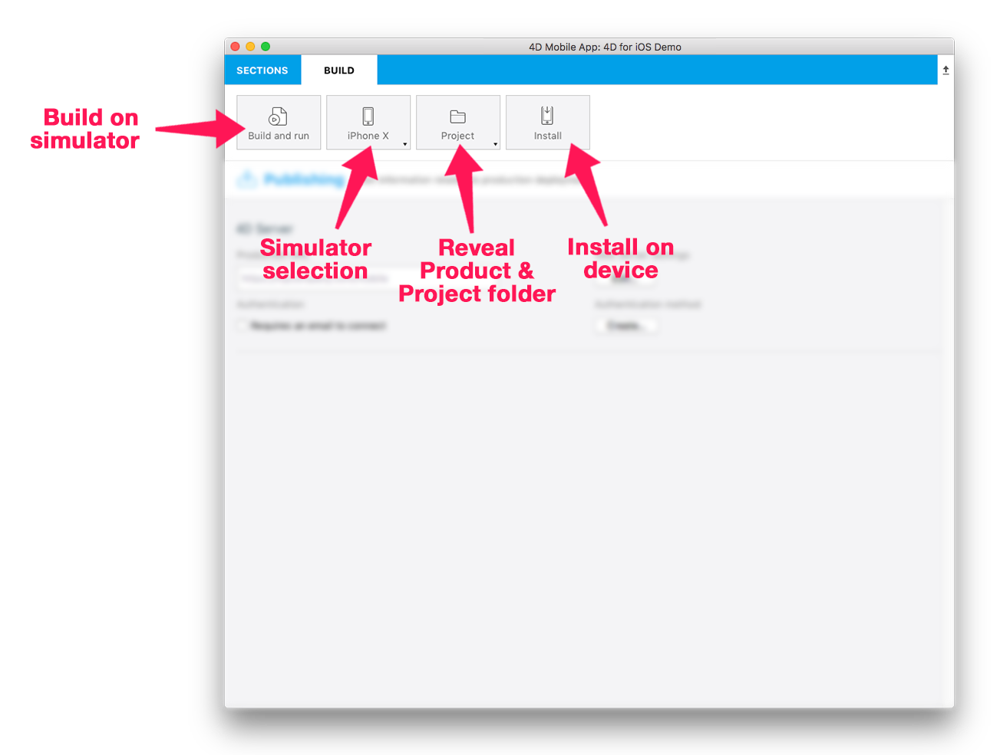

Vous pouvez tester votre application à tout moment lors de la phase de développement, grâce au Simulateur situé dans l'onglet GENERATION de l'éditeur de projet.

Voici la description des options de l'onglet Génération :

* **Créer & exécuter :** Lance l'application dans le simulateur.

* **iPhone X :** Le simulateur par défaut. En cliquant ici, vous afficherez une liste déroulante des simulateurs disponibles.

* **Projet :** Affiche une liste déroulante vous permettant d'**ouvrir le dossier du projet** ou le **dossier produit**, ou **d'ouvrir le produit avec Xcode**. Cette liste déroulante est utile pour [les opérations de débogage](../debug/from-project-editor).

* **Installer :** Installe l'application sur un appareil connecté (voir [Installation sur votre appareil iOS](../deployment/testing-on-your-device)).

## Utilisation du simulateur

Vous pouvez utiliser le simulateur en suivant ces étapes.

1. Sélectionnez votre appareil.

Dans l'onglet GÉNÉRATION de l'éditeur de projet, sélectionnez un appareil iOS ou Android à utiliser pour exécuter votre application.

2. Cliquez sur le bouton **Créer & exécuter**.

3. Testez votre application.

Testez la navigation entre les formulaires Liste et les formulaires détaillés dans votre application.

 
