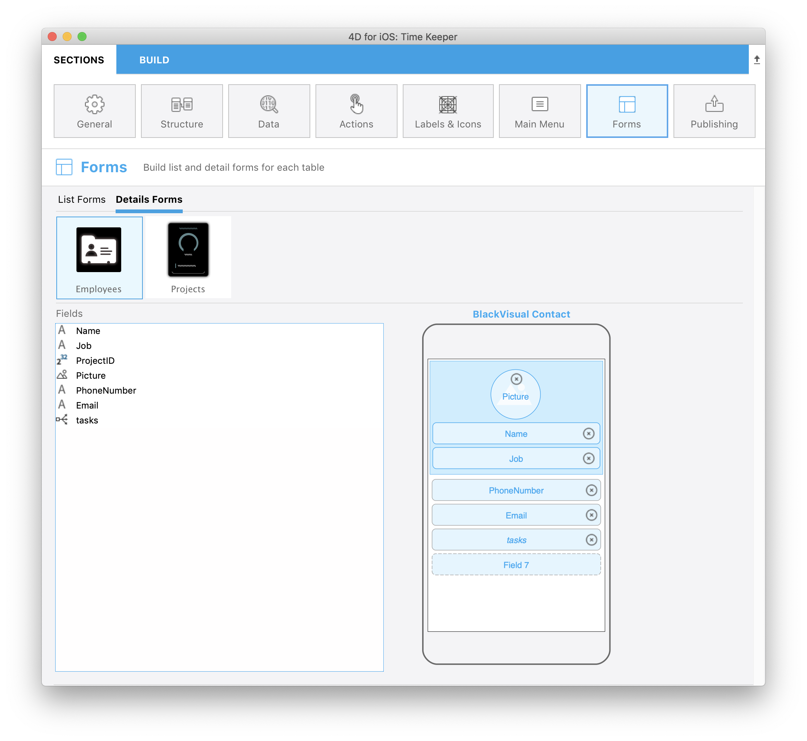

Grâce à ce tutoriel, vous pourrez facilement inclure des liens 1 vers N dans vos projets mobiles.

Commençons par télécharger le Projet Starter :

<a className="button button--primary"
href="https://github.com/4d-go-mobile/tutorial-OneToManyRelations/archive/c006015afeb0e134d872152f53b8cd5e4dcb59bb.zip">Projet Starter</a>

Dans ce tutoriel, nous allons créer une **application Task** à l'aide de 4D for iOS.

Mais d'abord, jetons un œil à la structure de notre base :

Vous remarquerez qu'il existe un lien 1 vers N nommé **tasks** qui utilisera une application iOS pour afficher les tâches (**vers N**) des employés (**1**).

Rendez-vous directement dans le menu Ouvrir> Projet mobile ... pour sélectionner *Time Keeper* puis dans la **section Structure**.

## Structure section

Vous voyez ici le lien **tasks** que nous avons créé précédemment... Vous pouvez le publier !

Il aura le même fonctionnement que n’importe quel autre champ pour la suite de la création de l’application.

:::tip

En survolant un élément, une astuce affiche le nom de la table source (qui est à l'origine) du lien.

:::

## Labels & Icons section

Le lien 1 vers N est maintenant disponible dans la section **Libellés et icônes**.

A noter qu'un lien 1 vers N créera un bouton dans l'application iOS générée.

Dans la section Libellés & icônes, vous définirez :

* un libellé de bouton
* une icône de bouton
* un titre qui sera affiché dans la vue de destination (pour indiquer d'où vous venez par exemple).

## Forms section

* Cliquez sur la section Formulaires et déposez le lien *tasks* dans le formulaire détaillé Employee Task.

## Build and Run

1. A partir du formulaire Lise Employee, cliquez sur un employé
2. Cela permettra d'ouvrir le formulaire détaillé des employés, où vous devriez voir apparaître un nouveau **bouton Relation** !
3. Cliquez sur ce bouton Relation pour afficher les tâches de l'employé.

Bravo ! Vous avez inclus des liens 1 vers N avec succès dans votre projet mobile.

Téléchargez le projet final :

<a className="button button--primary"
href="https://github.com/4d-go-mobile/tutorial-OneToManyRelations/releases/latest/download/tutorial-OneToManyRelations.zip">Download</a>

