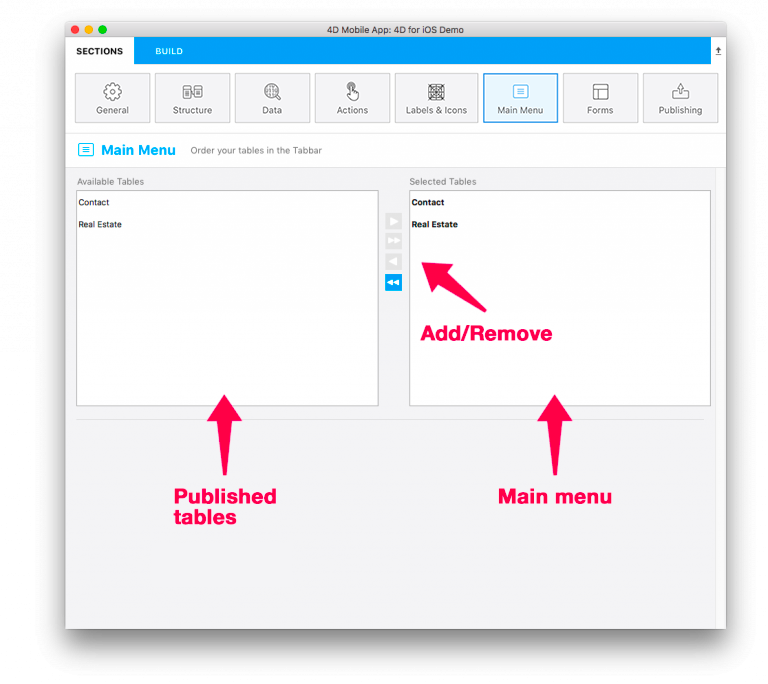

Cette page vous permet de sélectionner et de commander les tables qui seront disponibles dans la barre de navigation de votre application.

Par défaut, toutes les tables sélectionnées dans la page [Structure](structure.md) seront ajoutées au menu de votre application.

Vous pouvez utiliser les boutons **Ajouter**/**Supprimer** et glisser-déposer pour ajouter, supprimer et réorganiser les tables.

* Dans la liste des **Tables disponibles** figurent toutes les tables que vous avez publiées dans la [Structure ](structure.md)

* La liste des **Tables sélectionnées** comprend toutes les tables qui seront accessibles dans le menu de votre application.

