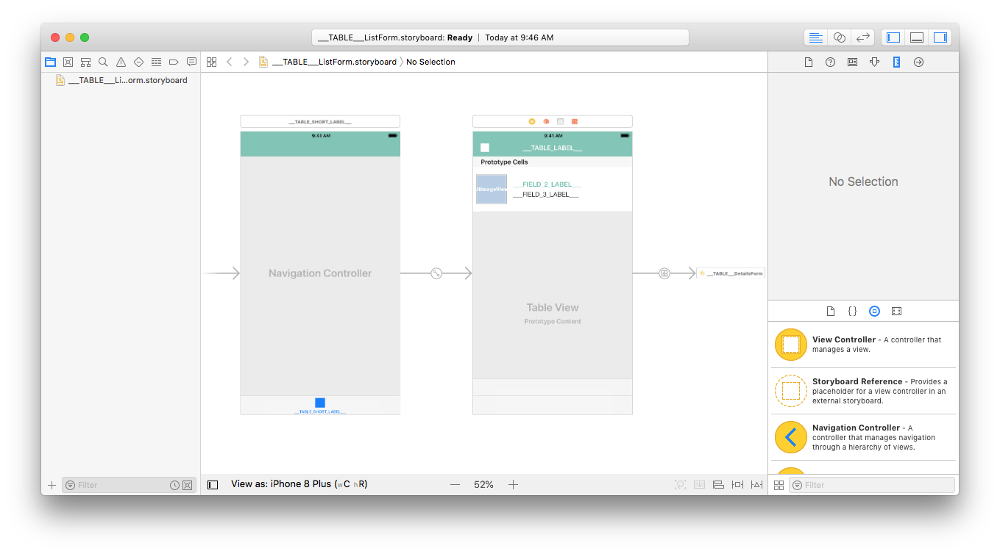
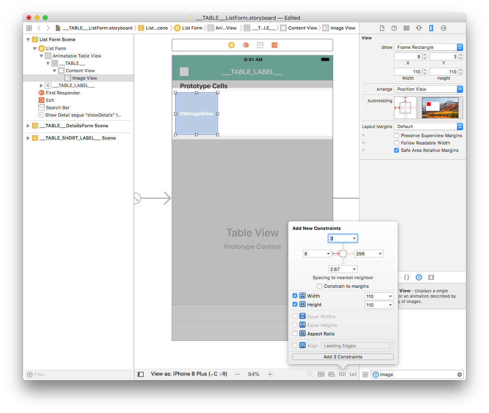
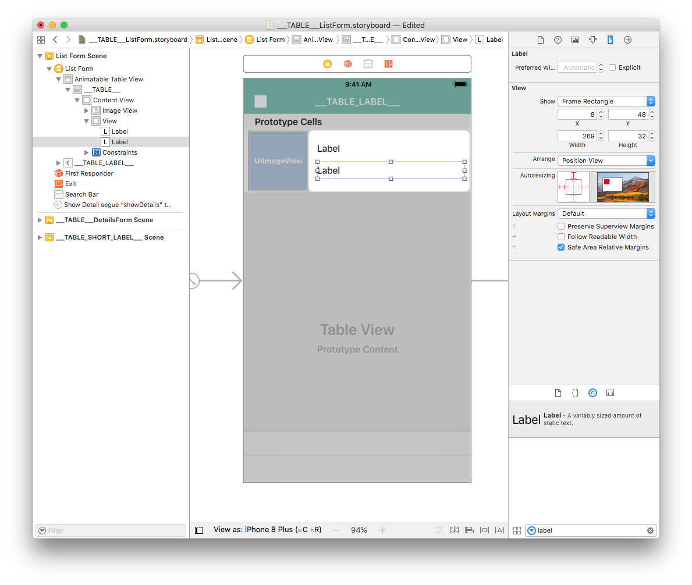
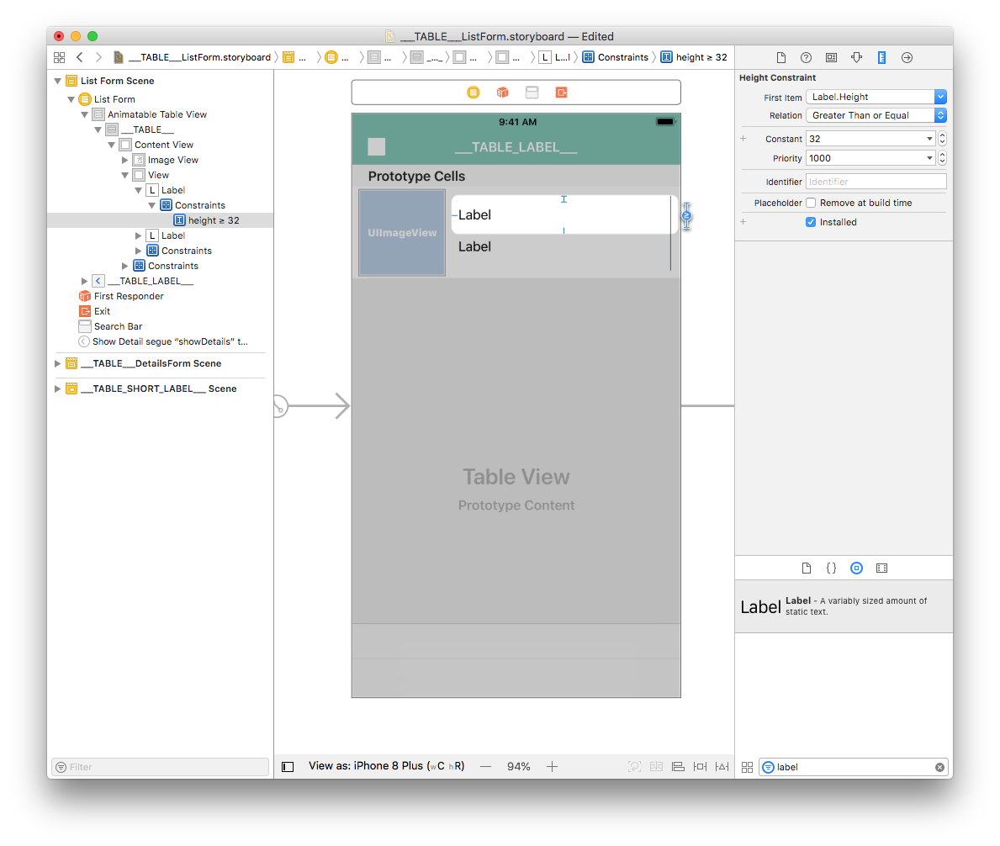
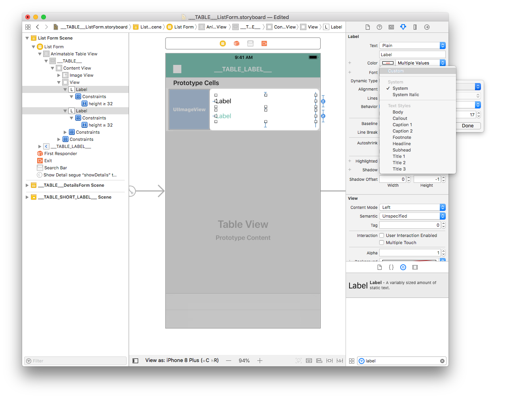
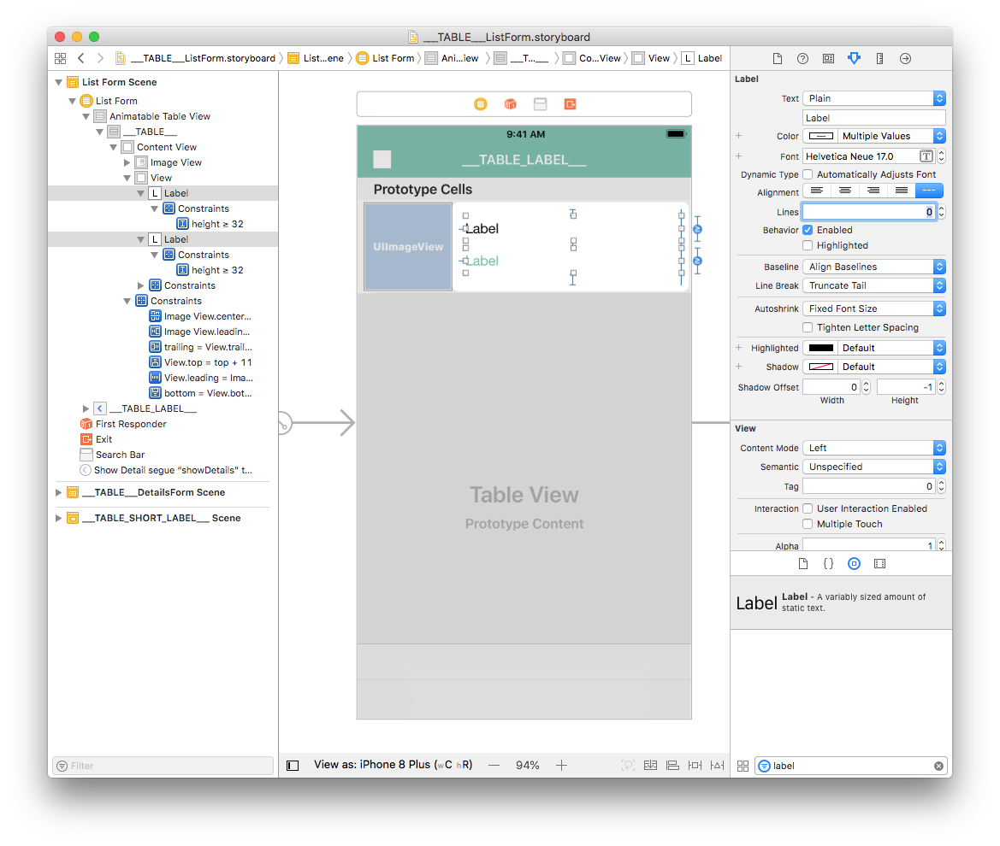
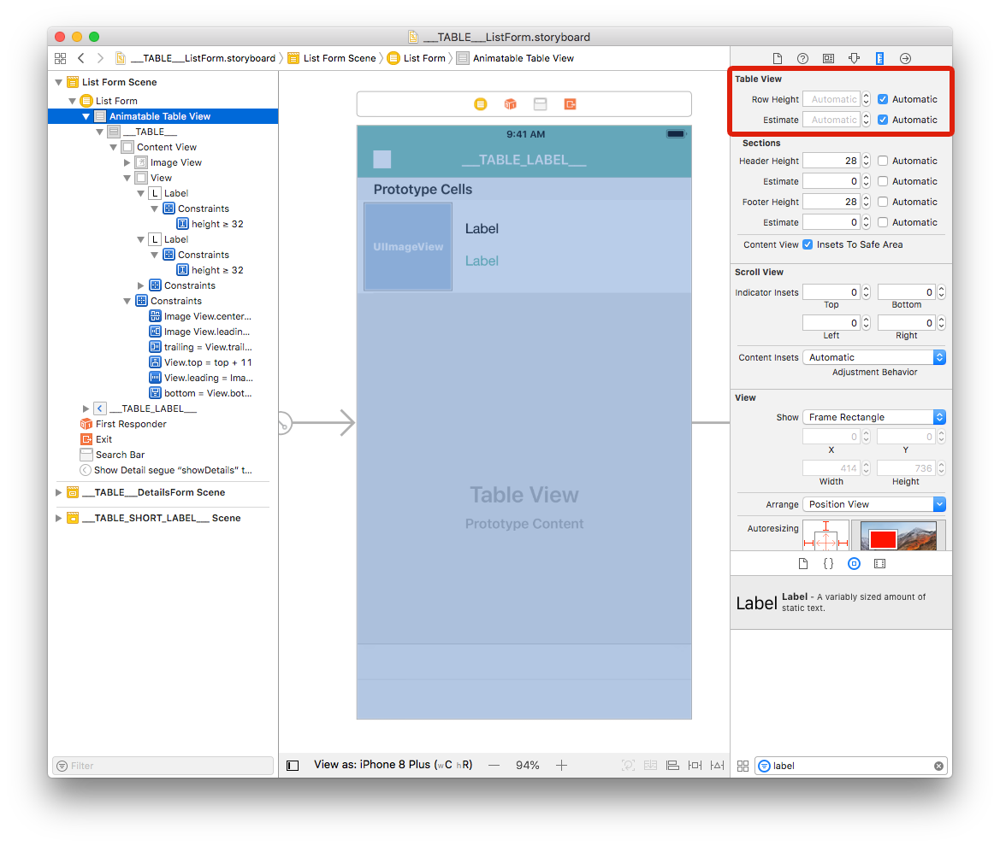
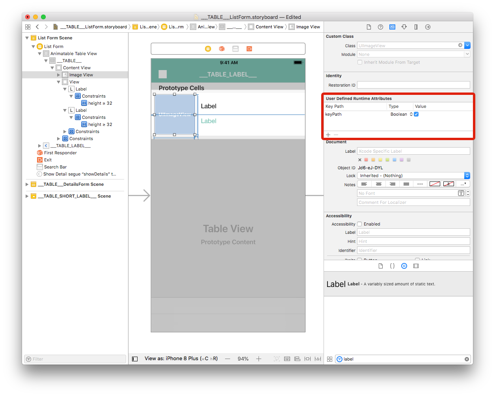
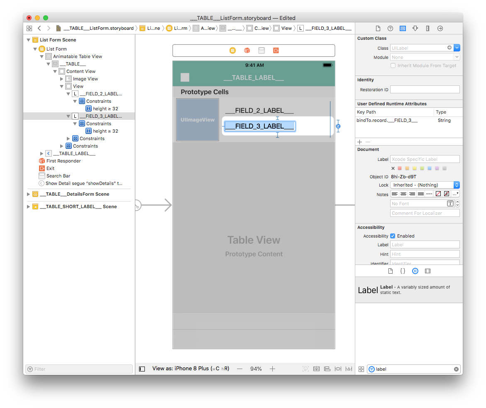

Now it's time to create your iOS list form interface with Xcode.

Voici le résultat que nous souhaitons obtenir :

Pour chaque cellule, nous allons ajouter :

* Une photo de profil
* Title
* Un sous-titre

## Ouvrir le fichier storyboard avec Xcode

Dans un premier temps, ouvrez votre fichier storyboard dans Xcode.

It's quite empty, so let's add some content!

## Add an Image View

À partir de l'**Object library** (la bibliothèque d'objets), glissez-déposez une **Image View** (une vue d'image) dans une cellule. Vous pouvez rechercher une « Image View » dans la barre de recherche en bas de la bibliothèque d’objets.

À partir du **Size inspector** (sur le côté droit de l’Interface Builder), définissez la largeur de la vue de l’image à 110 et la valeur de sa hauteur à 110. Définissez ensuite la valeur de X sur 8 et la valeur de Y sur 3.

Puis, ajoutez une contrainte (Leading : 8) en cliquant sur **Add New Constraints** (en bas de l’Interface Builder). Ajoutez également des contraintes de largeur et hauteur, comme suit :

Enfin, cliquez sur le bouton **Align** (dans la partie inférieure de l'nterface Builder) et cochez la case "Vertically in Container".

Your Image View is now well positioned.

Nous allons nous pencher maintenant sur les libellés de cellules.

## Ajouter des libellés de titre et de sous-titre

Nous allons commencer par **ajouter une vue**. Vous pouvez rechercher le terme « View » dans la **bibliothèque d'objets** et faire glisser la vue vers la cellule.

À partir du **Size inspector** (sur le côté droit de l’Interface Builder), définissez la largeur de la vue de l’image sur 277 et la valeur de sa hauteur sur 94. Définissez ensuite la valeur de X sur 126 et la valeur de Y sur 10.

Concernant la vue d'image, ajoutez quatre contraintes en cliquant sur le bouton **Add New Constraints** (Trailing: 11, Leading: 8, Top: 11 et Bottom: 10.67) pour la positionner correctement, comme suit :

Glissez et déposez un libellé dans la "View" que vous venez d’ajouter à partir de la bibliothèque d’objets.

À partir du **Size inspector**, définissez la largeur du libellé View sur 269 et sa hauteur sur 32. Définissez ensuite la valeur de X sur 8 et la valeur de Y sur 8.

**Dupliquez le libellé** et, dans le **Size inspector**, définissez la valeur de X sur 8 et la valeur de Y sur 48.

Sélectionnez les deux libellés et ajoutez quatre contraintes en cliquant sur le bouton **Add New Constraints** (Trailing: 0, Leading: 8, Top: 8 et Bottom: Multiple) comme suit :

Sélectionnez un libellé et double-cliquez sur **Height constraint** pour le modifier.

Remplacez la relation "Equal" par **Greater Than or Equal** afin que sa hauteur soit variable (pour gérer des libellés multilignes).

Répétez l’opération pour le deuxième libellé.

## Label customization

À partir de l’Attribute inspector (sur le côté droit de l’Interface Builder), vous pouvez personnaliser les couleurs de la police du libellé. Appliquons la couleur **Dark Grey Color** au deuxième libellé :

Vous pouvez également sélectionner la couleur principale de votre application :

À partir de l’Attribute inspector, vous pouvez également personnaliser la police. Sélectionnez les deux libellés et sélectionnez Font > Custom > **Helvetica Neue** :

Pour finaliser les personnalisations, sélectionnez les deux libellés et, dans la fenêtre Inspector, **entrez la valeur 0 dans Lines**. Ainsi, le nombre de lignes peut être illimité.

:::note

The provided storyboard is optimized to have a **variable cell height** depending on the contents of each cell.

:::

## Comment entrer des données dans vos cellules

### Image View

Sélectionnez votre Vue Image, cliquez sur **Identity inspector** et allez dans User Defined Runtime Attributes. Cliquez sur le **bouton +** pour ajouter une ligne.

* **Key Path **: commencez par bindTo pour activer la liaison sur le composant. Enter `bindTo.record.___FIELD_1___`

* **Type**: Always `String`

* **Value**: The attribute name. Enter `___FIELD_1_BINDING_TYPE___`

### Libellés

Select the first label and add a row in the Defined Runtime Attributes:

* **Key Path**: `bindTo.record.___FIELD_2___`

* **Type**: `String`

* **Value**: `___FIELD_2_BINDING_TYPE___`

Select the second label and add a row in the Defined Runtime Attributes:

* **Key Path**: `bindTo.record.___FIELD_3___`

* **Type**: `String`

* **Value**: `___FIELD_3_BINDING_TYPE___`

You can change the **storyboard display labels** to have better visibility:

* Double-cliquez sur le premier libellé pour le modifier et saisissez `___FIELD_2_LABEL___`
* Double-cliquez sur le deuxième libellé pour le modifier et saisissez `___FIELD_3_LABEL___`

Go to your project editor, select your list form template from the Forms section, then select Build and Run.

Here is the simulator result :

## Personnaliser votre application

The last step is adding a corner radius to the Image View to have a better design.

Sélectionnez votre Vue Image et ajoutez les deux lignes suivantes dans la zone User Defined Runtime Attributes :

* **Key Path**: `cornerRadius`

* **Type**: `Number`

* **Value**: `12`

et

* **Key Path**: `layer.masksToBounds`

* **Type**: `Boolean`

* **Value**: Check the box

Vous pouvez désormais créer votre projet depuis l'éditeur de projet !

## Que faire ensuite ?

In this tutorial, we've covered the basics for creating list form templates with iOS. You are now able to create simple templates on your own using the Starter project ressources. You can also see how to build [detail form templates](../creating-detail-forms/detail-form-template.md).

Download the completed template list folder:

<a className="button button--primary"
href="https://github.com/4d-go-mobile/tutorial-CustomListForm/archive/53ac1d5f506aa4ca2a8d78760ef799044c5c8bdc.zip">Download</a>

