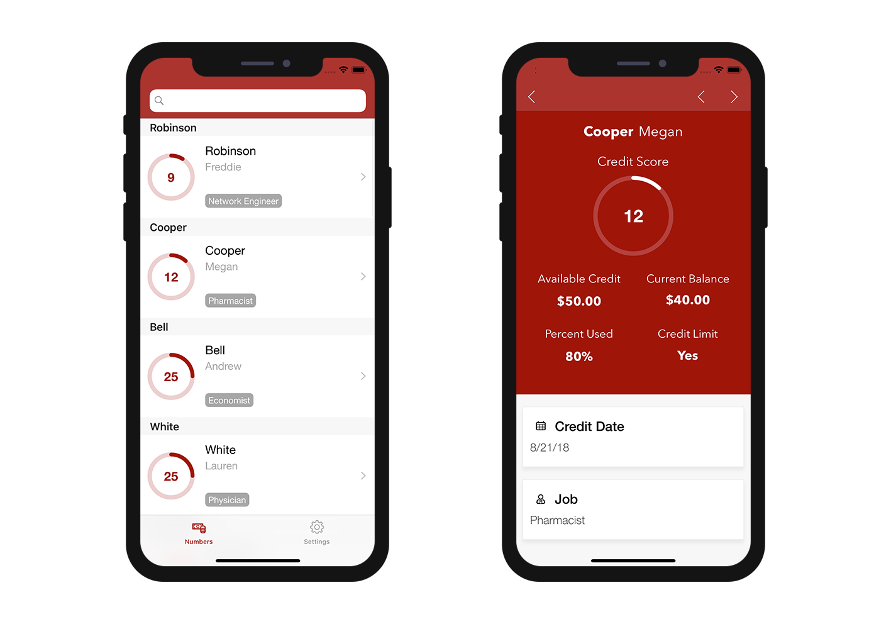

> **OBJECTIFS**
> 
> Use built-in formatters.

In this tutorial, we'll show you how to apply built-in [formatters](../../project-definition/labels-and-icons.md#formatters) to your fields.

## Téléchargez le projet Starter

Commençons par télécharger le Projet Starter :

<a className="button button--primary"
href="https://github.com/4d-go-mobile/tutorial-DataFormatter/releases/latest/download/tutorial-DataFormatter.zip">Download</a>

## Ouvrir un projet mobile

Go to **Labels & Icons** in Sections, you'll see that a Formats column is available in the Field Properties area:

From here, you can select specific formats depending on your needs. You can choose between [multiple built-in formats](../../project-definition/labels-and-icons.md#selecting-a-formatter).

Nous allons attribuer le format monnaie au champ "Available Credit" :

Nous ferons de même pour tous les autres champs :

* Attribuez le format **Monnaie $** au champ "Current Balance"
* Attribuez le format **Pourcentage** au champ "Percent Used"
* Attribuez le format **Oui ou non** au champ "Credit Limit"
* Attribuez le format **Date courte** au champ "Credit Date"

## Créer et exécuter votre projet

Voici le résultat final qui s'affiche dans votre application iOS à l'aide d'un formulaire Liste "Task" et d'un formulaire détaillé "Numbers".

Vous avez terminé ! Your fields are well formatted according to its defined type in **Labels & Icons**.