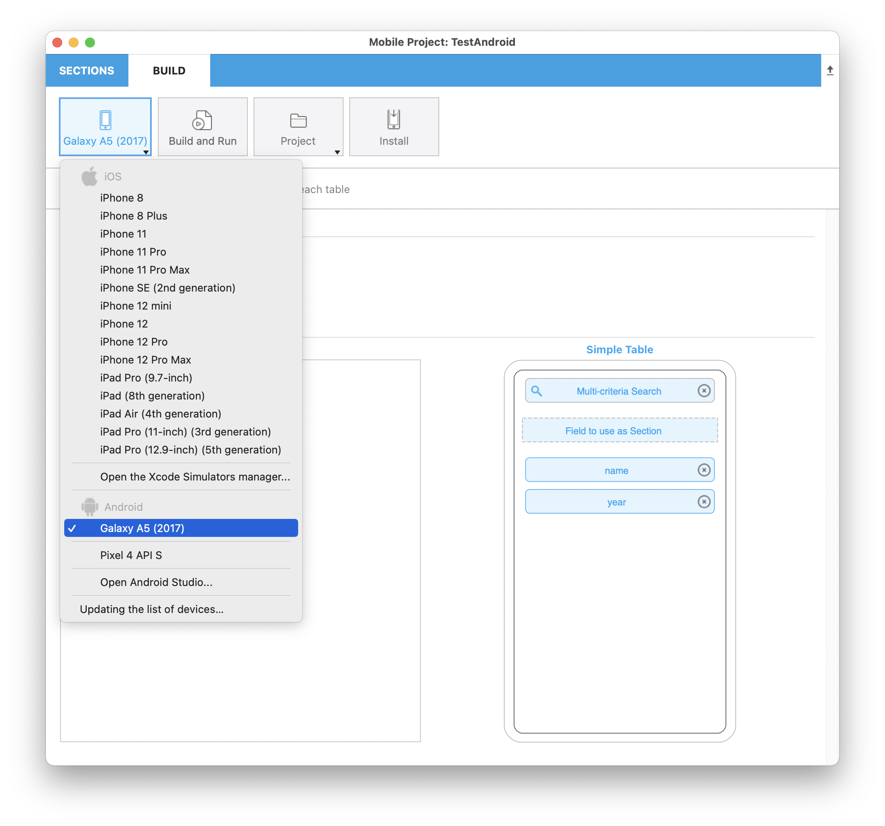

It may happen that you encounter issues using the 4D mobile project editor or your iOS or Android app. Reading log files can provide useful information in these cases.

To access log files, press the **Alt** key and select **Project** from the BUILD panel of the project editor:

Additional debug menu items appear for the [currently selected simulator](../project-definition/build-panel#using-the-simulator):

* **Open Simulator logs**: where you can find the `CrashReporter MobileInstallation` folder

* **Open Simulator Diagnostic Reports**

* **Open Current Simulator Folder**

* **Open Application Simulator Folder**: opens a submenu for each application

## Debug your app (Android)

Once your app is complete and the simulator’s result is satisfactory, you may want to test it on your smartphone.

To do so, only one action is needed [on the smartphone](from-your-android-device.md) and another one in the project editor.

In the Project editor, make sure you have plugged your smartphone, then select your physical device from the list and click on the “Build and Run" button.

4D shall then build the application and install it on the connected device.

For Windows developers, make sure you have installed [a USB driver](https://developer.android.com/studio/run/oem-usb) corresponding to your device.

