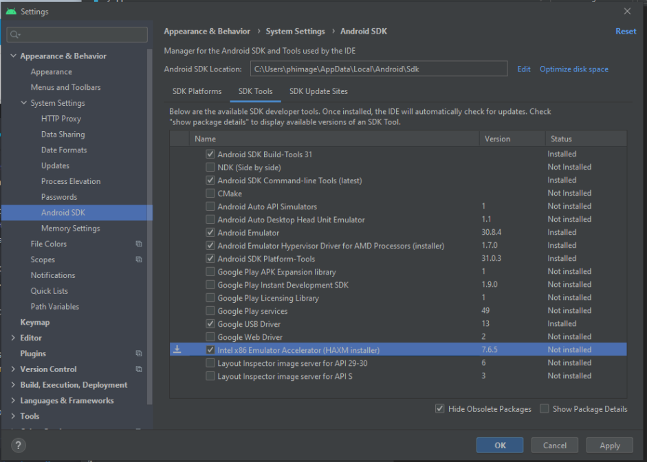

開発用のマシンとスマートフォンの連携を確認するには、スマートフォンと [プロジェクトエディター](from-project-editor.md) にてそれぞれ 1つずつアクションが必要です。

デバイスでは、開発者向けオプションの設定で [**USBデバッグ**](https://developer.android.com/studio/debug/dev-options#enable) を有効にする必要があります。

:::tip

設定内に開発者向けオプションの項目が見つからない場合は、ビルド番号を 7回クリックする方法もあります。

:::

もし、見つからない場合や、わからない場合は、[この Android ユーザーガイド](https://developer.android.com/studio/debug/dev-options) の Android のバージョン別の説明を参照ください。

:::note 注記

- Windows で、Google デバイスと接続してデバッグするには、[Google USB ドライバ](https://developer.android.com/studio/run/win-usb) をインストールする必要があります。

- macOS で開発しているのであれば、USBドライバは必要ないはずです。

- その他のデバイスの場合は、デバイスに対応する [OEM USB ドライバ](https://developer.android.com/studio/run/oem-usb) をダウンロードし、手動でインストールしてください。

:::

### Android Studio の設定

また、Android のデベロッパーは、Android Studio の設定をおこなう必要があります。これには、Android Studio ＞ Preferences... で設定ダイアログを開き、Appearance ＆ Behavior ＞ System Settings ＞ Android SDK の項目で SDK Tools タブを選択します。 利用可能な SDK デベロッパーツールの一覧より、次のツールにチェックを入れます:

- **Android SDK Build Tools 31**
- **Android SDK Command-line Tools (latest)**。 このチェックボックスを選択すると、4Dモバイルプロジェクトエディターから直接、すべての仮想デバイスを視覚化することができます。
- **Android Emulator**
- **Android SDK Platform Tools**
- **Google USB driver** (Windowsのみ)
- **Intel x86 Emulator Accelerator (HAXM installer)**

