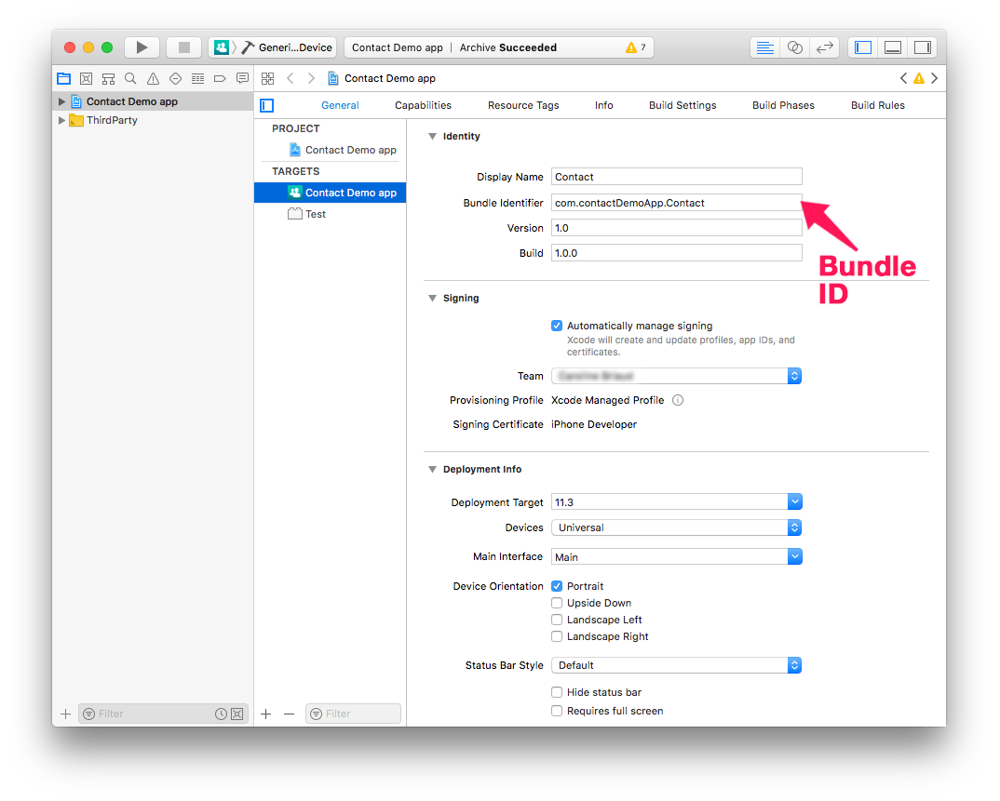
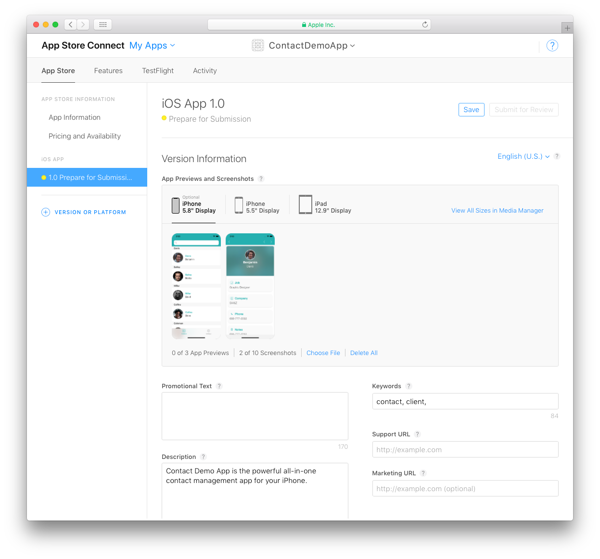
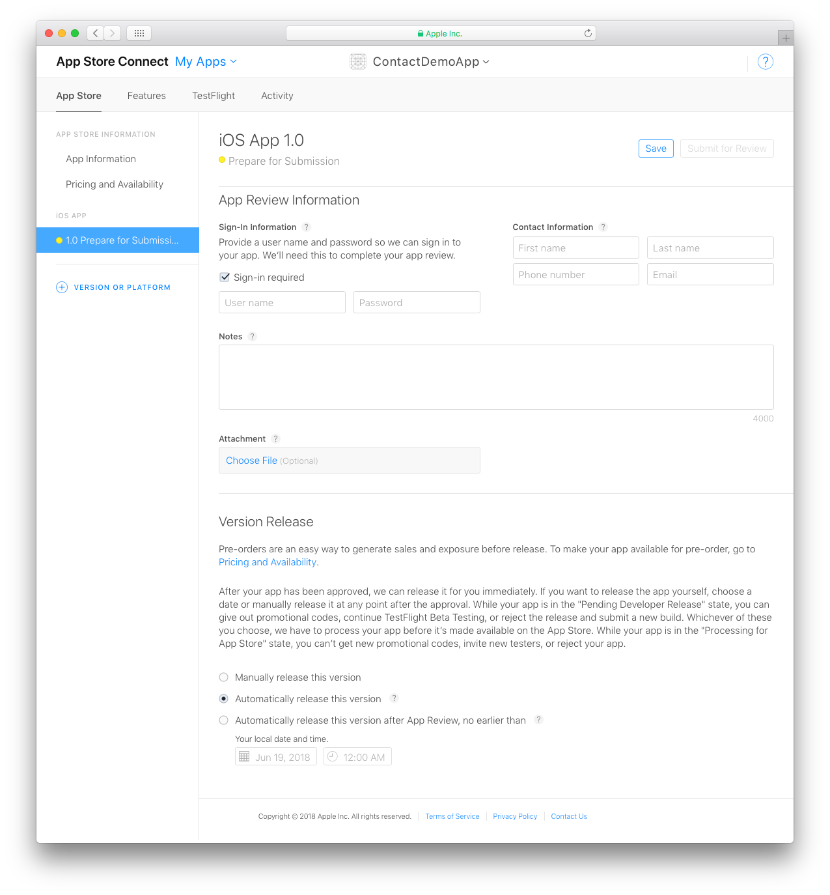

> **OBJECTIVES**
> 
> * Create an App ID on your Developer Account
> * Create your app in App Store Connect

> **PREREQUISITES**
> 
> `[Apple Developer Program for organization](selecting-your-developer-program-register-apple-developer-program-organization.html) or [individual](selecting-your-developer-program-register-apple-developer-program-individual.html)`

## STEP 1. Create an App ID

#### What is an App ID ?

*An App ID is a two-part string used to identify one or more apps from a single development team. The string consists of a Team ID and a Bundle ID, with a period (.) separating the two parts (ex: TeamID.BundleID).*

> **NOTE**
> 
> * If you have chosen an Apple Developer Account as an individual, your account is available immediately and you can create your App ID.
> * If you have chosen an Apple Developer Account as an organization, you must wait for Apple validation to create your App ID.

To create your App ID, go to your developer account and select [Certificates, IDs & Profile](https://developer.apple.com/account/ios/identifier/bundle)

* Click the + sign next to *Register iOS App IDs* to add a new App ID.

* Define your app's Name and Bundle ID.

* Define the App Services to include in your app

* Confirm your App ID by clicking **Register**.

## STEP 2. Sign in to App Store Connect

* Sign in to your [App Store Connect Account](https://appstoreconnect.apple.com)
* Click on **My Apps**.

## STEP 3. Create a new iOS App

Click the **+** sign in the top left corner to create a new iOS App.

Add the following information:

* **Platforms**: Select iOS.
* **Name**: The name of your app.
* **Primary language**: The main language for your app.
* **Bundle ID**: Select your App Bundle ID from the dropdown list.
* **SKU**: A unique ID for your app (this stays private and is not seen by users)
* **Limit User Access (optional)**: Allows you to limit access to your app to users with App Manager, Developer, Marketer, or Sales roles.

> **NOTE**
> 
> If your Bundle ID is not available, it may already be used by another app in the App Store. You'll need to change yours in your Xcode project.

## STEP 4. App information

From App Store Connect > App Information:

* Define your app's Privacy Policy URL (optional).
* Enter a subtitle for your app. This will appear below your app's name throughout the App Store in iOS 11.
* Select a primary and secondary (optional) category for your app to appear in.

## STEP 5. Pricing and Availability

This is where you define the price for your app.

> **TIPS**
> 
> You can define limited-time discounts by specifying start and end dates.

## STEP 6. Prepare for Submission

Add all of the assets for your app to appear in the App Store in **Version Information**:

> **TIPS**
> 
> You can generate all of your screenshots in Simulator (File > New Screen Shot).

* Add your app screenshots. Screenshots for the iPhone 5.5" Super Retina Display and iPad 12.9" Retina Display are mandatory. For more details, see [Screenshot specifications](https://help.apple.com/app-store-connect/#/devd274dd925).

* Scroll down and define the **Keywords** and complete the **Description** (this is what users will see in the App Store).
* You can share updates about your app, including new promotions or in-app purchases, upcoming features or content, limited- time sales, or other events within your app in also add a **Promotional Text** that will appear above your description on the App Store (for customers with devices running iOS 11 or later).
* Enter a **Support URL** that includes support information for your app. This URL will be visible on the App Store.
* **Marketing URL** is optional. This can direct users to a marketing website for your app.

In the **iOS App section**:

Locate your build versions in **Build**.

* In **General App Information** area, enter the Copyright, Version, and Trade Representative Contact Information for your app.
* Your app icon is included in the generated 4D for iOS project.
* Rating is a required property used by the App Store's parental controls. Click Edit and select the appropriate age category for your app.

The **App Review Information** and **Version Release** sections include information required by the App Store. The information provided here will not be seen by users.

* **App Review Information**: Confidential contact and security information.
* **Version Release**: Specifies an automatic or manual publication.
* Finally, click **Save**.
