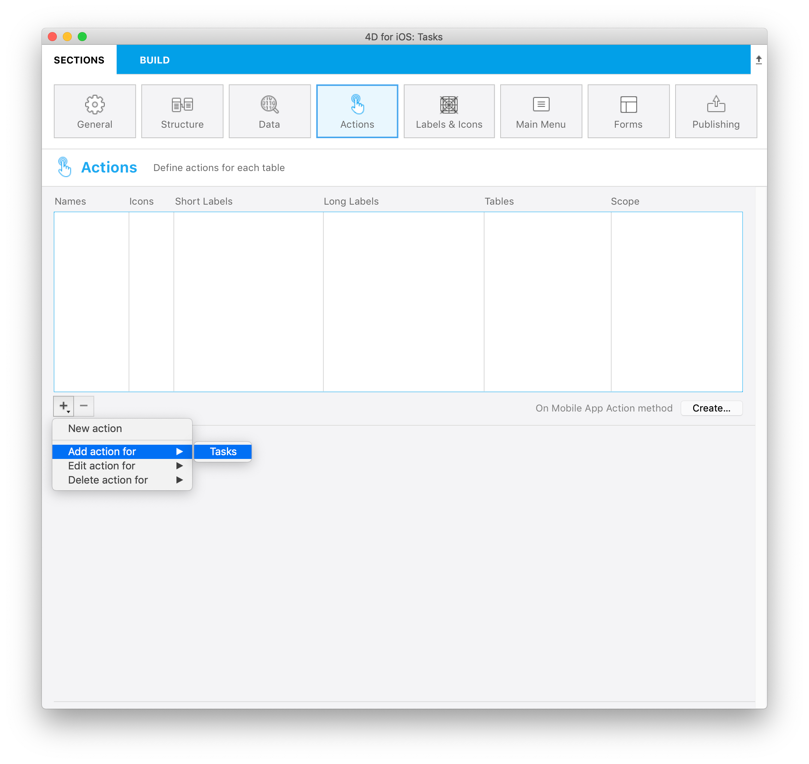
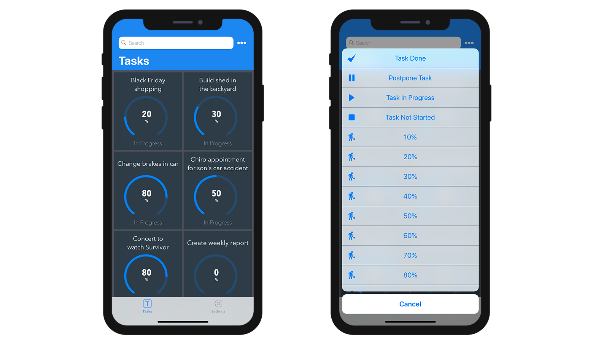

4D モバイルプロジェクトエディターでは、モバイルアプリに含めるアクションを作成することができます。

You can use [preset actions](#preset-actions) or [custom actions](../tutorials/actions/define-first-action.md) and [define their parameters](#add-parameters-to-your-action).

4D側では、[On Mobile App Action](../4d/on-mobile-app-action.md) データベースメソッド内で 4Dコードを実行することができます。

[モバイルインターフェース](#モバイルアプリ側) において、アクションは自動的に利用可能です。

## プロジェクトエディター側の設定

### アクションを作成する

新しいアクションを作成するには、アクションテーブルの下部にある + ボタンをクリックします。 すると、アクションテーブルに新しい行が追加されます。

次に、以下のものを定義する必要があります:

* **名前:** [On Mobile App Action](../4d/on-mobile-app-action.md) データベースメソッド内で 4Dコードをトリガーするのに使用するアクションの名前。
* **アイコン:** アイコンライブラリーから選択するアイコン。 また、[独自のアイコンを追加](labels-and-icons#カスタムのアイコンを追加する) することもできます。
* **短いラベルとラベル:** アプリに表示するアクションのラベル
* **テーブル:** アクションを適用するテーブル
* **Scope:** Where to use the action, an **entity** , a **table** or **global**.


:::note note

**名前** をドラッグ＆ドロップして並べ替えることができます。 これにより、アプリのメニューに表示される順番が指定されます。

:::

### アクションに引数を追加する

**アクション引数** を追加することで、アプリからデータを直接 **編集** することができます。

それぞれの引数について、以下のプロパティを設定することができます:

* 名前
* (長い) ラベル
* 短いラベル
* [入力コントロール](#ビルトイン入力コントロール)
* 必須オプション
* デフォルト値

入力コントロールの選択に応じて、以下の追加プロパティを定義することができます:

* 入力制限 (最小値または最大値)
* プレースホルダー
* [データソース](#動的選択リスト)

:::info

デフォルトで、入力コントロールメニューは **選択コントロール** を表示します。 "フォーマット" プロパティにより、選択コントロールはフィルターされます。 フォーマットを選択するには、そのフォーマットで少なくとも 1つの [選択入力コントロール](#選択入力コントロール) を作成している必要があります。

:::


引数の順番はドラッグ＆ドロップで自由に変えられます。

## プリセットアクション

4Dモバイルプロジェクトには、アプリのコンテンツを管理するための、以下のプリセット (定義済み) アクションが含まれています:

* 追加
* 編集
* 削除
* 共有
* ソート
* URLを開く

### 追加アクション

4Dモバイルプロジェクトで **追加アクション** を作成するのは簡単です。

まず、アクションテーブルの下にある **+ ボタン** をクリックすると表示される **追加アクション** オプションを選択します。



次に、その追加アクションをリンクする **テーブルを選択** するだけです。

これによって、プロジェクトエディター内に必要な引数がすべて **自動的に作成** されます。 生成されたアプリ内では、各フィールド値の編集ができるようになります。

この種のアクションの場合、引数リストの右側にある **プロパティ** は自動で設定済みです。

### 編集アクション

**編集アクション** の作成手順は追加アクションと同じですが、引数のデフォルト値が定義できない点が異なります。

### 削除アクション

**削除アクション** の作成手順は編集アクションと同じです。 唯一の違いは、このアクションを使用するとエンティティを削除できるという点です。

削除アクションを作成するには、アクションテーブルの下にある **+ ボタン** をクリックすると表示される **削除アクション** オプションを選択します。

この種のアクションは使用の際に注意が必要です。


### 共有アクション

**共有アクション** を選択すると、モバイルアプリのユーザーが他のユーザーとコンテンツを共有できるようになります。 これには、スコープを選択する必要があります:

- **エンティティ**: 詳細フォームのコンテンツを共有する
- **テーブル**: リストフォームを共有する

詳細については [ディープリンク](../special-features/deep-linking.md) を参照ください。

### ソートアクション

**ソートアクション** は以下のような目的に使います:

- テーブルのリストフォームのデフォルトのソート順を定義する
- モバイルアプリのユーザーがリストのソート順を選択できるようにする

テーブルに対してソートアクションを作成した場合、並べ替え基準となる最初のフィールドを選択する必要があります:


このフィールドはソート条件リストに追加されます。 デフォルトでは昇順ソートが適用されますが、これは **ソート順** メニューで変更できます。

エンティティの並べ替えは、複数フィールドを基準におこなえます。 ソートの基準となる各フィールドはソートレベルと呼ばれます。 たとえば、`lastName` および `firstName` フィールドに対して 2レベルの昇順ソートをおこなった場合、結果は以下のようになります:

```4d
Aardvark, Anthony
Aardvark, Artemis
Aardvark, Arthur
...
Zygote, Elena
Zymosian, Elmer
```

ソート条件リストにソートレベルを追加するには、リスト下部の **+** ボタンをクリックし、各レベルを設定します:


#### モバイルアプリ上でのソート順メニュー

テーブルに対して 2つ以上のソートアクションを定義していた場合、モバイルアプリのユーザーは **ソート** メニューを自動的に使用できるようになります。 ここには定義済みのソートアクションがすべて格納されています:


> テーブルに対するソートアクションが 1つしか定義されていない場合、モバイルアプリ側では **ソート** メニューは表示されません。

### URLを開くアクション

**URLを開くアクション** は、モバイルユーザーがモバイルアプリから URL を開けるようにします。 このアクションは、4D Server が提供する Webページをモバイルアプリ内で Webエリアに表示します。

このアクションを選択した場合、開くパスを定義する必要があります:


`/` で始まるパス、つまり [カレントの 4D Webフォルダー](https://developer.4d.com/docs/ja/WebServer/webServerConfig/#ルートフォルダー) を基準とした相対パスしか定義できません。

Like other actions, the Open URL action will be automatically available in the [mobile app interface](#mobile-app-side) (short or long label) if choose to the Table or the Current entity scope.

You could also choose to display the web page in main menu by choosing Global scope. Then you will be able to select it in "Main Menu" tab.

:::note

To close the web page and get back to the mobile app interface, use the `$4d.mobile.dismiss()` function from within the page (see below).

:::

#### Webサーバー側

The request sent to the server contains the context of the app (current entity and/or dataclass) in the `X-QMobile-Context` header. The content of this header is formatted in JSON and encoded in base64.

:::tip

You can get the context information already decoded as object using the [**4D Mobile App Server**](https://github.com/4d/4D-Mobile-App-Server#4d-mobile-app-server) component and its [WebHandler class](https://github.com/4d/4D-Mobile-App-Server/blob/main/Documentation/Classes/WebHandler.md).

:::

Context information can be processed in the web page to return through standard 4D web server features:

- [.shtml テンプレートページ](https://developer.4d.com/docs/ja/WebServer/templates/)
- [On Web Connection データベースメソッド](https://developer.4d.com/docs/ja/WebServer/httpRequests/#on-web-connection)。


#### Webエリア側

For your page to interact with the mobile app, some javascript code is automatically provided in the `$4d.mobile` object. This object contains the following properties and functions:

| プロパティ      |                  |                               | タイプ      | 詳細                                                                                                                                          |
| ---------- | ---------------- | ----------------------------- | -------- | ------------------------------------------------------------------------------------------------------------------------------------------- |
| $4d.mobile | .action          | .name                         | string   | アクション名                                                                                                                                      |
|            |                  | .label                        | string   | アクションのラベル                                                                                                                                   |
|            |                  | .shortlabel                   | string   | アクションの短いラベル                                                                                                                                 |
|            | .dismiss()       |                               | Function | ネイティブ Webビューを閉じます                                                                                                                           |
|            | .status(message) |                               | Function | ネイティブアプリでユーザーにメッセージを表示します<br/> message: string<br/> message: "message" (または "statusText") と "success" (または "level") キーを持つオブジェクト |
|            | .logger          | .log(level, message : string) | Function | ネイティブアプリで開発者向けのメッセージを表示します                                                                                                                  |
|            |                  | .info(message : string)       | Function | ネイティブアプリで開発者向けのメッセージを表示します                                                                                                                  |
|            |                  | .info(message : string)       | Function | ネイティブアプリで開発者向けのメッセージを表示します                                                                                                                  |
|            |                  | .warning(message : string)    | Function | ネイティブアプリで開発者向けのメッセージを表示します                                                                                                                  |
|            |                  | .error(message : string)      | Function | ネイティブアプリで開発者向けのメッセージを表示します                                                                                                                  |
|            |                  | .debug(message : string)      | Function | ネイティブアプリで開発者向けのメッセージを表示します                                                                                                                  |
|            |                  | .verbose(message : string)    | Function | ネイティブアプリで開発者向けのメッセージを表示します                                                                                                                  |


:::info See also

Blog post: [4D for Mobile : Display Web Pages in your Mobile Apps](https://blog.4d.com/4d-for-mobile-di…your-mobile-apps/)

:::

### On Mobile App Action

The [`On Mobile App Action`](../4d/on-mobile-app-action.md) database method is available to call all of your 4D methods.

After creating all of your actions, just click on the **Create** button from the Actions table to automatically generate a *Case of* code block that includes all your action names in the *On Mobile App Action* method.

:::note 注記

- `$result.dataSynchro:=True` というコードをアクション実行後に使用することで、セレクションを更新することができます。
- `$result.statusText:="表示したいメッセージ"` というコードを使用することで、アクション実行時にアプリユーザーに対して通知をすることができます。
- `$result.close:=True` というコードを使用することで、編集フォームを強制的に閉じることもできます。

:::

## ビルトイン入力コントロール

Input controls define how information will be entered by the user in the mobile app, and also how it will be rendered. The Project editor provides basic input controls for regular data types. These controls are built-in and can be directly selected in the "Input Control" menu.

You can also define [custom input controls](#custom-input-controls) (see below).

Available built-in input controls depend on the data type:

| データタイプ | 入力コントロール | 詳細                                                                                                                             |
| ------ | -------- | ------------------------------------------------------------------------------------------------------------------------------ |
| テキスト   | デフォルト    | 文字列の頭文字を大文字にします。                                                                                                               |
|        | メールアドレス  | メールアドレス入力用に最適化されたキーボード                                                                                                         |
|        | 電話番号     | 電話番号入力用のキーパッド                                                                                                                  |
|        | アカウント    | ユーザー名入力用に最適化されたキーボード                                                                                                           |
|        | パスワード    | パスワードの管理に最適化されています。                                                                                                            |
|        | URL      | URL入力に最適化されたキーボード                                                                                                              |
|        | 郵便番号     | 郵便番号入力に最適化されたキーボード                                                                                                             |
|        | テキストエリア  | 単一フィールド内に複数行のテキストを格納できます。                                                                                                      |
|        | バーコード    | バーコードに割り当てられた値を取り出します。 サポートされてるフォーマット: EAN8、EAN13、Code 39、Code 93、Code 128、QRコード、UPC、PDF417                                    |
| 数値     | デフォルト    | 小数点付き数値                                                                                                                        |
|        | 整数       | 小数点のつかない数値                                                                                                                     |
|        | 指数       | 指数表記                                                                                                                           |
|        | パーセント    | パーセント表記                                                                                                                        |
|        | 読み方      | 数値を文字列へと変換                                                                                                                     |
| 日付     | デフォルト    | Nov 23, 1937                                                                                                                   |
|        | 短い日付     | 11/23/37                                                                                                                       |
|        | 長い日付     | November 23, 1937                                                                                                              |
|        | 完全な日付    | Tuesday, November 23, 1937                                                                                                     |
| 時間     | デフォルト    | 3:30 PM                                                                                                                        |
|        | 経過時間     | 2 hours 30 minutes                                                                                                             |
| ブール    | デフォルト    | 数値を文字列へと変換                                                                                                                     |
| 時間     | デフォルト    | 3:30 PM                                                                                                                        |
|        | 経過時間     | 2 hours 30 minutes                                                                                                             |
| 時間     | デフォルト    |  |
|        | チェックマーク  |   |
| 画像     | デフォルト    |                                                                                                                                |
|        | 署名       | 手書き文字での署名が可能に                                                                                                                  |

## カスタム入力コントロール

You can add custom input controls to your mobile project to highly customize interactions with the user. There are two categories of custom input controls:

- [**選択**](#選択入力コントロール) - 選択する値のリストを表示します (静的または動的)。
- [**アクション**](#アクション入力コントロール) - Swift や Kotlin のコードを含み、あらゆる関連アクションをおこなうことができます。

You can create custom input controls for both categories. Note that you can also download **action** input controls from the [Input control Github gallery](https://4d-go-mobile.github.io/gallery//#/type/input-control).

### カスタム入力コントロールの定義

A custom input control is associated to a `manifest.json` file and (optionally) Swift or Kotlin source code. The custom input control files must be stored into a subfolder at the following location:

`myProject/Resources/Mobile/inputControls/`

The `manifest.json` file contains several attributes such as **name**, **type**, **format**, etc. depending on the input control category (selection or action).

### 選択入力コントロール

Selection input controls display formatted elements (values, pictures) in your mobile apps. これらの要素は、アクションフォーム内に自動的に含まれます。具体的には選択リストとして表示され、そこから値を選択し、引数として使用することができます。

These choice lists can be either **static** or **dynamic**.

#### 静的選択リスト

**Static** choice lists (predefined choices hard coded in json) must be located in a [`manifest.json` file in the "inputControls" folder](#defining-custom-input-controls). この選択リストは以下のような複数の要素から定義されています:

| プロパティ              |            | タイプ                 | 詳細                                                                                                |
| ------------------ | ---------- | ------------------- | ------------------------------------------------------------------------------------------------- |
| **"name"**         |            | text                | アクション入力コントロール名                                                                                    |
| **"binding"** (任意) |            | text                | 画像を紐付けるための "imageNamed" (実際の画像はアクションフォーマッターフォルダー内の "images" サブフォルダーに入れる必要あり)                      |
| **"choiceList"**   |            | object              | キー (サーバーに送られるデータ) / 値 (ユーザーに表示される値) のリストを定義するためのオブジェクトまたはコレクション                                   |
| **"type"**         |            | text または collection | 入力コントロールの型 (text、integer、boolean) を定義するためのテキスト、またはテキストのコレクション                                     |
| **"format"** (任意)  |            | text                | インターフェースの選択: "push" (未定義の場合のデフォルト)、"segmented"、"popover"、"sheet"、"picker"                         |
| **"assets"** (任意)  |            | object              | 表示サイズの調整 (幅と高さ)                                                                                   |
|                    | **"size"** | object または integer  | integer: 値を一つのみ渡して正方形を作成します。object: 以下の属性を渡します: <li>"width" (integer): 幅</li><li>"height" (integer): 高さ</li> |

以下は、静的な選択リストとして使用可能な、ある会社の支社の連絡先情報を格納した manifest.json ファイルの一例です:

```json
{
    "name": "choiceListSheet",
    "type": [
        "text"
     ],
    "format": "sheet",
    "choiceList": {
        "1":"Paris",
        "2":"Tokyo",
        "3":"Sydney",
        "4":"San Jose",
        "5":"Rabat",
        "6":"Eching"
     }
}
```

#### 動的選択リスト

**Dynamic** choice lists are based on datasource (choices depending on the database content). この方式では、ヘルパーモジュールを使用してフォームフィールドに値を入力することで、データを素早く取得することができます。 モバイルアプリから直接利用可能であるだけでなく、選択リストは常に更新されます。 The [`manifest.json` file](#defining-custom-input-controls) is composed of the following elements:

| プロパティ             | タイプ                 | 詳細                                                                        |
| ----------------- | ------------------- | ------------------------------------------------------------------------- |
| **"name"**        | text                | 入力コントロール名                                                                 |
| **"choiceList"**  | object              | **"dataSource"** を格納するオブジェクト (以下の表参照)                                     |
| **"type"**        | text または collection | 入力コントロールの型 (text、integer、boolean) を定義するためのテキスト、またはテキストのコレクション             |
| **"format"** (任意) | text                | インターフェースの選択: "push" (未定義の場合のデフォルト)、"segmented"、"popover"、"sheet"、"picker" |

| プロパティ            |                         | タイプ                        | 詳細                                                                                                                 |
| ---------------- | ----------------------- | -------------------------- | ------------------------------------------------------------------------------------------------------------------ |
| **"dataSource"** |                         | object                     | "dataClass"、"field"、そして任意の "entityFormat" を格納するオブジェクト。                                                             |
|                  | **"dataClass"**         | text                       | テーブル名                                                                                                              |
|                  | **"field"**             | text                       | サーバーに送るデータの抽出に使用                                                                                                   |
|                  | **"sort"** (任意)         | object / collection / text | **"field"** (ソート基準 / フィールド名) と、任意の **"order"** (ソート順) を格納するオブジェクト。または、フィールド名のコレクション。または、フィールド名。(デフォルトでは昇順でソートされます) |
|                  | **"search"** (任意)       | boolean / array            | 検索に使用するフィールドを格納した配列                                                                                                |
|                  | **"entityFormat"** (任意) | text                       | 値の表示用フォーマット (指定されていない場合、フィールドから取得したデータを使用)                                                                         |

**注意:** 選択リストが長くなった場合に、任意の "search" 要素が利用可能になります。

動的な選択リストの一例です:

```json
{
    "name": "datasourcePush",
    "type": [
        "text"
    ],
    "format":"push",

    "choiceList": {
        "dataSource": {
            "dataClass": "Contact",
            "field": "LastName",
            "entityFormat": "%FirstName% %LastName% - %Job%",
            "search": "LastName",
            "sort": {"field": "LastName", "order":"descending"} 
        }
    }
}
```


On the Project editor side, once you select your **Input control** format, the **Data Source** will be selectable from a filtered list based on the format you have selected. これでアプリは更新され、使用できます。

The various formats are illustrated in this animation:


### アクション入力コントロール

カスタムの入力コントロールを使用することで、ネイティブのアプリと容易にやりとりをすることができます。これはネイティブコードを使用した [ラベル & アイコン カスタムフォーマッター](labels-and-icons.md) と同じやり方を踏襲しています。

To do so, you can create your own input controls with native code, or you can download input controls from our [Github gallery](https://4d-go-mobile.github.io/gallery/#/type/input-control), depending on what you need for your app. Drop them into the "inputControls" folder (`mybase/Resources/mobile/inputControls`). するとプロジェクトエディターにて、アクションの引数プロパティ内にある入力コントロールメニューから追加の入力コントロールが利用・選択可能になります。

The [`manifest.json` file](#defining-custom-input-controls) is composed of the following attributes:

| プロパティ                   | タイプ                 | 詳細                                                                                     |
| ----------------------- | ------------------- | -------------------------------------------------------------------------------------- |
| **"name"**              | text                | 入力コントロール名                                                                              |
| **"inject"** (任意)       | boolean             | このフォーマッターを使ったアプリを生成する際に、Sources にあるいくつかのソースコードを最終プロジェクトに注入する必要がある場合には "inject" を指定します。 |
| **"type"**              | text または collection | 入力コントロールの型 (text、integer、boolean) を定義するためのテキスト、またはテキストのコレクション                          |
| **"capabilities"** (任意) | object              | ニーズに応じて任意の情報を追加するための capabilities要素 (地図、写真、場所など)。                                      |
| **"target"**            | text または collection | 入力コントロールがサポートするプラットフォーム ("ios"、"android")                                              |

たとえば、モバイルの連絡先リストから電話番号を取得するには、*phoneContact* 入力コントロールテンプレートを使用することで、電話番号フィールドを自動的に埋めることが可能になります。

 

ギャラリー内の入力コントロールはすべてオープンソースであり、Github から取得可能です。 自分の入力コントロールを共有したい、あるいは入力コントロールに対するフィードバックをしたい場合、お気軽に [4D Forum](https://discuss.4d.com/) までご投稿ください。

:::info

An example of Kotlin input control definition is provided in [this tutorial](../tutorials/actions/create-kotlin-input.md).

:::


## オフラインモードアクション

アプリのユーザーはオフライン中でも、アクションリクエストを作成・保存・キューすることが可能です (たとえば、顧客電話番号の追加、写真のアップロード、請求書や見積書の印刷、アドレスの削除など)。 これらのタスクはすべて、ネットワークにアクセスできるようになるまで、保留中アクションのリストに置かれます。 ユーザーがオンラインになると、保留中のアクションはすべて同期され、実行された後、完了したアクションのリストに表示されます。

保留中のタスクは以下にて確認し、開くことができます:

•   *設定画面*

保留中のタスクや完了したタスクの概要と履歴が表示されます。


•   *リスト & 詳細フォーム*

現在閲覧しているテーブルやエンティティに関連するすべてのタスクが表示されます。


:::note 注記

- プリセットの "共有" アクションは、オンラインでのみ実行可能です。
- アクションは保留中の間は編集可能ですが、"完了" モードに切り替わると、修正できなくなります。

:::

### 失敗した保留タスクの更新

サーバーのビジネスロジックにより、一部のタスクが拒否されることがあります。 それらの保留タスクを編集後、モバイルユーザーは送信を再試行できます。 そのために、"完了" アクションの履歴にて、失敗の理由を説明するステータステキストを確認できます。 たとえば、モバイルユーザーがサーバーに送信したアクションを拒否し、操作に失敗したことを通知することができます。 その場合、以下のように `success` の値を `False` に設定し、 `statusText` にメッセージを設定することができます:

```4d
 $response:=New object("success"; False; "statusText"; "操作に失敗しました"))
```

 アクション引数ごとのエラーを追加することもできます。たとえば、`alphaField` 引数について:

```4d
$response.errors:=New collection(New object("parameter"; "alphaField"; "message"; "Alpha フィールドの値が無効です")
```


## モバイルアプリ側

モバイルアプリでは、フォームセクションで選択したテンプレートに応じて、リストおよび詳細フォームで様々にアクションを利用できます。

### テーブルリストフォーム

* **エンティティアクション:** セルを左にスワイプすると、利用可能なアクションがリスト形式で表示されます。 3つより多い数のアクションがエンティティに定義されている場合、"..." ボタンが表示されます。


* **テーブルアクション:** 利用可能なテーブルアクションのリストを表示するために、ナビゲーションバーに汎用的なアクションボタンが用意されています。


:::tip

アクションは、アクションセクションで定義された順序で表示されます。

:::

### コレクションリストフォーム

* **エンティティアクション:** テンプレートによって、汎用ボタンをクリックするか、セル上で長押しすることでアクションが表示されます。



* **テーブルアクション:** テーブルリストフォームと同様に、利用可能なテーブルアクションのリストを表示するため、ナビゲーションバーに汎用的なアクションボタンが用意されています。


### 詳細フォーム

リストフォームのテーブルアクションと同様に、ナビゲーションバーに汎用的なアクションボタンがあり、すべてのエンティティアクションをリスト表示することができます。


### 編集フォーム

編集または追加アクションを作成した場合、アクションリストからそれらを選択すると、**編集フォーム** が表示されます。


ここでは:

* すべてのフィールドを選択して編集できます。
* **Done** または **Cancel** ボタン (ナビゲーションバーで利用可能) を使用して、変更内容を確定またはキャンセルします。

利便性のため、編集フォームにはいくつかの **特別な機能** が含まれています:

* キーボードのタイプは、アクションセクションで選択されたパラメーターに依存します。
* キーボード上部の矢印で、次のフィールドや前のフィールドに移動することができます。
* キーボードは、フィールドの外をタッチすることで、閉じることができます。
* 値が有効でない場合、ユーザーに表示されます。
* ユーザーが Done ボタンをクリックしたときに空の必須フィールドがあれば、それに焦点が当たります。

## これからどうする？

こちらの [チュートリアル](../tutorials/actions/getting-started.md) では **アクション定義の手順** について説明しています。

See [this tutorial](../tutorials/actions/create-kotlin-input.md) for an example of custom **Kotlin input control definition**.
