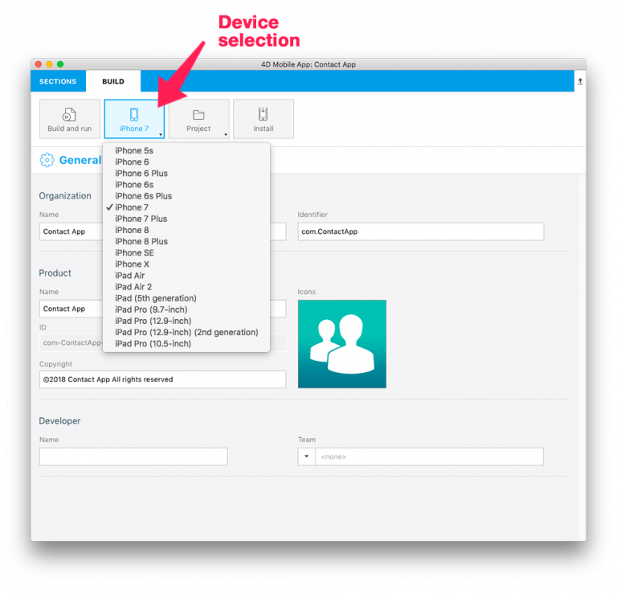

アプリの開発の途中において、シミュレータを使用していつでもテストを行うことができます。シミュレータはプロジェクトエディターのビルドタブ内に配置されています。

ビルドタブでのオプションについて説明していきます:

* **ビルドして実行:** アプリをシミュレーター内で起動します。

* **iPhone X:** デフォルトのシミュレーターです。 ここをクリックすると利用可能な全てのシミュレーターの一覧がドロップダウンに表示されます。

* **プロジェクト:** ドロップダウンリストが表示され、**プロジェクトフォルダを開く** あるいは **プロダクフォルダを開く**、または **プロダクトをXcodeで開く**ことができます。 このドロップダウンリストは[デバッグ用途](../debug/from-project-editor)のためには非常に有用です。

* **インストール:** アプリケーションを接続されたデバイスへとインストールします([自分のiOS デバイスへとインストールする](../deployment/testing-on-your-device)を参照してください)。

## シミュレータを使用する

シミュレータを使用するには以下の手順に従って下さい。

1. デバイスを選択する

プロジェクトエディターのビルドタブ内から、アプリを実行するのに使用するiOS またはAndroid デバイスを選択して下さい。

2. **ビルドして実行** ボタンをクリックする

3. アプリをテストする

アプリ内でリストフォームと詳細フォームを切り替えながらテストしてみて下さい。

 
