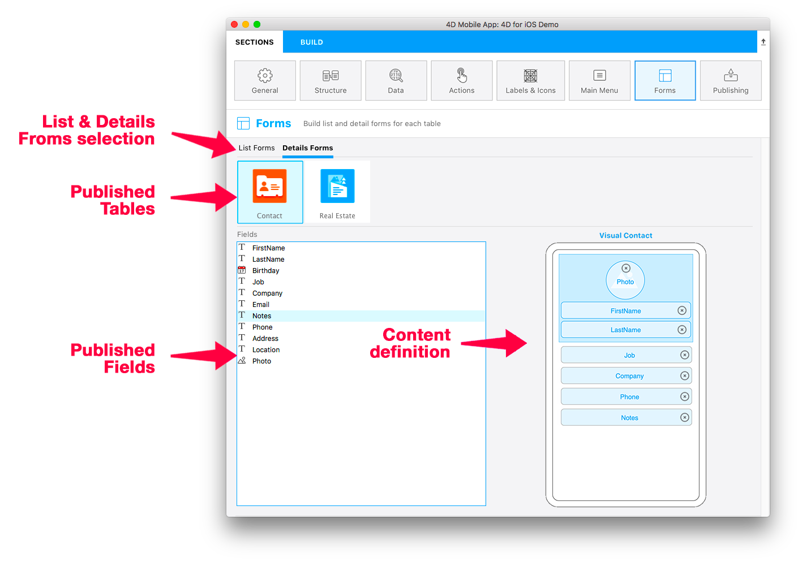

フォームページでは、各公開テーブルに対してリストフォームと詳細フォームの両方を選択できます。 公開テーブル 1つにつき、1つのリストフォームと 1つの詳細フォームが選択できます。

4Dモバイルエディターには、カスタムのトランジションエフェクトがある様々なテンプレートが用意されていて、これらを使用して現代的かつ新鮮なモバイルアプリがビルドできます。 デフォルトでは、アプリのリストフォーム/詳細フォームに対してシンプルな空のテンプレートが使用されます。

この画面を上から順に解説していきます:

* **リストフォーム / 詳細フォーム:** それぞれのテーブルに対して定義するリストフォーム/詳細フォームを切り替えます。
* **公開テーブル:** [ストラクチャー](structure.md) セクションで公開されている全テーブルを表示します。
* **フォーム:** 利用可能なフォームの一覧です。 テンプレートの選択画面とコンテンツの定義画面が切り替えられます。 コンテンツ定義エリアでは、フォームフィールド上で追加の情報を提供する Tips が表示できます。

## リストフォーム

テーブルに対してリストフォームのテンプレートを選択すると、コンテンツ定義画面が表示されます。 ここでは、左のフィールド一覧から右のモデルへと、フィールドをドラッグ＆ドロップできます。

:::note

リストフォームにおいては、テンプレートにあらかじめ含まれている以上のフィールドを追加することはできません。

:::

ほとんどのリストフォームには、任意の **検索** および **セクション** フィールドが指定可能です。 また、**バーコードスキャナー** を有効化することもできます。

### 検索

**検索** フィールドを指定すると、入力に応じてリストを動的に絞り込むことができます。

#### 複数条件検索

検索エリアには、複数のフィールドをドロップすることができます。その場合、エリアには "複数条件検索" と表示されます:

この場合、アプリは "OR" 演算子を使用して該当フィールドから検索文字列を検索します。 検索フィールドを削除するには、検索エリアの削除ボタンをクリックして、削除するフィールドを選択します:

### セクション

セクションフィールドを指定すると、そのフィールドの値に応じて、リスト内のエンティティをグループ化したり、並べ替えしたりします。

### バーコードスキャナー

バーコード検索を有効化するには、検索エリアの虫眼鏡アイコンをクリックし、**バーコードスキャナーを有効化する** オプションを選択します。

バーコード検索には 2つの機能があります:

* テキスト値を格納したバーコードをスキャンすることで、リストフォームをフィルターできます。 フィルター後に 1件しか結果が残らない場合は、検索バーに値を表示し、詳細フォームを開きます。
* [**ディープリンク**](../special-features/deep-linking.md) 機能が有効化されていれば、**URLスキーム**、または **ユニバーサルリンク** のバーコードをスキャンするだけで、特定のリストフォームおよび詳細フォームを表示できます。

## 詳細フォーム

As with the List Form definition, select a template and configure the fields. In detail forms, you can add as many fields as you want onto your detail form.

You have several ways to add your fields in Detail forms:

* 右側のエリアにフィールドをドラッグ＆ドロップすることで、最後に追加されたフィールドのすぐ下、あるいは既に表示されているフィールドの間に追加項目として表示できます。

* フィールドをダブルクリックします。 そのフィールドはリストの最後に追加されます。

* 左の一覧で利用可能なフィールドを右クリックし、コンテキストメニューから **不足しているフィールドを追加** を選択します。

You can reorder your fields at any moment using drag and drop in the detail form.

:::tip

If you want to try another template after dispatching your fields, just select it: previously selected fields are automatically moved for you to the new template in appropriate areas, according to the template and field types.

:::

## ギャラリー

When you select a template in the form section, a "More" icon is available for both list and detail forms.

Just click on that icon to display a list of additional templates from the 4D mobile Gallery:

Then, the only thing you have to do is selecting the template that suits your needs and the mobile editor will handle all the installation process. So you can directly start working on the template, as it is ready-to-use.

A github icon is displayed at the top left of a template icon in the Forms template picker to indicate that it comes from Github:

:::tip

The Gallery is also directly available on Github.
- [**リストフォームのテンプレートのギャラリー**](https://4d-for-ios.github.io/gallery/#/type/list-detail/picker/0)
- [**詳細フォームのテンプレートのギャラリー**](https://4d-for-ios.github.io/gallery/#/type/form-detail/picker/0)

:::

## 独自のテンプレートを作成する

If you want to customize a downloaded template or create your own templates, **several tutorials** can guide you through these tasks:

- [**テンプレートのフォームをカスタマイズする**](../tutorials/gallery/update-gallery-template.md)
- [**リストフォームを作成する**](../tutorials/creating-list-forms/list-form-template.md)
- [**詳細フォームを作成する**](../tutorials/creating-detail-forms/detail-form-template.md)