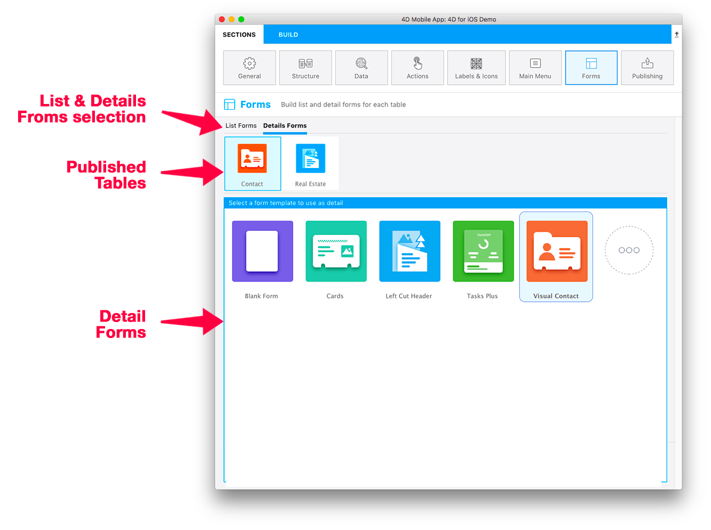

Forms ページを使用するとそれぞれの公開テーブルに対してリストフォームと詳細フォームの両方選択することができます。 公開テーブル1つにつき、1つのリストフォームと1つの詳細フォームを選択することができます。

4D Mobile エディターには、カスタムのトランジションエフェクトがある様々なテンプレートが用意されており、これらを使用して斬新でモダンなモバイルアプリケーションをビルドすることができます。 デフォルトでは、アプリのリストフォーム/詳細フォームに対してシンプルな空のテンプレートが使用されます。

この画面を上から順に解説していきます:

* **リストフォーム / 詳細フォーム:** それぞれのテーブルに対して定義するリストフォーム/詳細フォームを切り替えます。
* **公開テーブル:** [ストラクチャー](structure.md) セクションで公開に設定されている全てのテーブルを表示します。
* **フォーム:** 利用可能なフォームの一覧です。 テンプレートの選択とコンテンツの定義の切り替えをします。 コンテンツ定義エリアでは、フォームフィールド上で追加の情報を提供するTipsを表示させることができます。

## リストフォーム

テーブルに対してリストフォームのテンプレートを選択すると、コンテンツ定義スクリーンが表示されます。 ここでは、右側に表示されているモデルへフィールド一覧からフィールドをドラッグドロップすることができます。

:::note

リストフォームにおいては、テンプレートに含まれているフィールド以上のフィールドを追加することはできません。

:::

ほとんどのリストフォームには、任意の**検索** および **セクション** フィールドが含まれています。 また **バーコードスキャナー** を有効化することもできます。

### 検索

**検索** フィールドを使用すると、入力した文字に応じてリストの中身を動的にフィルターすることができます。

#### 検索エリアに複数のフィールドを設定する

検索フィールドには1つまたは複数のフィールドをドロップすることができます。複数のフィールドをドロップした場合、フィールドには"複数条件検索"と表示されます:

この場合、アプリは入力された文字列を、"OR" 演算子を使用して全てのフィールド内から検索します。 フィールドをリストから削除するには、検索フィールドの削除ボタンをクリックして、削除するフィールドを選択します:

### セクション

セクションフィールドを使用すると、そのフィールドに対する値に応じて、リスト内のエンティティをグループ化したり、順番を並べ替えしたりします。

### バーコードスキャナー

バーコード検索を有効化するためには、検索フィールドの横の虫眼鏡アイコンをクリックし、**バーコードスキャナーを有効化する** オプションを選択します。

バーコード検索には2つの機能があります:

* テキスト値を格納したバーコードをスキャンすることでリストフォームをフィルターすることができます。 フィルターしたあとに1件しか結果が残らない場合は、検索バーに値を入力され、詳細フォームを開きます。
* バーコードをスキャンするだけで特定のリストフォームおよび詳細フォームを表示することができます。この場合、バーコードの値は**URL スキーム** か、または[**ディープリンク**](../special-features/deep-linking.md) 機能が有効化されていれば**ユニバーサルリンク** の値が使用できます。

:::4D for Androidにおける注意

この機能は4D for Android では現在ご利用いただけません。

:::

## 詳細フォーム

リストフォームの定義と同様、テンプレートを選択し、フィールドを設定して下さい。 詳細フォームでは、フォーム内に必要なだけフィールドを追加することができます。

You have several ways to add your fields in Detail forms:

* Drag and drop a field anywhere into the rightmost view to add it and display it just after the last field added or between any other fields that are already displayed.

* Double-click on a field. Your field will be added at the end of the list.

* Right-click on an available field in the Fields table at the left and select **Add missing fields** from the contextual menu.

You can reorder your fields at any moment using drag and drop in the detail form.

:::tip

If you want to try another template after dispatching your fields, just select it: previously selected fields are automatically moved for you to the new template in appropriate areas, according to the template and field types.

:::

## Gallery

When you select a template in the form section, a "More" icon is available for both list and detail forms.

Just click on that icon to display a list of additional templates from the 4D mobile Gallery:

Then, the only thing you have to do is selecting the template that suits your needs and the mobile editor will handle all the installation process. So you can directly start working on the template, as it is ready-to-use.

A github icon is displayed at the top left of a template icon in the Forms template picker to indicate that it comes from Github:

:::tip

The Gallery is also directly available on Github.
- [**gallery of list form templates**](https://4d-for-ios.github.io/gallery/#/type/list-detail/picker/0)
- [**gallery of detail form templates**](https://4d-for-ios.github.io/gallery/#/type/form-detail/picker/0)

:::

## Creating your own templates

If you want to customize a downloaded template or create your own templates, **several tutorials** can guide you through these tasks:

- [**Customizing a template form**](../tutorials/gallery/update-gallery-template.md)
- [**Creating list forms**](../tutorials/creating-list-forms/list-form-template.md)
- [**Creating details forms**](../tutorials/creating-detail-forms/detail-form-template.md)